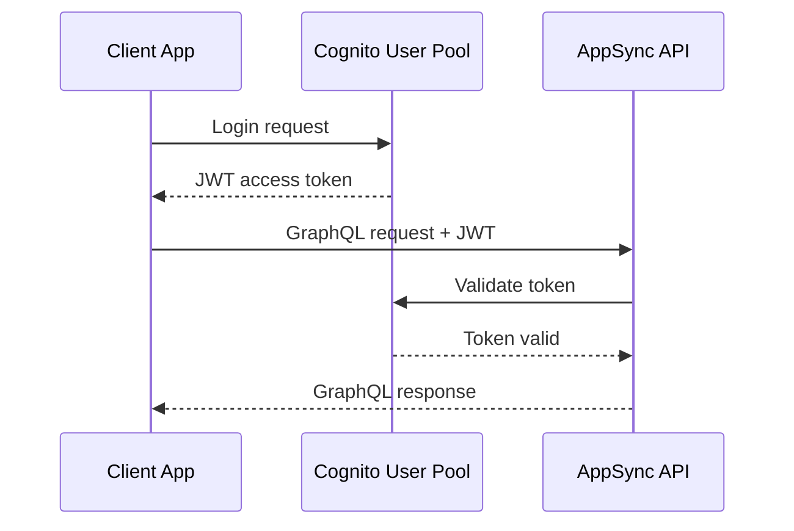

# GraphQL API Documentation

*Complete GraphQL schema documentation with field descriptions and usage examples.*

## API Overview

The OpenData Pulse GraphQL API provides unified access to NSW government data with real-time queries, historical analysis, and geographic filtering capabilities.

## API Endpoint

- **URL**: `https://{api-id}.appsync-api.{region}.amazonaws.com/graphql`
- **Authentication**: AWS Cognito JWT tokens
- **Protocol**: HTTPS only
- **Rate Limiting**: 1000 requests per minute per user

## Authentication

### Cognito Integration
- **User Pool**: Manages user registration and authentication
- **Identity Pool**: Provides temporary AWS credentials
- **JWT Tokens**: Bearer token authentication for API access

### Authentication Flow


## GraphQL Schema

### Core Types

```graphql
type AirQualityReading {
  id: ID!
  suburb: String!
  timestamp: AWSDateTime!
  pm25: Float
  pm10: Float
  ozone: Float
  no2: Float
  coordinates: Coordinates
  healthIndex: HealthIndex
}

type Coordinates {
  latitude: Float!
  longitude: Float!
}

type HealthIndex {
  value: Int!
  category: String!
  description: String
}
```

### Query Operations

```graphql
type Query {
  # Get current air quality for a suburb
  getCurrentAirQuality(suburb: String!): AirQualityReading
  
  # Get historical data with filtering
  getHistoricalData(
    suburb: String
    startDate: AWSDateTime!
    endDate: AWSDateTime!
    pollutant: String
  ): [AirQualityReading!]!
  
  # Get top/worst performing suburbs
  getTopSuburbs(
    pollutant: String!
    limit: Int = 10
    timeRange: String = "24h"
  ): [AirQualityReading!]!
  
  # Geographic queries
  getNearbyReadings(
    latitude: Float!
    longitude: Float!
    radius: Float = 10.0
  ): [AirQualityReading!]!
}
```

### Subscription Operations

```graphql
type Subscription {
  # Real-time updates for a suburb
  onAirQualityUpdate(suburb: String!): AirQualityReading
  
  # Health index threshold alerts
  onHealthIndexAlert(threshold: Int!): AirQualityReading
}
```

## Usage Examples

### Basic Query
```graphql
query GetCurrentAirQuality {
  getCurrentAirQuality(suburb: "Sydney") {
    id
    suburb
    timestamp
    pm25
    pm10
    healthIndex {
      value
      category
      description
    }
    coordinates {
      latitude
      longitude
    }
  }
}
```

### Historical Data Query
```graphql
query GetHistoricalData {
  getHistoricalData(
    suburb: "Sydney"
    startDate: "2024-01-01T00:00:00Z"
    endDate: "2024-01-31T23:59:59Z"
    pollutant: "PM2.5"
  ) {
    timestamp
    pm25
    healthIndex {
      category
    }
  }
}
```

### Geographic Query
```graphql
query GetNearbyReadings {
  getNearbyReadings(
    latitude: -33.8688
    longitude: 151.2093
    radius: 5.0
  ) {
    suburb
    pm25
    coordinates {
      latitude
      longitude
    }
  }
}
```

*Content will be generated from GraphQL schema file analysis*