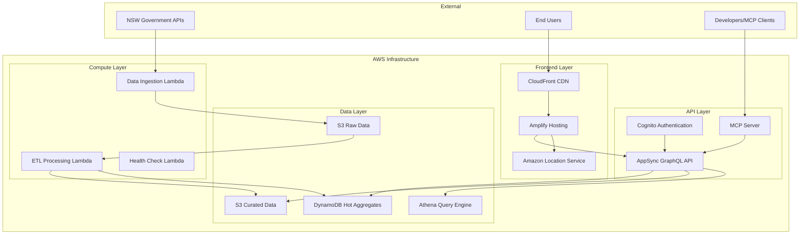
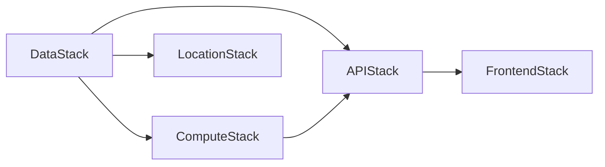

# Infrastructure Diagram

*Visual representation of the OpenData Pulse infrastructure and service relationships.*

## High-Level Architecture

## Stack Dependencies

*Diagrams generated automatically from CDK stack analysis*