# Infrastructure Diagrams

*Visual representation of the OpenData Pulse infrastructure, service relationships, and data flow patterns.*

**Last Updated:** 2025-08-26 23:13:03  
**Generated from:** CDK stack definitions and infrastructure analysis

## High-Level Architecture


## Stack Architecture

```mermaid
graph TB
    subgraph "OpenData Pulse CDK Stacks"
        
        subgraph "LocationStack"
            Location_Purpose["Geographic and location services"]
            Location_LocationService[Location Service<br/>2 resources]
        
        subgraph "ComputeStack"
            Compute_Purpose["Compute and processing services"]
            Compute_Lambda[Lambda<br/>5 resources]
            Compute_SQS[SQS<br/>1 resources]
            Compute_SNS[SNS<br/>1 resources]
            Compute_IAM[IAM<br/>1 resources]
            Compute_EventBridge[EventBridge<br/>2 resources]
        
        subgraph "DataStack"
            Data_Purpose["Data storage and management services"]
            Data_S3[S3<br/>3 resources]
            Data_DynamoDB[DynamoDB<br/>1 resources]
            Data_Glue[Glue<br/>1 resources]
            Data_Athena[Athena<br/>1 resources]
            Data_IAM[IAM<br/>1 resources]
        
        subgraph "ApiStack"
            Api_Purpose["API and authentication services"]
            Api_Cognito[Cognito<br/>2 resources]
            Api_WAF[WAF<br/>1 resources]
            Api_AppSync[AppSync<br/>1 resources]
            Api_IAM[IAM<br/>2 resources]
        
        subgraph "FrontendStack"
            Frontend_Purpose["Frontend hosting and distribution"]
            Frontend_Amplify[Amplify<br/>2 resources]
        end
    end
    
    %% Stack Dependencies
    Data_Purpose --> Compute_Purpose
    Data_Purpose --> Api_Purpose
    Compute_Purpose --> Api_Purpose
    Api_Purpose --> Frontend_Purpose
    Data_Purpose --> Location_Purpose
```

## Service Relationships


## Data Flow Architecture


## Deployment Dependencies

```mermaid
graph TD
    subgraph "Deployment Order & Dependencies"
        subgraph "Phase 1: Foundation"
            DS[DataStack<br/>S3, DynamoDB, Glue, Athena<br/>🟢 No Dependencies]
        end
        
        subgraph "Phase 2: Processing"
            CS[ComputeStack<br/>Lambda, EventBridge, SQS, SNS<br/>🟡 Depends on DataStack]
            LS[LocationStack<br/>Location Service, Maps<br/>🟡 Depends on DataStack]
        end
        
        subgraph "Phase 3: API"
            AS[APIStack<br/>AppSync, Cognito, WAF<br/>🟠 Depends on Data + Compute]
        end
        
        subgraph "Phase 4: Frontend"
            FS[FrontendStack<br/>Amplify, CloudFront<br/>🔴 Depends on API]
        end
    end
    
    %% Dependencies
    DS --> CS
    DS --> LS
    DS --> AS
    CS --> AS
    AS --> FS
    
    %% Deployment Commands
    subgraph "CDK Deployment Commands"
        CMD1[cdk deploy OpenDataPulseDataStack]
        CMD2[cdk deploy OpenDataPulseComputeStack<br/>cdk deploy OpenDataPulseLocationStack]
        CMD3[cdk deploy OpenDataPulseApiStack]
        CMD4[cdk deploy OpenDataPulseFrontendStack]
    end
    
    CMD1 --> CMD2
    CMD2 --> CMD3
    CMD3 --> CMD4
```



### Deployment Strategy

**Recommended Deployment Order:** DataStack → LocationStack → ComputeStack → ApiStack → FrontendStack

**Parallel Deployment Opportunities:**
- ComputeStack and LocationStack can be deployed in parallel after DataStack
- Individual resources within stacks deploy in parallel where possible
- Stack updates can be performed independently once dependencies are satisfied

**Rollback Strategy:**
- Stacks can be rolled back in reverse dependency order
- DataStack rollback requires careful consideration due to data retention policies
- Lambda functions support blue/green deployments for zero-downtime updates

## Security Architecture


## Network Architecture


### Network Characteristics

- **Global Distribution:** CloudFront edge locations for low-latency content delivery
- **Regional Deployment:** Primary deployment in ap-southeast-2 (Sydney) for NSW data locality
- **High Availability:** Multi-AZ deployment for Lambda functions and DynamoDB
- **Private Networking:** AWS service mesh for internal service communication
- **External Connectivity:** Secure HTTPS connections to NSW Government APIs
- **Service Integration:** Native AWS service connectivity without internet routing

---

*All diagrams are automatically generated from CDK stack definitions and updated with infrastructure changes.*
