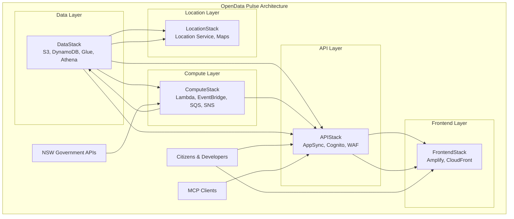
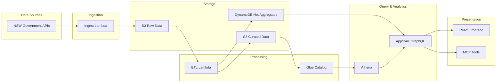

# Architecture Overview

*This document provides a comprehensive overview of the OpenData Pulse system architecture.*

**Last Updated:** 2025-08-26 23:07:25  
**Generated from:** CDK stack definitions and infrastructure analysis

## System Overview

OpenData Pulse is a serverless multi-stack application built on AWS that makes NSW government open datasets accessible through real-time dashboards, Gen-AI natural language queries, and MCP (Model Context Protocol) integration.

### Key Characteristics
- **Architecture Pattern:** Serverless Multi-Stack
- **Deployment Model:** AWS CDK v2
- **Primary Region:** ap-southeast-2 (Sydney)
- **Total Infrastructure:** 5 stacks, 15 AWS services, 28 resources

### Core Value Proposition
- Real-time data ingestion from NSW Air Quality API with hourly updates
- Gen-AI natural language interface for data exploration
- Interactive maps using Amazon Location Service for geographic visualization
- MCP tools for developer integration and programmatic access
- Serverless architecture ensuring scalability and cost-effectiveness

## Architecture Diagram



## Stack Architecture

### Infrastructure Stacks

#### LocationStack
**Purpose:** Geographic and location services

**Resources:** 2 resources across 1 AWS services

**AWS Services:**
- **Location Service:** 2 resources

**Key Resources:**
- `air_quality_map` (Location Service CfnMap) - Location Service resource
- `place_index` (Location Service CfnPlaceIndex) - Location Service resource

#### ComputeStack
**Purpose:** Compute and processing services

**Resources:** 10 resources across 5 AWS services

**AWS Services:**
- **EventBridge:** 2 resources
- **IAM:** 1 resources
- **Lambda:** 5 resources
- **SNS:** 1 resources
- **SQS:** 1 resources

**Key Resources:**
- `common_layer` (Lambda LayerVersion) - Lambda resource
- `powertools_layer` (Lambda LayerVersion) - Lambda resource
- `dlq` (SQS Queue) - Message queuing
- `notification_topic` (SNS Topic) - Event notifications
- `lambda_role` (IAM Role) - Access control
- ... and 5 more resources

**Stack Outputs:**
- `IngestFunctionName`: Data ingestion Lambda function name
- `ETLFunctionName`: ETL processing Lambda function name
- `HealthCheckFunctionName`: Health check Lambda function name
- `NotificationTopicArn`: SNS notification topic ARN
- `DLQUrl`: Dead Letter Queue URL

#### DataStack
**Purpose:** Data storage and management services

**Resources:** 7 resources across 5 AWS services

**AWS Services:**
- **Athena:** 1 resources
- **DynamoDB:** 1 resources
- **Glue:** 1 resources
- **IAM:** 1 resources
- **S3:** 3 resources

**Key Resources:**
- `raw_bucket` (S3 Bucket) - Data storage
- `curated_bucket` (S3 Bucket) - Data storage
- `exports_bucket` (S3 Bucket) - Data storage
- `air_quality_table` (DynamoDB Table) - Data storage and retrieval
- `glue_database` (Glue CfnDatabase) - Glue resource
- ... and 2 more resources

**Stack Outputs:**
- `RawBucketName`: S3 bucket for raw NSW air quality data
- `CuratedBucketName`: S3 bucket for curated/processed data
- `ExportsBucketName`: S3 bucket for data exports
- `DynamoDBTableName`: DynamoDB table for air quality hot aggregates

#### ApiStack
**Purpose:** API and authentication services

**Resources:** 7 resources across 5 AWS services

**AWS Services:**
- **AppSync:** 1 resources
- **Cognito:** 2 resources
- **IAM:** 2 resources
- **Unknown:** 1 resources
- **WAF:** 1 resources

**Key Resources:**
- `user_pool` (Cognito UserPool) - User authentication
- `app_client` (Unknown add_client) - Unknown resource
- `identity_pool` (Cognito CfnIdentityPool) - User authentication
- `web_acl` (WAF CfnWebACL) - WAF resource
- `api` (AppSync GraphqlApi) - API endpoint
- ... and 2 more resources

**Stack Outputs:**
- `UserPoolId`: Cognito User Pool ID
- `UserPoolClientId`: Cognito User Pool Client ID
- `IdentityPoolId`: Cognito Identity Pool ID
- `GraphQLApiUrl`: AppSync GraphQL API URL
- `GraphQLApiId`: AppSync GraphQL API ID
- `WebACLId`: WAF Web ACL ID

#### FrontendStack
**Purpose:** Frontend hosting and distribution

**Resources:** 2 resources across 1 AWS services

**AWS Services:**
- **Amplify:** 2 resources

**Key Resources:**
- `amplify_app` (Amplify CfnApp) - Amplify resource
- `main_branch` (Amplify CfnBranch) - Amplify resource


## Service Architecture

### AWS Services Usage

#### Lambda
**Usage:** 5 resources across 1 stacks

**Purpose:** Serverless compute and processing

**Used in Stacks:** ComputeStack

**Key Resources:**
- `common_layer` in ComputeStack - Lambda resource
- `powertools_layer` in ComputeStack - Lambda resource
- `ingest_function` in ComputeStack - Serverless compute
- ... and 2 more

#### IAM
**Usage:** 4 resources across 3 stacks

**Purpose:** Infrastructure services

**Used in Stacks:** DataStack, ComputeStack, ApiStack

**Key Resources:**
- `lambda_role` in ComputeStack - Access control
- `glue_role` in DataStack - Access control
- `authenticated_role` in ApiStack - Access control
- ... and 1 more

#### S3
**Usage:** 3 resources across 1 stacks

**Purpose:** Data storage and management

**Used in Stacks:** DataStack

**Key Resources:**
- `raw_bucket` in DataStack - Data storage
- `curated_bucket` in DataStack - Data storage
- `exports_bucket` in DataStack - Data storage

#### Location Service
**Usage:** 2 resources across 1 stacks

**Purpose:** Geographic and location services

**Used in Stacks:** LocationStack

**Key Resources:**
- `air_quality_map` in LocationStack - Location Service resource
- `place_index` in LocationStack - Location Service resource

#### EventBridge
**Usage:** 2 resources across 1 stacks

**Purpose:** Infrastructure services

**Used in Stacks:** ComputeStack

**Key Resources:**
- `ingestion_rule` in ComputeStack - Event scheduling
- `health_check_rule` in ComputeStack - Event scheduling

#### Cognito
**Usage:** 2 resources across 1 stacks

**Purpose:** API and authentication services

**Used in Stacks:** ApiStack

**Key Resources:**
- `user_pool` in ApiStack - User authentication
- `identity_pool` in ApiStack - User authentication

#### Amplify
**Usage:** 2 resources across 1 stacks

**Purpose:** Infrastructure services

**Used in Stacks:** FrontendStack

**Key Resources:**
- `amplify_app` in FrontendStack - Amplify resource
- `main_branch` in FrontendStack - Amplify resource

#### SQS
**Usage:** 1 resources across 1 stacks

**Purpose:** Infrastructure services

**Used in Stacks:** ComputeStack

**Key Resources:**
- `dlq` in ComputeStack - Message queuing

#### SNS
**Usage:** 1 resources across 1 stacks

**Purpose:** Infrastructure services

**Used in Stacks:** ComputeStack

**Key Resources:**
- `notification_topic` in ComputeStack - Event notifications

#### DynamoDB
**Usage:** 1 resources across 1 stacks

**Purpose:** Data storage and management

**Used in Stacks:** DataStack

**Key Resources:**
- `air_quality_table` in DataStack - Data storage and retrieval

#### Glue
**Usage:** 1 resources across 1 stacks

**Purpose:** Infrastructure services

**Used in Stacks:** DataStack

**Key Resources:**
- `glue_database` in DataStack - Glue resource

#### Athena
**Usage:** 1 resources across 1 stacks

**Purpose:** Infrastructure services

**Used in Stacks:** DataStack

**Key Resources:**
- `athena_workgroup` in DataStack - Athena resource

#### WAF
**Usage:** 1 resources across 1 stacks

**Purpose:** Infrastructure services

**Used in Stacks:** ApiStack

**Key Resources:**
- `web_acl` in ApiStack - WAF resource

#### AppSync
**Usage:** 1 resources across 1 stacks

**Purpose:** API and authentication services

**Used in Stacks:** ApiStack

**Key Resources:**
- `api` in ApiStack - API endpoint


## Deployment Architecture

### Deployment Architecture

**Stack Dependencies:** 5 explicit dependencies

**Deployment Order:**
```
DataStack → ComputeStack → ApiStack → FrontendStack → LocationStack
```

#### Dependency Details

**ComputeStack** depends on:
- DataStack (explicit): ComputeStack depends on DataStack

**ApiStack** depends on:
- DataStack (explicit): ApiStack depends on DataStack
- ComputeStack (explicit): ApiStack depends on ComputeStack

**FrontendStack** depends on:
- ApiStack (explicit): FrontendStack depends on ApiStack

**LocationStack** depends on:
- DataStack (explicit): LocationStack depends on DataStack

#### Deployment Strategy

1. **Foundation Layer** - Deploy DataStack first to establish storage infrastructure
2. **Processing Layer** - Deploy ComputeStack with Lambda functions and event processing
3. **API Layer** - Deploy APIStack with GraphQL API and authentication
4. **Presentation Layer** - Deploy FrontendStack for web interface
5. **Enhancement Layer** - Deploy LocationStack for geographic features

Each stack can be deployed independently once its dependencies are satisfied, enabling incremental deployments and rollbacks.


## Data Flow Architecture

### Data Flow Architecture



#### Data Flow Components

**Data Ingestion:**
- `ingest_function` (Lambda) - Serverless compute
- `ingestion_rule` (EventBridge) - Event scheduling
- `ApiStack` (CloudFormation) - API and authentication services
- `api` (AppSync) - API endpoint

**Storage Layers:**
- `raw_bucket` (S3) - Data storage
- `curated_bucket` (S3) - Data storage
- `exports_bucket` (S3) - Data storage
- `air_quality_table` (DynamoDB) - Data storage and retrieval

**Processing Components:**
- `common_layer` (Lambda) - Lambda resource
- `powertools_layer` (Lambda) - Lambda resource
- `etl_function` (Lambda) - Serverless compute
- `health_check_function` (Lambda) - Serverless compute
- `glue_database` (Glue) - Glue resource


## Security Architecture

### Security Architecture

#### Authentication & Authorization
- **UserPool** (`user_pool`) in ApiStack
- **CfnIdentityPool** (`identity_pool`) in ApiStack

#### Access Control
**IAM Roles:** 4 roles for service access control
- `lambda_role` in ComputeStack - Access control
- `glue_role` in DataStack - Access control
- `authenticated_role` in ApiStack - Access control
- `unauthenticated_role` in ApiStack - Access control

#### Data Protection
**Encryption:** 3 resources with encryption enabled
- `raw_bucket` (S3) in DataStack
- `curated_bucket` (S3) in DataStack
- `exports_bucket` (S3) in DataStack

#### Permission Grants
- `dlq` (SQS): grant_send_messages, grant_consume_messages
- `notification_topic` (SNS): grant_publish
- `raw_bucket` (S3): grant_read_write
- `curated_bucket` (S3): grant_read_write


## Technology Stack

### Technology Stack

#### Infrastructure as Code
- **AWS CDK v2+** with Python for infrastructure definitions
- **CloudFormation** for resource provisioning and management

#### Backend Services
- **AWS Lambda** with Python 3.9+ runtime
- **AWS Lambda Powertools** for observability and best practices
- **EventBridge** for event-driven architecture
- **SQS/SNS** for message queuing and notifications

#### Data Services
- **Amazon S3** for raw and curated data storage
- **Amazon DynamoDB** for hot aggregates and fast queries
- **AWS Glue** for data cataloging and ETL jobs
- **Amazon Athena** for ad-hoc SQL queries

#### API & Authentication
- **AWS AppSync** for GraphQL API
- **Amazon Cognito** for user authentication and authorization
- **AWS WAF** for API protection

#### Frontend & Visualization
- **React** with Apollo Client for GraphQL integration
- **AWS Amplify** for hosting and CI/CD
- **Amazon Location Service** for geographic visualization

#### AI/ML & Integration
- **Amazon Bedrock** for natural language processing
- **Model Context Protocol (MCP)** for tool integration
- **GraphQL** for flexible data querying

## Resource Summary

### Resource Summary

| Metric | Count |
|--------|-------|
| Total Stacks | 5 |
| Total Services | 15 |
| Total Resources | 28 |

#### Service Distribution

| AWS Service | Resources | Stacks |
|-------------|-----------|--------|
| Lambda | 5 | 1 |
| IAM | 4 | 3 |
| S3 | 3 | 1 |
| Location Service | 2 | 1 |
| EventBridge | 2 | 1 |
| Cognito | 2 | 1 |
| Amplify | 2 | 1 |
| SQS | 1 | 1 |
| SNS | 1 | 1 |
| DynamoDB | 1 | 1 |
| Glue | 1 | 1 |
| Athena | 1 | 1 |
| WAF | 1 | 1 |
| AppSync | 1 | 1 |


---

*This documentation is automatically generated from CDK stack definitions. For detailed component information, see the individual stack documentation.*
