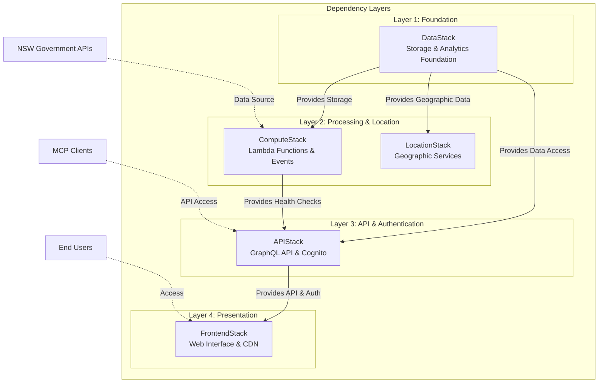
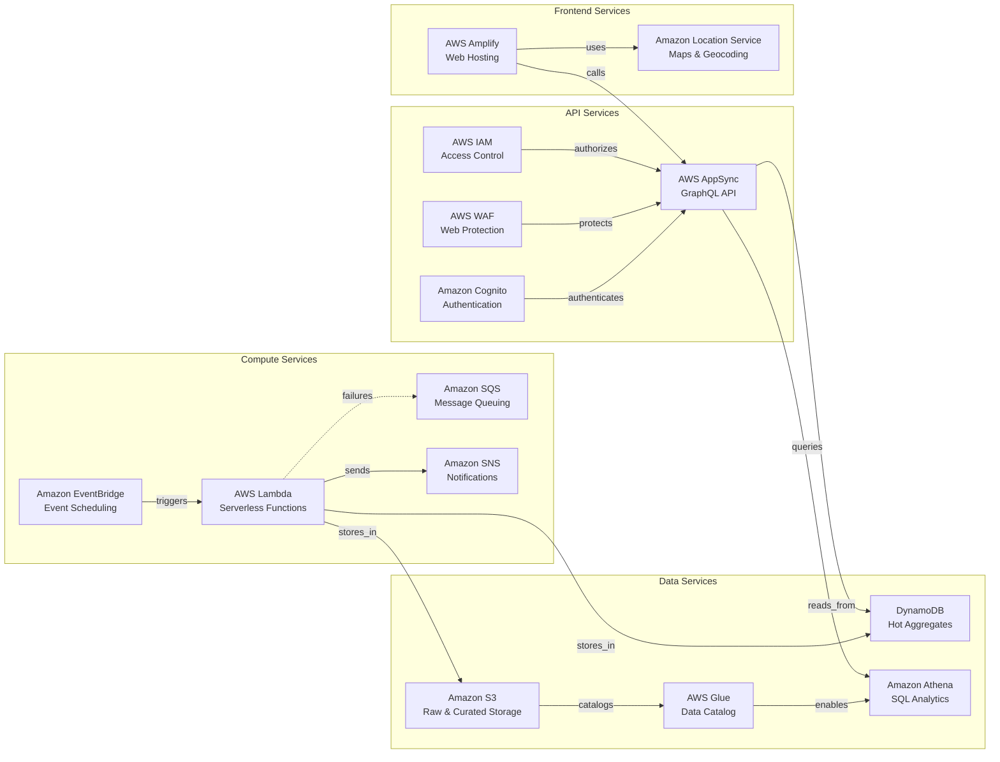
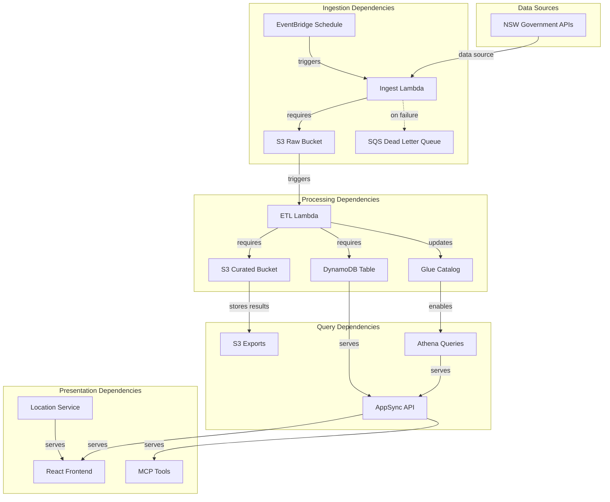

# Service Dependencies

*Comprehensive mapping of service interactions, dependencies, and resource relationships within the OpenData Pulse system.*

**Last Updated:** 2025-08-26 23:15:50  
**Generated from:** CDK stack definitions and infrastructure analysis

## Overview

The OpenData Pulse system consists of 5 interconnected CDK stacks with 5 explicit dependencies and 6 service relationships.

### Dependency Statistics
- **Stack Dependencies:** 5 explicit cross-stack dependencies
- **Service Relationships:** 6 inter-service relationships
- **Deployment Phases:** 4 deployment phases
- **Critical Path:** DataStack → ComputeStack → LocationStack → ApiStack → FrontendStack

### Architecture Characteristics
- **Layered Architecture:** Clear separation between data, compute, API, and presentation layers
- **Loose Coupling:** Services communicate through well-defined interfaces
- **High Cohesion:** Related functionality grouped within appropriate stacks
- **Dependency Direction:** Dependencies flow upward through architectural layers

## Cross-Stack Dependencies

### Stack Dependency Diagram

### Detailed Stack Dependencies

#### LocationStack

**Purpose:** Geographic and location services

**Dependencies:**
- **DataStack** (explicit): LocationStack depends on DataStack

**Consumed by:** None (top layer)

**Provides:**
- **Location Service:** air_quality_map, place_index

#### ComputeStack

**Purpose:** Compute and processing services

**Dependencies:**
- **DataStack** (explicit): ComputeStack depends on DataStack

**Consumed by:** ApiStack

**Provides:**
- **Lambda:** common_layer, powertools_layer, ingest_function (and 2 more)
- **SQS:** dlq
- **SNS:** notification_topic
- **IAM:** lambda_role
- **EventBridge:** ingestion_rule, health_check_rule

#### DataStack

**Purpose:** Data storage and management services

**Dependencies:** None (foundation layer)

**Consumed by:** ComputeStack, ApiStack, LocationStack

**Provides:**
- **S3:** raw_bucket, curated_bucket, exports_bucket
- **DynamoDB:** air_quality_table
- **Glue:** glue_database
- **Athena:** athena_workgroup
- **IAM:** glue_role

#### ApiStack

**Purpose:** API and authentication services

**Dependencies:**
- **DataStack** (explicit): ApiStack depends on DataStack
- **ComputeStack** (explicit): ApiStack depends on ComputeStack

**Consumed by:** FrontendStack

**Provides:**
- **Cognito:** user_pool, identity_pool
- **Unknown:** app_client
- **WAF:** web_acl
- **AppSync:** api
- **IAM:** authenticated_role, unauthenticated_role

#### FrontendStack

**Purpose:** Frontend hosting and distribution

**Dependencies:**
- **ApiStack** (explicit): FrontendStack depends on ApiStack

**Consumed by:** None (top layer)

**Provides:**
- **Amplify:** amplify_app, main_branch

## Service Interaction Map

### Service Interaction Diagram

### Service Relationship Details

#### Stores In Relationships

- **Lambda** stores_in **S3**
  - Source: `common_layer`
  - Target: `raw_bucket`
  - Description: common_layer stores_in raw_bucket

- **Lambda** stores_in **S3**
  - Source: `common_layer`
  - Target: `curated_bucket`
  - Description: common_layer stores_in curated_bucket

- **Lambda** stores_in **S3**
  - Source: `common_layer`
  - Target: `exports_bucket`
  - Description: common_layer stores_in exports_bucket

- **Lambda** stores_in **S3**
  - Source: `powertools_layer`
  - Target: `raw_bucket`
  - Description: powertools_layer stores_in raw_bucket

- **Lambda** stores_in **S3**
  - Source: `powertools_layer`
  - Target: `curated_bucket`
  - Description: powertools_layer stores_in curated_bucket

- **Lambda** stores_in **S3**
  - Source: `powertools_layer`
  - Target: `exports_bucket`
  - Description: powertools_layer stores_in exports_bucket

- **Lambda** stores_in **S3**
  - Source: `ingest_function`
  - Target: `raw_bucket`
  - Description: ingest_function stores_in raw_bucket

- **Lambda** stores_in **S3**
  - Source: `ingest_function`
  - Target: `curated_bucket`
  - Description: ingest_function stores_in curated_bucket

- **Lambda** stores_in **S3**
  - Source: `ingest_function`
  - Target: `exports_bucket`
  - Description: ingest_function stores_in exports_bucket

- **Lambda** stores_in **S3**
  - Source: `etl_function`
  - Target: `raw_bucket`
  - Description: etl_function stores_in raw_bucket

- **Lambda** stores_in **S3**
  - Source: `etl_function`
  - Target: `curated_bucket`
  - Description: etl_function stores_in curated_bucket

- **Lambda** stores_in **S3**
  - Source: `etl_function`
  - Target: `exports_bucket`
  - Description: etl_function stores_in exports_bucket

- **Lambda** stores_in **S3**
  - Source: `health_check_function`
  - Target: `raw_bucket`
  - Description: health_check_function stores_in raw_bucket

- **Lambda** stores_in **S3**
  - Source: `health_check_function`
  - Target: `curated_bucket`
  - Description: health_check_function stores_in curated_bucket

- **Lambda** stores_in **S3**
  - Source: `health_check_function`
  - Target: `exports_bucket`
  - Description: health_check_function stores_in exports_bucket

- **Lambda** stores_in **DynamoDB**
  - Source: `common_layer`
  - Target: `air_quality_table`
  - Description: common_layer stores_in air_quality_table

- **Lambda** stores_in **DynamoDB**
  - Source: `powertools_layer`
  - Target: `air_quality_table`
  - Description: powertools_layer stores_in air_quality_table

- **Lambda** stores_in **DynamoDB**
  - Source: `ingest_function`
  - Target: `air_quality_table`
  - Description: ingest_function stores_in air_quality_table

- **Lambda** stores_in **DynamoDB**
  - Source: `etl_function`
  - Target: `air_quality_table`
  - Description: etl_function stores_in air_quality_table

- **Lambda** stores_in **DynamoDB**
  - Source: `health_check_function`
  - Target: `air_quality_table`
  - Description: health_check_function stores_in air_quality_table

#### Triggers Relationships

- **EventBridge** triggers **Lambda**
  - Source: `ingestion_rule`
  - Target: `common_layer`
  - Description: ingestion_rule triggers common_layer

- **EventBridge** triggers **Lambda**
  - Source: `ingestion_rule`
  - Target: `powertools_layer`
  - Description: ingestion_rule triggers powertools_layer

- **EventBridge** triggers **Lambda**
  - Source: `ingestion_rule`
  - Target: `ingest_function`
  - Description: ingestion_rule triggers ingest_function

- **EventBridge** triggers **Lambda**
  - Source: `ingestion_rule`
  - Target: `etl_function`
  - Description: ingestion_rule triggers etl_function

- **EventBridge** triggers **Lambda**
  - Source: `ingestion_rule`
  - Target: `health_check_function`
  - Description: ingestion_rule triggers health_check_function

- **EventBridge** triggers **Lambda**
  - Source: `health_check_rule`
  - Target: `common_layer`
  - Description: health_check_rule triggers common_layer

- **EventBridge** triggers **Lambda**
  - Source: `health_check_rule`
  - Target: `powertools_layer`
  - Description: health_check_rule triggers powertools_layer

- **EventBridge** triggers **Lambda**
  - Source: `health_check_rule`
  - Target: `ingest_function`
  - Description: health_check_rule triggers ingest_function

- **EventBridge** triggers **Lambda**
  - Source: `health_check_rule`
  - Target: `etl_function`
  - Description: health_check_rule triggers etl_function

- **EventBridge** triggers **Lambda**
  - Source: `health_check_rule`
  - Target: `health_check_function`
  - Description: health_check_rule triggers health_check_function

#### Authenticates With Relationships

- **AppSync** authenticates_with **Cognito**
  - Source: `api`
  - Target: `user_pool`
  - Description: api authenticates_with user_pool

#### Processed By Relationships

- **S3** processed_by **Glue**
  - Source: `raw_bucket`
  - Target: `glue_database`
  - Description: raw_bucket processed_by glue_database

- **S3** processed_by **Glue**
  - Source: `curated_bucket`
  - Target: `glue_database`
  - Description: curated_bucket processed_by glue_database

- **S3** processed_by **Glue**
  - Source: `exports_bucket`
  - Target: `glue_database`
  - Description: exports_bucket processed_by glue_database

#### Queried By Relationships

- **S3** queried_by **Athena**
  - Source: `raw_bucket`
  - Target: `athena_workgroup`
  - Description: raw_bucket queried_by athena_workgroup

- **S3** queried_by **Athena**
  - Source: `curated_bucket`
  - Target: `athena_workgroup`
  - Description: curated_bucket queried_by athena_workgroup

- **S3** queried_by **Athena**
  - Source: `exports_bucket`
  - Target: `athena_workgroup`
  - Description: exports_bucket queried_by athena_workgroup

## Resource Dependencies

### Resource Dependencies

#### Critical Resource Dependencies

##### ingest_function (Lambda)

**Stack:** ComputeStack
**Purpose:** Serverless compute

##### etl_function (Lambda)

**Stack:** ComputeStack
**Purpose:** Serverless compute

##### health_check_function (Lambda)

**Stack:** ComputeStack
**Purpose:** Serverless compute

##### raw_bucket (S3)

**Stack:** DataStack
**Purpose:** Data storage

##### curated_bucket (S3)

**Stack:** DataStack
**Purpose:** Data storage

##### exports_bucket (S3)

**Stack:** DataStack
**Purpose:** Data storage

##### air_quality_table (DynamoDB)

**Stack:** DataStack
**Purpose:** Data storage and retrieval

##### user_pool (Cognito)

**Stack:** ApiStack
**Purpose:** User authentication

##### identity_pool (Cognito)

**Stack:** ApiStack
**Purpose:** User authentication

##### api (AppSync)

**Stack:** ApiStack
**Purpose:** API endpoint

## Data Flow Dependencies

### Data Flow Dependencies

#### Data Flow Stages

##### Data Ingestion

**Dependencies:** NSW Government APIs, EventBridge scheduling, S3 raw storage

**Components:**
- `ingest_function` (Lambda) - Serverless compute
- `ingestion_rule` (EventBridge) - Event scheduling
- `ApiStack` (CloudFormation) - API and authentication services
- `api` (AppSync) - API endpoint

##### Data Processing

**Dependencies:** S3 raw data, Lambda execution environment, DynamoDB tables

**Components:**
- `common_layer` (Lambda) - Lambda resource
- `powertools_layer` (Lambda) - Lambda resource
- `etl_function` (Lambda) - Serverless compute
- `health_check_function` (Lambda) - Serverless compute
- `glue_database` (Glue) - Glue resource

##### Data Storage

**Dependencies:** Processed data, Glue catalog, Athena workgroup

**Components:**
- `raw_bucket` (S3) - Data storage
- `curated_bucket` (S3) - Data storage
- `exports_bucket` (S3) - Data storage
- `air_quality_table` (DynamoDB) - Data storage and retrieval

##### Data Access

**Dependencies:** Stored data, Authentication services, Authorization policies

## Naming Conventions

### Resource Naming Conventions

#### Naming Patterns

- Resources use descriptive names indicating their purpose
- Stack names follow OpenDataPulse{Purpose}Stack pattern
- S3 buckets include account ID for global uniqueness
- Lambda functions use {Purpose}Function naming pattern
- DynamoDB tables use kebab-case naming

#### Naming Examples by Service

##### Location Service

- `air_quality_map` (CfnMap) in LocationStack
- `place_index` (CfnPlaceIndex) in LocationStack

##### Lambda

- `common_layer` (LayerVersion) in ComputeStack
- `powertools_layer` (LayerVersion) in ComputeStack
- `ingest_function` (Function) in ComputeStack
- ... and 2 more resources

##### SQS

- `dlq` (Queue) in ComputeStack

##### SNS

- `notification_topic` (Topic) in ComputeStack

##### IAM

- `lambda_role` (Role) in ComputeStack
- `glue_role` (Role) in DataStack
- `authenticated_role` (Role) in ApiStack
- ... and 1 more resources

##### EventBridge

- `ingestion_rule` (Rule) in ComputeStack
- `health_check_rule` (Rule) in ComputeStack

##### S3

- `raw_bucket` (Bucket) in DataStack
- `curated_bucket` (Bucket) in DataStack
- `exports_bucket` (Bucket) in DataStack

##### DynamoDB

- `air_quality_table` (Table) in DataStack

##### Glue

- `glue_database` (CfnDatabase) in DataStack

##### Athena

- `athena_workgroup` (CfnWorkGroup) in DataStack

##### Cognito

- `user_pool` (UserPool) in ApiStack
- `identity_pool` (CfnIdentityPool) in ApiStack

##### WAF

- `web_acl` (CfnWebACL) in ApiStack

##### AppSync

- `api` (GraphqlApi) in ApiStack

##### Amplify

- `amplify_app` (CfnApp) in FrontendStack
- `main_branch` (CfnBranch) in FrontendStack

#### Naming Convention Rules

1. **Prefix Pattern:** All resources use `opendata-pulse-` prefix
2. **Account ID Suffix:** S3 buckets include account ID for global uniqueness
3. **Descriptive Names:** Resource names clearly indicate their purpose
4. **Consistent Casing:** Use kebab-case for most resources, PascalCase for CDK constructs
5. **Stack Grouping:** Related resources grouped within appropriate stacks

#### Examples by Resource Type

| Resource Type | Pattern | Example |
|---------------|---------|---------|
| S3 Bucket | `opendata-pulse-{purpose}-{account-id}` | `opendata-pulse-raw-data-123456789012` |
| DynamoDB Table | `opendata-pulse-{purpose}` | `opendata-pulse-air-quality` |
| Lambda Function | `{Purpose}Function` | `DataIngestFunction` |
| IAM Role | `{Purpose}Role` | `LambdaExecutionRole` |
| EventBridge Rule | `{Purpose}Rule` | `DataIngestionRule` |

## Dependency Matrix

### Stack Dependency Matrix

| Stack | DataStack | ComputeStack | APIStack | FrontendStack | LocationStack |
|-------|-----------|--------------|----------|---------------|---------------|
| LocationStack | - | - | ✓ | - | - |
| ComputeStack | - | - | ✓ | - | - |
| DataStack | - | - | - | - | - |
| ApiStack | - | ✓ | ✓ | - | - |
| FrontendStack | - | - | - | ✓ | - |

**Legend:**
- ✓ = Direct dependency
- - = No dependency

**Reading the Matrix:**
- Rows represent dependent stacks
- Columns represent dependency targets
- ✓ indicates that the row stack depends on the column stack

## Impact Analysis

### Impact Analysis

#### Change Impact Assessment

Understanding the impact of changes to each stack:

##### LocationStack Changes

**Direct Impact:** None (leaf stack)
**Risk Level:** Low

##### ComputeStack Changes

**Direct Impact:** ApiStack
**Cascading Impact:** FrontendStack
**Risk Level:** Medium

##### DataStack Changes

**Direct Impact:** ComputeStack, ApiStack, LocationStack
**Cascading Impact:** FrontendStack, ApiStack
**Risk Level:** High

##### ApiStack Changes

**Direct Impact:** FrontendStack
**Risk Level:** Medium

##### FrontendStack Changes

**Direct Impact:** None (leaf stack)
**Risk Level:** Low

#### Deployment Risk Assessment

**High Risk Changes:**
- DataStack modifications (affects all other stacks)
- Breaking changes to GraphQL schema in APIStack
- Authentication changes in Cognito configuration

**Medium Risk Changes:**
- Lambda function updates in ComputeStack
- New API endpoints in APIStack
- Frontend deployment in FrontendStack

**Low Risk Changes:**
- LocationStack updates (isolated geographic features)
- Non-breaking schema additions
- Configuration parameter updates

#### Rollback Considerations

**Rollback Order:** Reverse of deployment order
1. FrontendStack (lowest risk)
2. APIStack (medium risk - may affect active users)
3. ComputeStack & LocationStack (medium risk - may affect data processing)
4. DataStack (highest risk - data retention policies apply)

**Data Considerations:**
- S3 buckets have retention policies preventing accidental deletion
- DynamoDB tables use point-in-time recovery
- Lambda functions support blue/green deployments

---

*This documentation is automatically generated from CDK stack definitions and updated with infrastructure changes.*
