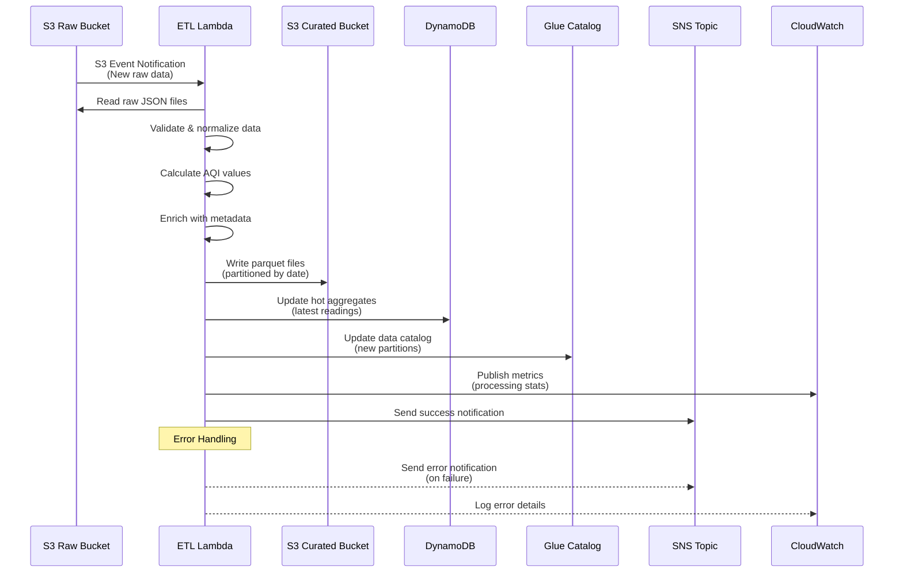

# ETL Processing Pipeline

## Overview

The ETL (Extract, Transform, Load) processing pipeline transforms raw NSW Air Quality data from S3 into curated, analysis-ready formats. The pipeline processes data in near real-time, creating both structured parquet files for analytical queries and hot aggregates in DynamoDB for fast API responses.

## Architecture Components

- **S3 Event Notifications**: Trigger ETL when new raw data arrives
- **Lambda ETL Function**: Processes and transforms raw data
- **S3 Curated Bucket**: Stores processed parquet files
- **DynamoDB Table**: Hot aggregates for real-time queries
- **Glue Data Catalog**: Metadata for processed datasets
- **SNS Notifications**: Success/failure alerts
- **CloudWatch**: Monitoring and observability

## ETL Processing Flow



## Data Transformation Process

### 1. Extract Phase

#### Input Data Structure
Raw data from S3 follows this structure:
```json
{
  "station_id": "001",
  "station_name": "Rozelle",
  "latitude": -33.8606,
  "longitude": 151.1711,
  "suburb": "Rozelle",
  "region": "Sydney East",
  "timestamp": "2024-01-15T10:00:00Z",
  "readings": {
    "PM2.5": 12.5,
    "PM10": 18.3,
    "NO2": 45.2,
    "O3": 78.1,
    "SO2": 2.1,
    "CO": 0.8
  },
  "metadata": {
    "data_quality": "Good",
    "calibration_date": "2024-01-01",
    "instrument_status": "Operational"
  }
}
```

#### Data Extraction Logic
```python
def extract_raw_data(s3_event):
    """Extract raw data from S3 based on event notification"""
    bucket = s3_event['Records'][0]['s3']['bucket']['name']
    key = s3_event['Records'][0]['s3']['object']['key']
    
    # Parse S3 key to extract partition information
    # Format: nsw-air-quality/raw/YYYY/MM/DD/HH/filename.json
    path_parts = key.split('/')
    year, month, day, hour = path_parts[2:6]
    
    # Read all files in the partition
    raw_data = []
    for obj in s3_client.list_objects_v2(
        Bucket=bucket, 
        Prefix=f"nsw-air-quality/raw/{year}/{month}/{day}/{hour}/"
    )['Contents']:
        data = json.loads(s3_client.get_object(
            Bucket=bucket, 
            Key=obj['Key']
        )['Body'].read())
        raw_data.append(data)
    
    return raw_data, (year, month, day, hour)
```

### 2. Transform Phase

#### Data Validation and Cleaning
```python
def validate_and_clean(raw_record):
    """Validate and clean individual air quality record"""
    cleaned_record = {}
    
    # Required fields validation
    required_fields = ['station_id', 'timestamp', 'latitude', 'longitude']
    for field in required_fields:
        if field not in raw_record or raw_record[field] is None:
            raise ValueError(f"Missing required field: {field}")
    
    # Data type validation and conversion
    cleaned_record['station_id'] = str(raw_record['station_id']).zfill(3)
    cleaned_record['timestamp'] = pd.to_datetime(raw_record['timestamp'])
    cleaned_record['latitude'] = float(raw_record['latitude'])
    cleaned_record['longitude'] = float(raw_record['longitude'])
    
    # Pollutant readings validation
    pollutants = ['PM2.5', 'PM10', 'NO2', 'O3', 'SO2', 'CO']
    for pollutant in pollutants:
        value = raw_record.get('readings', {}).get(pollutant)
        if value is not None and value >= 0:
            cleaned_record[f"{pollutant}_value"] = float(value)
        else:
            cleaned_record[f"{pollutant}_value"] = None
    
    return cleaned_record
```

#### Air Quality Index (AQI) Calculation
```python
def calculate_aqi(pollutant_values):
    """Calculate AQI based on NSW air quality standards"""
    aqi_breakpoints = {
        'PM2.5': [(0, 8, 0, 33), (8, 16, 34, 66), (16, 25, 67, 99), (25, 37, 100, 149)],
        'PM10': [(0, 25, 0, 33), (25, 50, 34, 66), (50, 75, 67, 99), (75, 100, 100, 149)],
        'NO2': [(0, 40, 0, 33), (40, 80, 34, 66), (80, 120, 67, 99), (120, 160, 100, 149)],
        'O3': [(0, 50, 0, 33), (50, 100, 34, 66), (100, 150, 67, 99), (150, 200, 100, 149)]
    }
    
    max_aqi = 0
    dominant_pollutant = None
    
    for pollutant, value in pollutant_values.items():
        if value is None or pollutant not in aqi_breakpoints:
            continue
            
        # Find appropriate breakpoint
        for bp_low, bp_high, aqi_low, aqi_high in aqi_breakpoints[pollutant]:
            if bp_low <= value <= bp_high:
                # Linear interpolation
                aqi = ((aqi_high - aqi_low) / (bp_high - bp_low)) * (value - bp_low) + aqi_low
                if aqi > max_aqi:
                    max_aqi = aqi
                    dominant_pollutant = pollutant
                break
    
    return {
        'aqi_value': round(max_aqi),
        'aqi_category': get_aqi_category(max_aqi),
        'dominant_pollutant': dominant_pollutant
    }

def get_aqi_category(aqi_value):
    """Convert AQI value to category"""
    if aqi_value <= 33:
        return 'Good'
    elif aqi_value <= 66:
        return 'Fair'
    elif aqi_value <= 99:
        return 'Poor'
    elif aqi_value <= 149:
        return 'Very Poor'
    else:
        return 'Extremely Poor'
```

#### Data Enrichment
```python
def enrich_with_metadata(record):
    """Enrich record with additional metadata"""
    # Add geographic information
    record['suburb'] = get_suburb_from_coordinates(
        record['latitude'], 
        record['longitude']
    )
    record['region'] = get_region_from_suburb(record['suburb'])
    record['postcode'] = get_postcode_from_coordinates(
        record['latitude'], 
        record['longitude']
    )
    
    # Add temporal features
    dt = record['timestamp']
    record['year'] = dt.year
    record['month'] = dt.month
    record['day'] = dt.day
    record['hour'] = dt.hour
    record['day_of_week'] = dt.dayofweek
    record['is_weekend'] = dt.dayofweek >= 5
    
    # Add data quality indicators
    record['data_completeness'] = calculate_completeness(record)
    record['data_freshness_minutes'] = (
        datetime.now(timezone.utc) - dt
    ).total_seconds() / 60
    
    return record
```

### 3. Load Phase

#### Curated Data Storage (S3 Parquet)
```python
def save_to_curated_s3(processed_data, partition_info):
    """Save processed data as parquet files in S3"""
    year, month, day, hour = partition_info
    
    # Convert to pandas DataFrame
    df = pd.DataFrame(processed_data)
    
    # Partition path
    partition_path = f"nsw-air-quality/curated/year={year}/month={month}/day={day}/hour={hour}/"
    
    # Save as parquet with compression
    parquet_buffer = io.BytesIO()
    df.to_parquet(
        parquet_buffer, 
        engine='pyarrow',
        compression='snappy',
        index=False
    )
    
    # Upload to S3
    s3_key = f"{partition_path}air-quality-{year}{month}{day}{hour}.parquet"
    s3_client.put_object(
        Bucket=os.getenv('CURATED_BUCKET_NAME'),
        Key=s3_key,
        Body=parquet_buffer.getvalue(),
        ContentType='application/octet-stream',
        Metadata={
            'record_count': str(len(df)),
            'processing_timestamp': datetime.now(timezone.utc).isoformat(),
            'data_version': '1.0'
        }
    )
    
    return s3_key
```

#### Hot Aggregates (DynamoDB)
```python
def update_dynamodb_aggregates(processed_data):
    """Update DynamoDB with latest readings and aggregates"""
    table_name = os.getenv('DYNAMODB_TABLE_NAME')
    
    for record in processed_data:
        # Latest reading per station
        latest_item = {
            'PK': f"STATION#{record['station_id']}",
            'SK': 'LATEST',
            'station_name': record.get('station_name', ''),
            'suburb': record['suburb'],
            'region': record['region'],
            'latitude': Decimal(str(record['latitude'])),
            'longitude': Decimal(str(record['longitude'])),
            'timestamp': record['timestamp'].isoformat(),
            'aqi_value': record['aqi_value'],
            'aqi_category': record['aqi_category'],
            'dominant_pollutant': record['dominant_pollutant'],
            'TTL': int((datetime.now() + timedelta(days=7)).timestamp())
        }
        
        # Add pollutant values
        for pollutant in ['PM2.5', 'PM10', 'NO2', 'O3', 'SO2', 'CO']:
            value = record.get(f"{pollutant}_value")
            if value is not None:
                latest_item[f"{pollutant}_value"] = Decimal(str(value))
        
        # Put item in DynamoDB
        dynamodb_client.put_item(
            TableName=table_name,
            Item=latest_item
        )
        
        # Hourly aggregate per suburb
        hourly_key = record['timestamp'].strftime('%Y-%m-%d-%H')
        aggregate_item = {
            'PK': f"SUBURB#{record['suburb']}",
            'SK': f"HOURLY#{hourly_key}",
            'timestamp': record['timestamp'].isoformat(),
            'station_count': 1,
            'avg_aqi': Decimal(str(record['aqi_value'])),
            'max_aqi': Decimal(str(record['aqi_value'])),
            'TTL': int((datetime.now() + timedelta(days=30)).timestamp())
        }
        
        # Update or create aggregate (would need proper aggregation logic)
        dynamodb_client.put_item(
            TableName=table_name,
            Item=aggregate_item
        )
```

## Output Data Formats

### Curated Parquet Schema
```python
# Parquet file schema
parquet_schema = {
    'station_id': 'string',
    'station_name': 'string',
    'latitude': 'double',
    'longitude': 'double',
    'suburb': 'string',
    'region': 'string',
    'postcode': 'string',
    'timestamp': 'timestamp',
    'year': 'int32',
    'month': 'int32',
    'day': 'int32',
    'hour': 'int32',
    'day_of_week': 'int32',
    'is_weekend': 'boolean',
    'PM2.5_value': 'double',
    'PM10_value': 'double',
    'NO2_value': 'double',
    'O3_value': 'double',
    'SO2_value': 'double',
    'CO_value': 'double',
    'aqi_value': 'int32',
    'aqi_category': 'string',
    'dominant_pollutant': 'string',
    'data_completeness': 'double',
    'data_freshness_minutes': 'double'
}
```

### DynamoDB Hot Aggregates Schema
```python
# Latest readings per station
{
    'PK': 'STATION#001',           # Partition Key
    'SK': 'LATEST',                # Sort Key
    'station_name': 'Rozelle',
    'suburb': 'Rozelle',
    'region': 'Sydney East',
    'latitude': -33.8606,
    'longitude': 151.1711,
    'timestamp': '2024-01-15T10:00:00Z',
    'aqi_value': 45,
    'aqi_category': 'Fair',
    'dominant_pollutant': 'PM2.5',
    'PM2.5_value': 12.5,
    'PM10_value': 18.3,
    'TTL': 1705939200
}

# Hourly aggregates per suburb
{
    'PK': 'SUBURB#Rozelle',       # Partition Key
    'SK': 'HOURLY#2024-01-15-10', # Sort Key
    'timestamp': '2024-01-15T10:00:00Z',
    'station_count': 2,
    'avg_aqi': 42.5,
    'max_aqi': 45,
    'avg_pm25': 11.8,
    'max_pm25': 12.5,
    'TTL': 1708531200
}
```

## Performance Optimization

### Current Performance Metrics
- **Processing Time**: ~5-8 minutes for 25 stations/hour
- **Memory Usage**: 1024MB allocated, ~600MB peak usage
- **Throughput**: ~100-150 records per execution
- **S3 Operations**: ~10 reads, ~5 writes per execution

### Optimization Strategies

#### 1. Batch Processing
```python
# Process records in batches for better performance
def process_in_batches(records, batch_size=50):
    for i in range(0, len(records), batch_size):
        batch = records[i:i + batch_size]
        yield process_batch(batch)
```

#### 2. Parallel Processing
```python
# Use multiprocessing for CPU-intensive operations
from concurrent.futures import ProcessPoolExecutor

def parallel_transform(records):
    with ProcessPoolExecutor(max_workers=4) as executor:
        futures = [executor.submit(transform_record, record) for record in records]
        return [future.result() for future in futures]
```

#### 3. Memory Optimization
```python
# Stream processing for large datasets
def stream_process_s3_data(bucket, prefix):
    paginator = s3_client.get_paginator('list_objects_v2')
    
    for page in paginator.paginate(Bucket=bucket, Prefix=prefix):
        for obj in page.get('Contents', []):
            # Process one file at a time
            yield process_s3_object(bucket, obj['Key'])
```

## Error Handling and Data Quality

### Data Validation Rules
1. **Required Fields**: station_id, timestamp, coordinates
2. **Data Types**: Numeric pollutant values, valid timestamps
3. **Range Validation**: Pollutant values within realistic ranges
4. **Temporal Validation**: Timestamps within expected window
5. **Geographic Validation**: Coordinates within NSW boundaries

### Error Categories and Handling

#### 1. Data Quality Issues
```python
def handle_data_quality_error(record, error_type, error_details):
    """Handle data quality issues with appropriate actions"""
    quality_issue = {
        'record_id': record.get('station_id', 'unknown'),
        'timestamp': record.get('timestamp', 'unknown'),
        'error_type': error_type,
        'error_details': error_details,
        'action_taken': None
    }
    
    if error_type == 'missing_pollutant':
        # Continue processing with null values
        quality_issue['action_taken'] = 'processed_with_nulls'
        logger.warning("Missing pollutant data", extra=quality_issue)
        
    elif error_type == 'invalid_range':
        # Flag as anomaly but include in processing
        record['data_quality_flag'] = 'anomaly'
        quality_issue['action_taken'] = 'flagged_as_anomaly'
        logger.warning("Pollutant value out of range", extra=quality_issue)
        
    elif error_type == 'missing_coordinates':
        # Skip record - cannot process without location
        quality_issue['action_taken'] = 'record_skipped'
        logger.error("Missing coordinates", extra=quality_issue)
        raise ValueError("Cannot process record without coordinates")
    
    return quality_issue
```

#### 2. Processing Failures
```python
def handle_processing_failure(batch, error):
    """Handle batch processing failures with recovery"""
    logger.error("Batch processing failed", extra={
        'batch_size': len(batch),
        'error': str(error),
        'error_type': type(error).__name__
    })
    
    # Try processing records individually
    successful_records = []
    failed_records = []
    
    for record in batch:
        try:
            processed = transform_record(record)
            successful_records.append(processed)
        except Exception as individual_error:
            failed_records.append({
                'record': record,
                'error': str(individual_error)
            })
    
    # Store failed records for manual review
    if failed_records:
        store_failed_records(failed_records)
    
    return successful_records
```

### Data Quality Metrics
```python
def calculate_quality_metrics(processed_records, raw_records):
    """Calculate data quality metrics for monitoring"""
    total_raw = len(raw_records)
    total_processed = len(processed_records)
    
    # Completeness metrics
    completeness_rate = total_processed / total_raw if total_raw > 0 else 0
    
    # Field completeness
    field_completeness = {}
    for field in ['PM2.5_value', 'PM10_value', 'NO2_value', 'O3_value']:
        non_null_count = sum(1 for r in processed_records if r.get(field) is not None)
        field_completeness[field] = non_null_count / total_processed if total_processed > 0 else 0
    
    # Publish metrics to CloudWatch
    metrics.add_metric(name="DataCompletenessRate", unit="Percent", value=completeness_rate * 100)
    metrics.add_metric(name="RecordsProcessed", unit="Count", value=total_processed)
    metrics.add_metric(name="RecordsFailed", unit="Count", value=total_raw - total_processed)
    
    return {
        'completeness_rate': completeness_rate,
        'field_completeness': field_completeness,
        'total_processed': total_processed,
        'total_failed': total_raw - total_processed
    }
```

## Monitoring and Alerting

### CloudWatch Metrics
| Metric Name | Unit | Description | Alert Threshold |
|-------------|------|-------------|-----------------|
| `ETLProcessingAttempts` | Count | Processing attempts | - |
| `RecordsProcessed` | Count | Successfully processed records | < 80% of expected |
| `RecordsValidated` | Count | Records passing validation | < 90% of processed |
| `RecordsFailed` | Count | Failed processing attempts | > 10% of total |
| `ProcessingDurationMs` | Milliseconds | ETL execution time | > 600,000 (10 min) |
| `DataCompletenessRate` | Percent | Data completeness percentage | < 85% |
| `S3WriteOperations` | Count | S3 write operations | - |
| `DynamoDBWriteOperations` | Count | DynamoDB write operations | - |

### Structured Logging
```json
{
  "timestamp": "2024-01-15T10:05:00Z",
  "level": "INFO",
  "service": "opendata-pulse-etl",
  "event_type": "etl_processing_completed",
  "records_processed": 100,
  "records_validated": 95,
  "records_failed": 5,
  "processing_duration_ms": 45000,
  "data_completeness_rate": 0.95,
  "partition": "2024/01/15/10"
}
```

### Alert Configurations

#### Critical Alerts (Immediate Response)
- ETL processing failures (> 50% failure rate)
- No successful processing in 2+ hours
- Data completeness < 70%
- Processing time > 15 minutes

#### Warning Alerts (Next Business Day)
- Data completeness 70-85%
- Individual station processing failures
- Performance degradation (> 10 minutes)
- High validation failure rate (> 15%)

## Troubleshooting Guide

### Common Issues and Solutions

#### Issue: "High validation failure rate"
**Symptoms**: `RecordsFailed` metric increasing, validation errors in logs
**Diagnosis**:
```bash
# Check recent validation errors
aws logs filter-log-events \
  --log-group-name /aws/lambda/ETLFunction \
  --filter-pattern "validation_error" \
  --start-time $(date -d '1 hour ago' +%s)000
```
**Resolution**:
- Review NSW API response format changes
- Update validation rules if data format evolved
- Check for new pollutants or measurement units

#### Issue: "DynamoDB write throttling"
**Symptoms**: DynamoDB write errors, increased processing time
**Diagnosis**:
```bash
# Check DynamoDB metrics
aws cloudwatch get-metric-statistics \
  --namespace AWS/DynamoDB \
  --metric-name ThrottledRequests \
  --dimensions Name=TableName,Value=opendata-pulse-air-quality \
  --start-time $(date -d '1 hour ago' --iso-8601) \
  --end-time $(date --iso-8601) \
  --period 300 \
  --statistics Sum
```
**Resolution**:
- Implement exponential backoff for DynamoDB writes
- Consider batch write operations
- Review DynamoDB capacity settings

#### Issue: "S3 parquet files corrupted"
**Symptoms**: Athena query failures, parquet read errors
**Diagnosis**:
```python
# Validate parquet file integrity
import pandas as pd
try:
    df = pd.read_parquet(s3_path)
    print(f"File valid: {len(df)} records")
except Exception as e:
    print(f"File corrupted: {e}")
```
**Resolution**:
- Implement parquet file validation before S3 upload
- Add file integrity checks using checksums
- Implement automatic retry for corrupted files

## Integration Points

### Upstream Dependencies
- **Data Ingestion Pipeline**: Provides raw data in S3
- **S3 Event Notifications**: Triggers ETL processing
- **NSW API**: Source of truth for data validation

### Downstream Consumers
- **Query Pipeline**: Reads curated parquet files
- **GraphQL API**: Queries DynamoDB hot aggregates
- **Analytics Dashboard**: Uses both S3 and DynamoDB data
- **MCP Tools**: Access processed data via API

## Configuration Management

### Environment Variables
```bash
# ETL Lambda Function Environment
POWERTOOLS_SERVICE_NAME=opendata-pulse-etl
POWERTOOLS_METRICS_NAMESPACE=OpenDataPulse/ETL
LOG_LEVEL=INFO
RAW_BUCKET_NAME=opendata-pulse-raw-data-123456789012
CURATED_BUCKET_NAME=opendata-pulse-curated-data-123456789012
DYNAMODB_TABLE_NAME=opendata-pulse-air-quality
GLUE_DATABASE_NAME=opendata_pulse_db
NOTIFICATION_TOPIC_ARN=arn:aws:sns:ap-southeast-2:123456789012:opendata-pulse-notifications
```

### Processing Configuration
```python
# ETL processing parameters
ETL_CONFIG = {
    'batch_size': 50,
    'max_workers': 4,
    'validation_rules': {
        'required_fields': ['station_id', 'timestamp', 'latitude', 'longitude'],
        'pollutant_ranges': {
            'PM2.5': (0, 500),
            'PM10': (0, 1000),
            'NO2': (0, 2000),
            'O3': (0, 1000)
        }
    },
    'aqi_calculation': 'nsw_standard',
    'data_retention_days': 365
}
```

For the next stage in the data pipeline, see [Query Pipeline Documentation](query-pipeline.md).