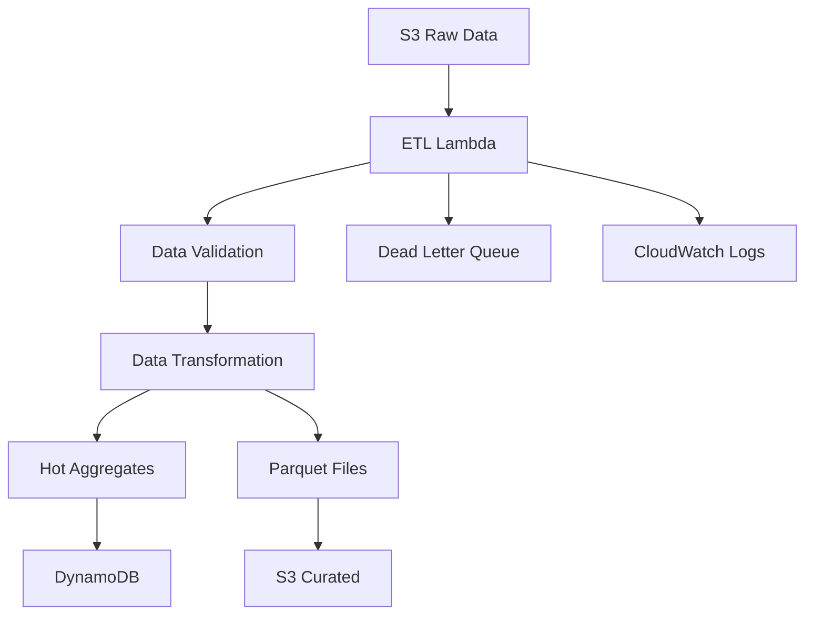

# ETL Processing Pipeline

*Documentation for raw to curated data transformation processes.*

## Overview

The ETL pipeline processes raw data from S3, applies transformations, and outputs curated data in multiple formats for different access patterns.

## Processing Stages

### ETL Lambda Function
- **Function**: `opendata-pulse-etl-processor`
- **Trigger**: S3 object creation events
- **Runtime**: Python 3.9 with pandas/pyarrow
- **Memory**: 1024 MB

### Transformation Steps
1. **Validation** - Schema validation and data quality checks
2. **Cleansing** - Remove duplicates, handle missing values
3. **Enrichment** - Add geographic coordinates, time zone conversion
4. **Aggregation** - Calculate hot aggregates for DynamoDB
5. **Partitioning** - Create parquet files with optimal partitioning

## Data Flow Diagram

*Content will be generated from ETL Lambda function analysis*