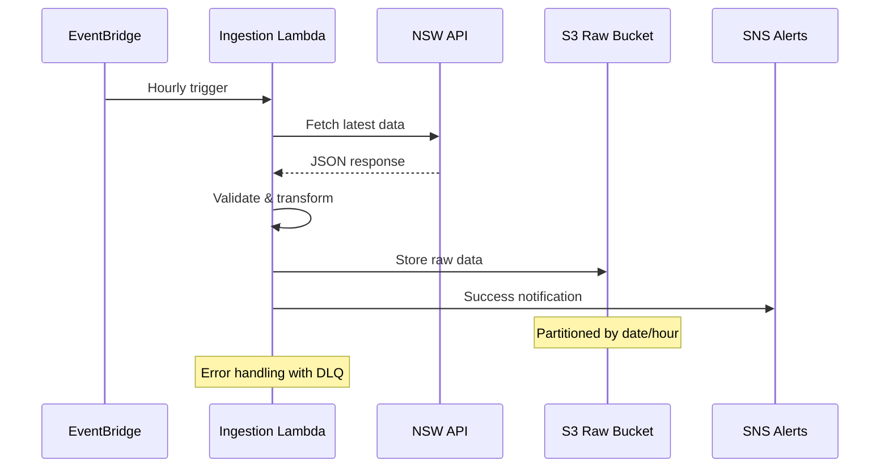

# Data Ingestion Pipeline

*Documentation for the NSW API to S3 raw data ingestion process.*

## Overview

The data ingestion pipeline automatically fetches data from NSW Government APIs on a scheduled basis and stores it in S3 raw data buckets with proper partitioning.

## Pipeline Components

### Ingestion Lambda Function
- **Function**: `opendata-pulse-data-ingest`
- **Runtime**: Python 3.9
- **Schedule**: Hourly via EventBridge
- **Timeout**: 5 minutes
- **Memory**: 512 MB

### Data Sources
- NSW Air Quality API
- Additional NSW Government APIs (configurable)

## Data Flow Diagram

*Content will be generated from Lambda function analysis*