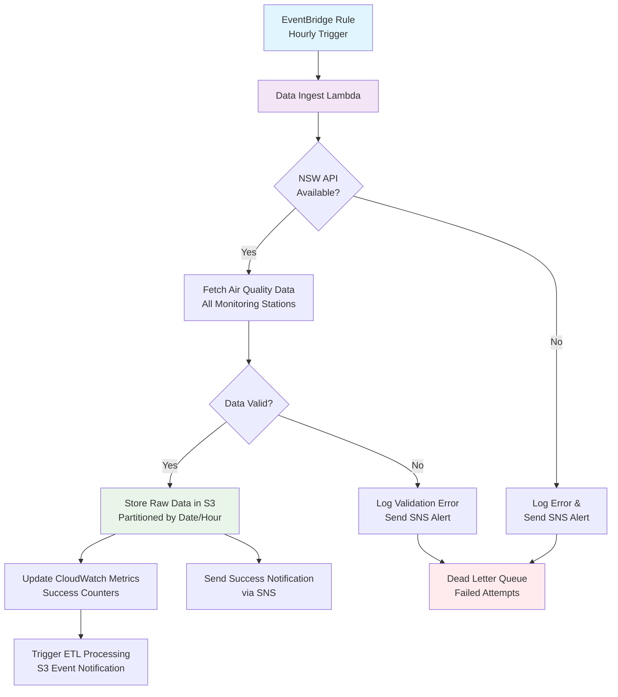

# Data Ingestion Pipeline

## Overview

The OpenData Pulse data ingestion pipeline automatically fetches NSW Air Quality data from the NSW Government API every hour and stores it in S3 for further processing. The pipeline is built using serverless AWS services to ensure scalability and cost-effectiveness.

## Architecture Components

- **EventBridge Rule**: Triggers ingestion every hour
- **Lambda Function**: Fetches data from NSW API and stores in S3
- **S3 Raw Bucket**: Stores unprocessed data with lifecycle policies
- **SNS Topic**: Sends notifications for success/failure events
- **SQS DLQ**: Handles failed processing attempts
- **CloudWatch**: Monitors metrics, logs, and alarms

## Data Ingestion Flow



## Step-by-Step Process

### 1. Scheduled Trigger
- **Frequency**: Every hour (configurable via EventBridge)
- **Trigger**: EventBridge rule `DataIngestionRule`
- **Target**: `DataIngestFunction` Lambda

### 2. NSW API Data Fetch
The Lambda function performs the following operations:

```python
# Environment Variables
NSW_API_BASE_URL = "https://data.airquality.nsw.gov.au"
POWERTOOLS_SERVICE_NAME = "opendata-pulse-ingest"
NOTIFICATION_TOPIC_ARN = "arn:aws:sns:..."
```

**API Endpoints**:
- Station metadata: `/api/Data/get_Stations`
- Current readings: `/api/Data/get_CurrentData`
- Historical data: `/api/Data/get_HistoricalData`

### 3. Data Processing Steps

#### 3.1 Station Discovery
```python
# Fetch all monitoring stations
stations_response = requests.get(f"{NSW_API_BASE_URL}/api/Data/get_Stations")
stations = stations_response.json()
```

#### 3.2 Data Collection
```python
# For each station, collect current air quality readings
for station in stations:
    station_data = requests.get(
        f"{NSW_API_BASE_URL}/api/Data/get_CurrentData",
        params={"stationId": station["Id"]}
    )
```

#### 3.3 Data Validation
- Check for required fields (station_id, timestamp, pollutant values)
- Validate data types and ranges
- Flag missing or anomalous readings

### 4. S3 Storage Structure

Raw data is stored in S3 with the following partitioning scheme:

```
s3://opendata-pulse-raw-data-{account-id}/
├── nsw-air-quality/
│   └── raw/
│       └── YYYY/          # Year partition
│           └── MM/        # Month partition
│               └── DD/    # Day partition
│                   └── HH/ # Hour partition
│                       ├── stations-metadata.json
│                       ├── station-001-readings.json
│                       ├── station-002-readings.json
│                       └── ...
```

**File Naming Convention**:
- Metadata: `stations-metadata-{timestamp}.json`
- Readings: `station-{station_id}-readings-{timestamp}.json`
- Timestamp format: `YYYYMMDDHHMM`

### 5. Monitoring and Observability

#### CloudWatch Metrics
The ingestion function publishes the following custom metrics:

| Metric Name | Unit | Description |
|-------------|------|-------------|
| `IngestionAttempts` | Count | Number of ingestion attempts |
| `StationsProcessed` | Count | Successfully processed stations |
| `DataPointsCollected` | Count | Total data points collected |
| `IngestionErrors` | Count | Failed ingestion attempts |

#### Structured Logging
All log entries include structured data for easy querying:

```json
{
  "timestamp": "2024-01-15T10:00:00Z",
  "level": "INFO",
  "service": "opendata-pulse-ingest",
  "event_type": "data_ingestion_started",
  "stations_processed": 25,
  "data_points_collected": 150
}
```

#### SNS Notifications
Success and error notifications are sent to the `opendata-pulse-notifications` topic:

**Success Notification**:
```json
{
  "status": "success",
  "service": "data-ingestion",
  "timestamp": "2024-01-15T10:00:00Z",
  "stations_processed": 25,
  "data_points_collected": 150
}
```

**Error Notification**:
```json
{
  "status": "error",
  "service": "data-ingestion",
  "timestamp": "2024-01-15T10:00:00Z",
  "error": "NSW API timeout after 30 seconds"
}
```

## Error Handling and Resilience

### Retry Logic
- **Lambda Retry**: Automatic retry on function failure (up to 2 attempts)
- **Dead Letter Queue**: Failed attempts sent to SQS DLQ for manual investigation
- **API Timeout**: 30-second timeout for NSW API calls
- **Exponential Backoff**: For rate limiting scenarios

### Common Error Scenarios

#### 1. NSW API Unavailable
**Symptoms**: HTTP 5xx errors, connection timeouts
**Response**: 
- Log error with structured data
- Send SNS alert to operations team
- Retry after exponential backoff
- Store partial data if some stations succeeded

#### 2. Invalid API Response
**Symptoms**: Malformed JSON, missing required fields
**Response**:
- Log validation errors with sample data
- Continue processing valid stations
- Flag problematic stations for investigation

#### 3. S3 Storage Failures
**Symptoms**: S3 PutObject errors, permission issues
**Response**:
- Retry with exponential backoff
- Send critical alert via SNS
- Store data in temporary location if possible

#### 4. Lambda Timeout
**Symptoms**: Function execution exceeds 5-minute limit
**Response**:
- Process stations in smaller batches
- Implement checkpointing for partial completion
- Scale memory allocation if needed

### Monitoring Alerts

#### Critical Alerts (Immediate Response)
- No successful ingestion in 2+ hours
- Error rate > 50% over 15 minutes
- S3 storage failures
- Lambda function errors

#### Warning Alerts (Next Business Day)
- Individual station failures
- Data validation warnings
- Performance degradation (>2 minute execution time)

## Performance Optimization

### Current Performance Metrics
- **Execution Time**: ~2-3 minutes for 25 stations
- **Memory Usage**: 512MB allocated, ~200MB peak usage
- **API Calls**: ~30 calls per execution (stations + readings)
- **Data Volume**: ~5MB raw data per hour

### Optimization Strategies

#### 1. Parallel Processing
```python
# Process stations concurrently
import concurrent.futures

with concurrent.futures.ThreadPoolExecutor(max_workers=5) as executor:
    futures = [executor.submit(process_station, station) for station in stations]
    results = [future.result() for future in futures]
```

#### 2. Caching Strategy
- Cache station metadata (updates infrequently)
- Use ETag headers for conditional requests
- Implement local caching for repeated API calls

#### 3. Batch Operations
- Batch S3 uploads using multipart upload
- Combine small files to reduce S3 request costs
- Use S3 Transfer Acceleration for large uploads

## Data Quality Assurance

### Validation Rules
1. **Required Fields**: station_id, timestamp, at least one pollutant reading
2. **Data Types**: Numeric values for pollutant concentrations
3. **Range Validation**: Pollutant values within expected ranges
4. **Temporal Validation**: Timestamps within expected time window

### Quality Metrics
- **Completeness**: Percentage of expected stations reporting
- **Accuracy**: Data validation pass rate
- **Timeliness**: Data freshness (time since last update)
- **Consistency**: Cross-validation with historical patterns

## Configuration Management

### Environment Variables
```bash
# Lambda Function Environment
POWERTOOLS_SERVICE_NAME=opendata-pulse-ingest
POWERTOOLS_METRICS_NAMESPACE=OpenDataPulse/Ingest
LOG_LEVEL=INFO
NSW_API_BASE_URL=https://data.airquality.nsw.gov.au
NOTIFICATION_TOPIC_ARN=arn:aws:sns:ap-southeast-2:123456789012:opendata-pulse-notifications
RAW_BUCKET_NAME=opendata-pulse-raw-data-123456789012
```

### CDK Configuration
```python
# EventBridge schedule (configurable)
schedule=events.Schedule.rate(Duration.hours(1))

# Lambda timeout and memory
timeout=Duration.minutes(5)
memory_size=512

# S3 lifecycle policies
transitions=[
    s3.Transition(
        storage_class=s3.StorageClass.INFREQUENT_ACCESS,
        transition_after=Duration.days(30)
    )
]
```

## Security Considerations

### IAM Permissions
The Lambda execution role has minimal required permissions:
- `s3:PutObject` on raw data bucket
- `sns:Publish` on notification topic
- `sqs:SendMessage` on dead letter queue
- `logs:CreateLogGroup`, `logs:CreateLogStream`, `logs:PutLogEvents`

### Data Protection
- All data encrypted at rest using S3-managed encryption
- API calls use HTTPS/TLS 1.2
- No sensitive data logged (API keys, personal information)
- VPC endpoints for internal AWS service communication

### Network Security
- Lambda function runs in default VPC (no custom VPC required)
- Outbound internet access for NSW API calls
- No inbound network access required
- WAF protection for any exposed endpoints

## Troubleshooting Guide

### Common Issues and Solutions

#### Issue: "No data ingested for 2+ hours"
**Diagnosis Steps**:
1. Check CloudWatch logs for Lambda execution errors
2. Verify EventBridge rule is enabled and triggering
3. Test NSW API availability manually
4. Check IAM permissions for S3 and SNS

**Resolution**:
```bash
# Check recent Lambda executions
aws logs filter-log-events \
  --log-group-name /aws/lambda/DataIngestFunction \
  --start-time $(date -d '2 hours ago' +%s)000

# Test EventBridge rule
aws events put-events \
  --entries Source=manual,DetailType=test,Detail='{}'
```

#### Issue: "High error rate in ingestion"
**Diagnosis Steps**:
1. Review CloudWatch metrics for error patterns
2. Check SNS notifications for specific error messages
3. Examine DLQ messages for failed attempts
4. Validate NSW API response format changes

**Resolution**:
- Update API parsing logic if format changed
- Increase Lambda timeout if processing is slow
- Add retry logic for transient failures

#### Issue: "S3 storage costs increasing rapidly"
**Diagnosis Steps**:
1. Check S3 bucket size and object count
2. Review lifecycle policy effectiveness
3. Analyze data volume trends
4. Verify partitioning strategy efficiency

**Resolution**:
- Adjust lifecycle policies for faster transitions
- Implement data compression before storage
- Review data retention requirements
- Consider S3 Intelligent Tiering

## Next Steps

After successful data ingestion, the pipeline triggers:
1. **ETL Processing**: Transform raw data into curated formats
2. **DynamoDB Updates**: Create hot aggregates for fast queries
3. **Data Catalog Updates**: Register new partitions in Glue
4. **Quality Checks**: Validate data completeness and accuracy

For detailed information on the next stage, see [ETL Processing Pipeline](etl-processing.md).