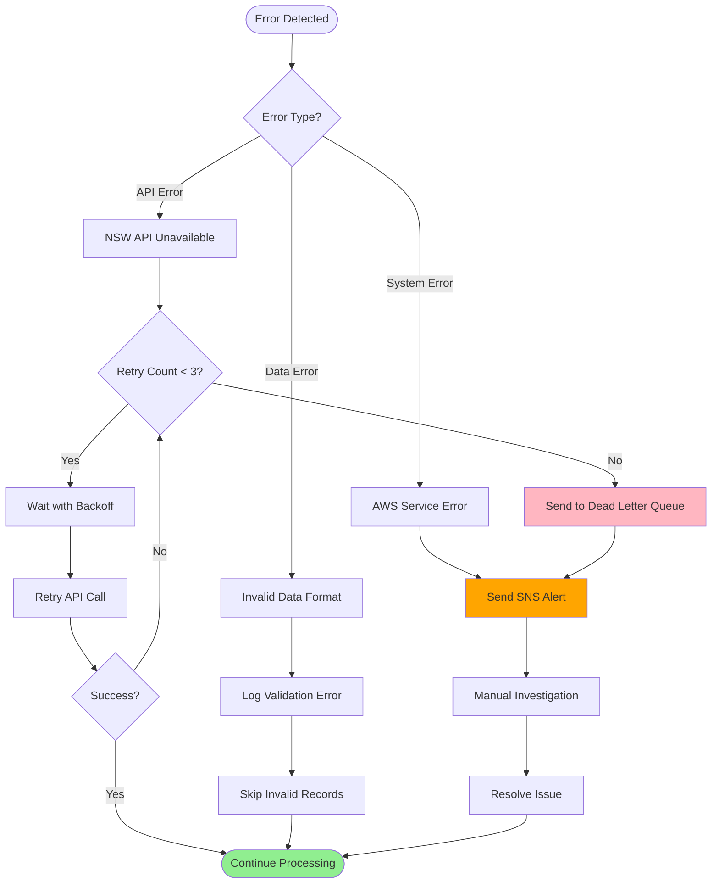

# Monitoring and Alerting

*Documentation for CloudWatch metrics, alarms, and logging patterns across all data processing stages.*

## Overview

Comprehensive monitoring and alerting system that provides visibility into data ingestion, processing, and serving with automated notifications for operational issues.

## Monitoring Architecture

### CloudWatch Components
- **Metrics**: Custom and AWS service metrics
- **Alarms**: Threshold-based alerting
- **Logs**: Structured logging with Lambda Powertools
- **Dashboards**: Operational visibility

### SNS Notifications
- **Success Notifications**: Data processing completion
- **Error Alerts**: Processing failures and retries
- **Health Checks**: System availability monitoring
- **Threshold Breaches**: Performance and cost alerts

## Error Handling Flow

## Key Metrics

### Data Ingestion Metrics
- API response times and success rates
- Data volume ingested per hour
- Lambda function duration and errors
- S3 object creation rates

### ETL Processing Metrics
- Processing latency and throughput
- Data quality validation results
- DynamoDB write capacity utilization
- Parquet file generation success rates

### API Performance Metrics
- GraphQL query response times
- Authentication success rates
- Cache hit ratios
- Concurrent user counts

*Content will be generated from CloudWatch configuration analysis*