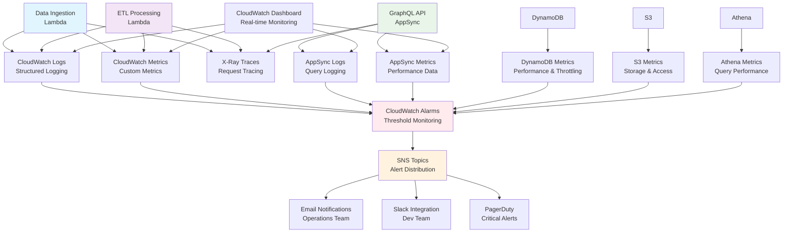

# Monitoring and Alerting Documentation

## Overview

The OpenData Pulse monitoring and alerting system provides comprehensive observability across all data processing stages, from ingestion through query execution. The system uses AWS native monitoring services combined with custom metrics to ensure high availability, performance, and data quality.

## Architecture Components

- **CloudWatch**: Centralized logging, metrics, and alarms
- **X-Ray**: Distributed tracing for request flow analysis
- **SNS**: Alert notifications and escalation
- **Lambda Powertools**: Structured logging and custom metrics
- **EventBridge**: Event-driven monitoring and automation
- **CloudWatch Dashboards**: Visual monitoring interfaces
- **AWS Config**: Configuration compliance monitoring

## Monitoring Architecture



## Monitoring Metrics by Component

### 1. Data Ingestion Pipeline

#### Lambda Function Metrics
```python
# Custom metrics published by ingestion Lambda
INGESTION_METRICS = {
    'IngestionAttempts': {
        'unit': 'Count',
        'description': 'Number of ingestion attempts',
        'alert_threshold': None
    },
    'StationsProcessed': {
        'unit': 'Count',
        'description': 'Successfully processed stations',
        'alert_threshold': '< 20'  # Alert if fewer than 20 stations
    },
    'DataPointsCollected': {
        'unit': 'Count',
        'description': 'Total data points collected',
        'alert_threshold': '< 100'  # Alert if fewer than 100 data points
    },
    'IngestionErrors': {
        'unit': 'Count',
        'description': 'Failed ingestion attempts',
        'alert_threshold': '> 0'  # Alert on any errors
    },
    'NSWAPIResponseTime': {
        'unit': 'Milliseconds',
        'description': 'NSW API response time',
        'alert_threshold': '> 30000'  # Alert if > 30 seconds
    },
    'S3UploadTime': {
        'unit': 'Milliseconds',
        'description': 'Time to upload data to S3',
        'alert_threshold': '> 60000'  # Alert if > 1 minute
    }
}
```

#### AWS Service Metrics
```yaml
# CloudWatch metrics for AWS services
aws_service_metrics:
  lambda:
    - Duration
    - Errors
    - Throttles
    - ConcurrentExecutions
    - DeadLetterErrors
  
  s3:
    - BucketSizeBytes
    - NumberOfObjects
    - AllRequests
    - 4xxErrors
    - 5xxErrors
  
  eventbridge:
    - SuccessfulInvocations
    - FailedInvocations
    - MatchedRules
```

#### Structured Logging Format
```json
{
  "timestamp": "2024-01-15T10:00:00.000Z",
  "level": "INFO",
  "service": "opendata-pulse-ingest",
  "event_type": "data_ingestion_started",
  "correlation_id": "abc123-def456-ghi789",
  "station_id": "001",
  "api_endpoint": "/api/Data/get_CurrentData",
  "response_time_ms": 1250,
  "data_points": 6,
  "data_quality": "good",
  "errors": [],
  "metadata": {
    "lambda_request_id": "xyz789-uvw012-rst345",
    "memory_used_mb": 128,
    "duration_ms": 2500
  }
}
```

### 2. ETL Processing Pipeline

#### Processing Metrics
```python
# ETL processing metrics
ETL_METRICS = {
    'ETLProcessingAttempts': {
        'unit': 'Count',
        'description': 'ETL processing attempts',
        'alert_threshold': None
    },
    'RecordsProcessed': {
        'unit': 'Count',
        'description': 'Successfully processed records',
        'alert_threshold': '< 80'  # Alert if < 80% of expected
    },
    'RecordsValidated': {
        'unit': 'Count',
        'description': 'Records passing validation',
        'alert_threshold': '< 90% of processed'
    },
    'RecordsFailed': {
        'unit': 'Count',
        'description': 'Failed processing attempts',
        'alert_threshold': '> 10% of total'
    },
    'DataCompletenessRate': {
        'unit': 'Percent',
        'description': 'Data completeness percentage',
        'alert_threshold': '< 85%'
    },
    'AQICalculationErrors': {
        'unit': 'Count',
        'description': 'AQI calculation failures',
        'alert_threshold': '> 5'
    },
    'S3ParquetWriteTime': {
        'unit': 'Milliseconds',
        'description': 'Time to write parquet files',
        'alert_threshold': '> 120000'  # Alert if > 2 minutes
    },
    'DynamoDBWriteTime': {
        'unit': 'Milliseconds',
        'description': 'Time to update DynamoDB',
        'alert_threshold': '> 30000'  # Alert if > 30 seconds
    }
}
```

#### Data Quality Metrics
```python
def calculate_data_quality_metrics(processed_records):
    """Calculate comprehensive data quality metrics"""
    total_records = len(processed_records)
    
    quality_metrics = {
        'completeness': {
            'total_records': total_records,
            'complete_records': 0,
            'missing_coordinates': 0,
            'missing_pollutants': 0,
            'missing_timestamps': 0
        },
        'accuracy': {
            'valid_coordinates': 0,
            'valid_pollutant_ranges': 0,
            'valid_timestamps': 0,
            'anomaly_count': 0
        },
        'consistency': {
            'duplicate_records': 0,
            'temporal_inconsistencies': 0,
            'cross_validation_failures': 0
        },
        'timeliness': {
            'on_time_records': 0,
            'delayed_records': 0,
            'average_delay_minutes': 0
        }
    }
    
    for record in processed_records:
        # Completeness checks
        if all(record.get(field) for field in ['latitude', 'longitude']):
            quality_metrics['completeness']['complete_records'] += 1
        else:
            quality_metrics['completeness']['missing_coordinates'] += 1
        
        # Accuracy checks
        if validate_coordinate_range(record.get('latitude'), record.get('longitude')):
            quality_metrics['accuracy']['valid_coordinates'] += 1
        
        # Timeliness checks
        delay = calculate_data_delay(record.get('timestamp'))
        if delay <= 60:  # Within 1 hour
            quality_metrics['timeliness']['on_time_records'] += 1
        else:
            quality_metrics['timeliness']['delayed_records'] += 1
    
    # Publish metrics to CloudWatch
    for category, metrics in quality_metrics.items():
        for metric_name, value in metrics.items():
            cloudwatch_client.put_metric_data(
                Namespace=f'OpenDataPulse/DataQuality/{category.title()}',
                MetricData=[{
                    'MetricName': metric_name,
                    'Value': value,
                    'Unit': 'Count'
                }]
            )
    
    return quality_metrics
```

### 3. Query Pipeline Monitoring

#### GraphQL API Metrics
```python
# AppSync and GraphQL metrics
GRAPHQL_METRICS = {
    'QueryExecutionTime': {
        'unit': 'Milliseconds',
        'description': 'GraphQL query execution time',
        'alert_threshold': '> 5000'  # Alert if > 5 seconds
    },
    'QueryErrorRate': {
        'unit': 'Percent',
        'description': 'Percentage of failed queries',
        'alert_threshold': '> 5%'
    },
    'CacheHitRate': {
        'unit': 'Percent',
        'description': 'Cache hit percentage',
        'alert_threshold': '< 70%'
    },
    'ConcurrentUsers': {
        'unit': 'Count',
        'description': 'Number of concurrent users',
        'alert_threshold': '> 500'  # Scale alert
    },
    'RateLimitExceeded': {
        'unit': 'Count',
        'description': 'Rate limit violations',
        'alert_threshold': '> 10'
    },
    'AuthenticationFailures': {
        'unit': 'Count',
        'description': 'Authentication failures',
        'alert_threshold': '> 20'
    }
}
```

#### DynamoDB Performance Metrics
```yaml
# DynamoDB monitoring configuration
dynamodb_metrics:
  table_metrics:
    - ConsumedReadCapacityUnits
    - ConsumedWriteCapacityUnits
    - ThrottledRequests
    - SystemErrors
    - UserErrors
    - SuccessfulRequestLatency
  
  gsi_metrics:
    - ConsumedReadCapacityUnits
    - ConsumedWriteCapacityUnits
    - ThrottledRequests
  
  alert_thresholds:
    throttled_requests: "> 0"
    consumed_read_capacity: "> 80% of provisioned"
    successful_request_latency: "> 100ms"
    system_errors: "> 0"
```

### 4. Infrastructure Health Monitoring

#### System Health Checks
```python
def perform_health_checks():
    """Comprehensive system health check"""
    health_status = {
        'overall_status': 'healthy',
        'components': {},
        'timestamp': datetime.now(timezone.utc).isoformat()
    }
    
    # Check DynamoDB health
    try:
        response = dynamodb_client.describe_table(
            TableName='opendata-pulse-air-quality'
        )
        health_status['components']['dynamodb'] = {
            'status': 'healthy',
            'table_status': response['Table']['TableStatus'],
            'item_count': response['Table']['ItemCount']
        }
    except Exception as e:
        health_status['components']['dynamodb'] = {
            'status': 'unhealthy',
            'error': str(e)
        }
        health_status['overall_status'] = 'degraded'
    
    # Check S3 bucket accessibility
    try:
        s3_client.head_bucket(Bucket='opendata-pulse-raw-data-123456789012')
        health_status['components']['s3_raw'] = {'status': 'healthy'}
    except Exception as e:
        health_status['components']['s3_raw'] = {
            'status': 'unhealthy',
            'error': str(e)
        }
        health_status['overall_status'] = 'degraded'
    
    # Check Athena workgroup
    try:
        athena_client.get_work_group(WorkGroup='opendata-pulse-workgroup')
        health_status['components']['athena'] = {'status': 'healthy'}
    except Exception as e:
        health_status['components']['athena'] = {
            'status': 'unhealthy',
            'error': str(e)
        }
        health_status['overall_status'] = 'degraded'
    
    # Check NSW API availability
    try:
        response = requests.get(
            'https://data.airquality.nsw.gov.au/api/Data/get_Stations',
            timeout=10
        )
        if response.status_code == 200:
            health_status['components']['nsw_api'] = {
                'status': 'healthy',
                'response_time_ms': response.elapsed.total_seconds() * 1000
            }
        else:
            health_status['components']['nsw_api'] = {
                'status': 'degraded',
                'status_code': response.status_code
            }
    except Exception as e:
        health_status['components']['nsw_api'] = {
            'status': 'unhealthy',
            'error': str(e)
        }
        health_status['overall_status'] = 'degraded'
    
    # Publish health metrics
    for component, status in health_status['components'].items():
        cloudwatch_client.put_metric_data(
            Namespace='OpenDataPulse/Health',
            MetricData=[{
                'MetricName': f'{component}_health',
                'Value': 1 if status['status'] == 'healthy' else 0,
                'Unit': 'Count'
            }]
        )
    
    return health_status
```

## Alert Configuration

### Alert Severity Levels

#### Critical Alerts (Immediate Response - PagerDuty)
```yaml
critical_alerts:
  - name: "DataIngestionFailure"
    condition: "No successful ingestion in 2+ hours"
    metric: "IngestionAttempts"
    threshold: "0 successful attempts in 2 hours"
    response_time: "15 minutes"
    escalation: "PagerDuty + Phone"
  
  - name: "APICompleteOutage"
    condition: "GraphQL API error rate > 90%"
    metric: "QueryErrorRate"
    threshold: "> 90% for 5 minutes"
    response_time: "5 minutes"
    escalation: "PagerDuty + Phone"
  
  - name: "DataCorruption"
    condition: "Data validation failure rate > 50%"
    metric: "RecordsValidated"
    threshold: "< 50% for 10 minutes"
    response_time: "30 minutes"
    escalation: "PagerDuty + Email"
  
  - name: "SecurityBreach"
    condition: "Unusual authentication patterns"
    metric: "AuthenticationFailures"
    threshold: "> 100 failures in 5 minutes"
    response_time: "Immediate"
    escalation: "PagerDuty + Phone + Security Team"
```

#### High Priority Alerts (Email + Slack)
```yaml
high_priority_alerts:
  - name: "HighErrorRate"
    condition: "Error rate > 10% for any component"
    threshold: "> 10% for 15 minutes"
    response_time: "1 hour"
    escalation: "Email + Slack"
  
  - name: "PerformanceDegradation"
    condition: "Query response time > 10 seconds"
    threshold: "> 10s for 10 minutes"
    response_time: "2 hours"
    escalation: "Email + Slack"
  
  - name: "DataFreshness"
    condition: "Data older than 2 hours"
    threshold: "No new data for 2 hours"
    response_time: "1 hour"
    escalation: "Email + Slack"
  
  - name: "ResourceThrottling"
    condition: "DynamoDB or Lambda throttling"
    threshold: "> 0 throttles for 5 minutes"
    response_time: "30 minutes"
    escalation: "Email + Slack"
```

#### Warning Alerts (Slack Only)
```yaml
warning_alerts:
  - name: "DataQualityDegradation"
    condition: "Data completeness < 90%"
    threshold: "< 90% for 30 minutes"
    response_time: "Next business day"
    escalation: "Slack"
  
  - name: "CachePerformance"
    condition: "Cache hit rate < 70%"
    threshold: "< 70% for 1 hour"
    response_time: "Next business day"
    escalation: "Slack"
  
  - name: "CostAnomaly"
    condition: "Daily costs > 150% of baseline"
    threshold: "Daily cost increase > 50%"
    response_time: "Next business day"
    escalation: "Slack + Finance Team"
```

### CloudWatch Alarm Configurations

#### Lambda Function Alarms
```python
def create_lambda_alarms(function_name, sns_topic_arn):
    """Create comprehensive CloudWatch alarms for Lambda function"""
    
    alarms = [
        {
            'AlarmName': f'{function_name}-ErrorRate',
            'ComparisonOperator': 'GreaterThanThreshold',
            'EvaluationPeriods': 2,
            'MetricName': 'Errors',
            'Namespace': 'AWS/Lambda',
            'Period': 300,
            'Statistic': 'Sum',
            'Threshold': 5.0,
            'ActionsEnabled': True,
            'AlarmActions': [sns_topic_arn],
            'AlarmDescription': f'Error rate alarm for {function_name}',
            'Dimensions': [
                {'Name': 'FunctionName', 'Value': function_name}
            ]
        },
        {
            'AlarmName': f'{function_name}-Duration',
            'ComparisonOperator': 'GreaterThanThreshold',
            'EvaluationPeriods': 3,
            'MetricName': 'Duration',
            'Namespace': 'AWS/Lambda',
            'Period': 300,
            'Statistic': 'Average',
            'Threshold': 300000.0,  # 5 minutes
            'ActionsEnabled': True,
            'AlarmActions': [sns_topic_arn],
            'AlarmDescription': f'Duration alarm for {function_name}',
            'Dimensions': [
                {'Name': 'FunctionName', 'Value': function_name}
            ]
        },
        {
            'AlarmName': f'{function_name}-Throttles',
            'ComparisonOperator': 'GreaterThanThreshold',
            'EvaluationPeriods': 1,
            'MetricName': 'Throttles',
            'Namespace': 'AWS/Lambda',
            'Period': 300,
            'Statistic': 'Sum',
            'Threshold': 0.0,
            'ActionsEnabled': True,
            'AlarmActions': [sns_topic_arn],
            'AlarmDescription': f'Throttle alarm for {function_name}',
            'Dimensions': [
                {'Name': 'FunctionName', 'Value': function_name}
            ]
        }
    ]
    
    for alarm in alarms:
        cloudwatch_client.put_metric_alarm(**alarm)
```

#### Custom Metric Alarms
```python
def create_custom_metric_alarms(sns_topic_arn):
    """Create alarms for custom application metrics"""
    
    custom_alarms = [
        {
            'AlarmName': 'DataIngestion-StationCount',
            'ComparisonOperator': 'LessThanThreshold',
            'EvaluationPeriods': 2,
            'MetricName': 'StationsProcessed',
            'Namespace': 'OpenDataPulse/Ingest',
            'Period': 3600,  # 1 hour
            'Statistic': 'Maximum',
            'Threshold': 20.0,
            'ActionsEnabled': True,
            'AlarmActions': [sns_topic_arn],
            'AlarmDescription': 'Alert when fewer than 20 stations processed',
            'TreatMissingData': 'breaching'
        },
        {
            'AlarmName': 'DataQuality-CompletenessRate',
            'ComparisonOperator': 'LessThanThreshold',
            'EvaluationPeriods': 3,
            'MetricName': 'DataCompletenessRate',
            'Namespace': 'OpenDataPulse/DataQuality',
            'Period': 1800,  # 30 minutes
            'Statistic': 'Average',
            'Threshold': 85.0,
            'ActionsEnabled': True,
            'AlarmActions': [sns_topic_arn],
            'AlarmDescription': 'Alert when data completeness < 85%',
            'TreatMissingData': 'breaching'
        },
        {
            'AlarmName': 'API-ResponseTime',
            'ComparisonOperator': 'GreaterThanThreshold',
            'EvaluationPeriods': 2,
            'MetricName': 'QueryExecutionTime',
            'Namespace': 'OpenDataPulse/API',
            'Period': 300,
            'Statistic': 'Average',
            'Threshold': 5000.0,  # 5 seconds
            'ActionsEnabled': True,
            'AlarmActions': [sns_topic_arn],
            'AlarmDescription': 'Alert when API response time > 5 seconds',
            'TreatMissingData': 'notBreaching'
        }
    ]
    
    for alarm in custom_alarms:
        cloudwatch_client.put_metric_alarm(**alarm)
```

### SNS Topic Configuration

#### Alert Distribution Setup
```python
def setup_alert_distribution():
    """Configure SNS topics for different alert severities"""
    
    topics = {
        'critical': {
            'name': 'opendata-pulse-critical-alerts',
            'subscribers': [
                {'protocol': 'email', 'endpoint': 'ops-team@company.com'},
                {'protocol': 'sms', 'endpoint': '+61400000000'},
                {'protocol': 'https', 'endpoint': 'https://events.pagerduty.com/integration/...'}
            ]
        },
        'high': {
            'name': 'opendata-pulse-high-alerts',
            'subscribers': [
                {'protocol': 'email', 'endpoint': 'dev-team@company.com'},
                {'protocol': 'https', 'endpoint': 'https://hooks.slack.com/services/...'}
            ]
        },
        'warning': {
            'name': 'opendata-pulse-warning-alerts',
            'subscribers': [
                {'protocol': 'https', 'endpoint': 'https://hooks.slack.com/services/...'}
            ]
        }
    }
    
    for severity, config in topics.items():
        # Create SNS topic
        topic_response = sns_client.create_topic(Name=config['name'])
        topic_arn = topic_response['TopicArn']
        
        # Add subscribers
        for subscriber in config['subscribers']:
            sns_client.subscribe(
                TopicArn=topic_arn,
                Protocol=subscriber['protocol'],
                Endpoint=subscriber['endpoint']
            )
        
        # Set topic attributes
        sns_client.set_topic_attributes(
            TopicArn=topic_arn,
            AttributeName='DisplayName',
            AttributeValue=f'OpenData Pulse {severity.title()} Alerts'
        )
```

## Dashboard Configuration

### CloudWatch Dashboard Layout
```json
{
  "widgets": [
    {
      "type": "metric",
      "properties": {
        "metrics": [
          ["OpenDataPulse/Ingest", "StationsProcessed"],
          [".", "DataPointsCollected"],
          [".", "IngestionErrors"]
        ],
        "period": 300,
        "stat": "Sum",
        "region": "ap-southeast-2",
        "title": "Data Ingestion Overview",
        "yAxis": {
          "left": {
            "min": 0
          }
        }
      }
    },
    {
      "type": "metric",
      "properties": {
        "metrics": [
          ["OpenDataPulse/ETL", "RecordsProcessed"],
          [".", "RecordsValidated"],
          [".", "RecordsFailed"]
        ],
        "period": 300,
        "stat": "Sum",
        "region": "ap-southeast-2",
        "title": "ETL Processing Status",
        "yAxis": {
          "left": {
            "min": 0
          }
        }
      }
    },
    {
      "type": "metric",
      "properties": {
        "metrics": [
          ["OpenDataPulse/API", "QueryExecutionTime"],
          [".", "CacheHitRate"],
          [".", "QueryErrorRate"]
        ],
        "period": 300,
        "stat": "Average",
        "region": "ap-southeast-2",
        "title": "API Performance",
        "yAxis": {
          "left": {
            "min": 0
          }
        }
      }
    },
    {
      "type": "log",
      "properties": {
        "query": "SOURCE '/aws/lambda/DataIngestFunction'\n| fields @timestamp, level, event_type, station_id, response_time_ms\n| filter level = \"ERROR\"\n| sort @timestamp desc\n| limit 20",
        "region": "ap-southeast-2",
        "title": "Recent Errors",
        "view": "table"
      }
    }
  ]
}
```

### Custom Dashboard Widgets
```python
def create_custom_dashboard():
    """Create comprehensive monitoring dashboard"""
    
    dashboard_body = {
        "widgets": [
            # System Health Overview
            {
                "type": "metric",
                "properties": {
                    "metrics": [
                        ["OpenDataPulse/Health", "dynamodb_health"],
                        [".", "s3_raw_health"],
                        [".", "athena_health"],
                        [".", "nsw_api_health"]
                    ],
                    "period": 300,
                    "stat": "Average",
                    "region": "ap-southeast-2",
                    "title": "System Health Status",
                    "yAxis": {"left": {"min": 0, "max": 1}}
                }
            },
            
            # Data Quality Metrics
            {
                "type": "metric",
                "properties": {
                    "metrics": [
                        ["OpenDataPulse/DataQuality/Completeness", "complete_records"],
                        ["OpenDataPulse/DataQuality/Accuracy", "valid_coordinates"],
                        ["OpenDataPulse/DataQuality/Timeliness", "on_time_records"]
                    ],
                    "period": 1800,
                    "stat": "Sum",
                    "region": "ap-southeast-2",
                    "title": "Data Quality Metrics"
                }
            },
            
            # Performance Trends
            {
                "type": "metric",
                "properties": {
                    "metrics": [
                        ["AWS/Lambda", "Duration", "FunctionName", "DataIngestFunction"],
                        [".", ".", ".", "ETLFunction"],
                        ["OpenDataPulse/API", "QueryExecutionTime"]
                    ],
                    "period": 300,
                    "stat": "Average",
                    "region": "ap-southeast-2",
                    "title": "Performance Trends"
                }
            }
        ]
    }
    
    cloudwatch_client.put_dashboard(
        DashboardName='OpenDataPulse-Monitoring',
        DashboardBody=json.dumps(dashboard_body)
    )
```

## Troubleshooting Runbooks

### Data Ingestion Failures

#### Runbook: "No Data Ingested for 2+ Hours"
```markdown
## Incident: Data Ingestion Failure

### Immediate Actions (0-15 minutes)
1. **Check EventBridge Rule Status**
   ```bash
   aws events describe-rule --name DataIngestionRule
   ```
   - Verify rule is enabled
   - Check schedule configuration

2. **Check Lambda Function Health**
   ```bash
   aws lambda get-function --function-name DataIngestFunction
   aws logs filter-log-events \
     --log-group-name /aws/lambda/DataIngestFunction \
     --start-time $(date -d '2 hours ago' +%s)000
   ```

3. **Test NSW API Availability**
   ```bash
   curl -I https://data.airquality.nsw.gov.au/api/Data/get_Stations
   ```

### Investigation Steps (15-30 minutes)
1. **Review CloudWatch Metrics**
   - Check `IngestionAttempts` metric
   - Review `IngestionErrors` for error patterns
   - Analyze Lambda duration and memory usage

2. **Examine Error Logs**
   ```bash
   aws logs filter-log-events \
     --log-group-name /aws/lambda/DataIngestFunction \
     --filter-pattern "ERROR" \
     --start-time $(date -d '4 hours ago' +%s)000
   ```

3. **Check S3 Bucket Status**
   ```bash
   aws s3 ls s3://opendata-pulse-raw-data-123456789012/nsw-air-quality/raw/
   ```

### Resolution Actions
1. **If EventBridge Issue**: Re-enable rule or adjust schedule
2. **If Lambda Issue**: Check permissions, increase timeout/memory
3. **If NSW API Issue**: Implement fallback data source or wait for recovery
4. **If S3 Issue**: Check bucket permissions and policies

### Post-Incident Actions
1. Update monitoring thresholds if needed
2. Document lessons learned
3. Consider implementing additional resilience measures
```

#### Runbook: "High ETL Processing Errors"
```markdown
## Incident: ETL Processing Degradation

### Immediate Actions (0-15 minutes)
1. **Check Processing Metrics**
   ```bash
   aws cloudwatch get-metric-statistics \
     --namespace OpenDataPulse/ETL \
     --metric-name RecordsFailed \
     --start-time $(date -d '1 hour ago' --iso-8601) \
     --end-time $(date --iso-8601) \
     --period 300 \
     --statistics Sum
   ```

2. **Review Recent ETL Logs**
   ```bash
   aws logs filter-log-events \
     --log-group-name /aws/lambda/ETLFunction \
     --filter-pattern "validation_error OR processing_error" \
     --start-time $(date -d '1 hour ago' +%s)000
   ```

### Investigation Steps (15-45 minutes)
1. **Analyze Data Quality Issues**
   - Check for NSW API format changes
   - Review validation failure patterns
   - Examine data completeness metrics

2. **Check Downstream Services**
   ```bash
   # Check DynamoDB throttling
   aws cloudwatch get-metric-statistics \
     --namespace AWS/DynamoDB \
     --metric-name ThrottledRequests \
     --dimensions Name=TableName,Value=opendata-pulse-air-quality
   
   # Check S3 write errors
   aws cloudwatch get-metric-statistics \
     --namespace AWS/S3 \
     --metric-name 4xxErrors \
     --dimensions Name=BucketName,Value=opendata-pulse-curated-data-123456789012
   ```

3. **Review Processing Logic**
   - Check for code changes in ETL function
   - Validate AQI calculation logic
   - Review data transformation rules

### Resolution Actions
1. **If Data Format Changed**: Update parsing logic
2. **If Validation Too Strict**: Adjust validation rules
3. **If Resource Throttling**: Increase capacity or implement backoff
4. **If Code Issue**: Deploy hotfix or rollback

### Prevention Measures
1. Implement data format change detection
2. Add more granular validation metrics
3. Set up proactive capacity monitoring
4. Create automated rollback procedures
```

### API Performance Issues

#### Runbook: "Slow GraphQL Query Performance"
```markdown
## Incident: API Performance Degradation

### Immediate Actions (0-10 minutes)
1. **Check Current Performance**
   ```bash
   aws cloudwatch get-metric-statistics \
     --namespace OpenDataPulse/API \
     --metric-name QueryExecutionTime \
     --start-time $(date -d '30 minutes ago' --iso-8601) \
     --end-time $(date --iso-8601) \
     --period 300 \
     --statistics Average,Maximum
   ```

2. **Review Cache Performance**
   ```bash
   aws cloudwatch get-metric-statistics \
     --namespace OpenDataPulse/API \
     --metric-name CacheHitRate \
     --start-time $(date -d '1 hour ago' --iso-8601) \
     --end-time $(date --iso-8601) \
     --period 300 \
     --statistics Average
   ```

### Investigation Steps (10-30 minutes)
1. **Analyze Query Patterns**
   - Check AppSync logs for slow queries
   - Identify query complexity patterns
   - Review authentication overhead

2. **Check Backend Performance**
   ```bash
   # DynamoDB performance
   aws cloudwatch get-metric-statistics \
     --namespace AWS/DynamoDB \
     --metric-name SuccessfulRequestLatency \
     --dimensions Name=TableName,Value=opendata-pulse-air-quality
   
   # Athena query performance
   aws athena list-query-executions \
     --work-group opendata-pulse-workgroup \
     --max-results 10
   ```

3. **Review Resource Utilization**
   - Check Lambda concurrent executions
   - Review DynamoDB consumed capacity
   - Analyze network latency patterns

### Resolution Actions
1. **If Cache Issues**: Clear and warm cache, adjust TTL
2. **If DynamoDB Slow**: Optimize queries, increase capacity
3. **If Athena Slow**: Optimize partition pruning, pre-aggregate data
4. **If High Load**: Implement additional caching layers

### Optimization Measures
1. Implement query complexity limits
2. Add more aggressive caching for common queries
3. Pre-compute frequently requested aggregations
4. Implement connection pooling and batching
```

## Compliance and Audit Logging

### Audit Trail Configuration
```python
def setup_audit_logging():
    """Configure comprehensive audit logging"""
    
    # CloudTrail for API calls
    cloudtrail_config = {
        'TrailName': 'opendata-pulse-audit-trail',
        'S3BucketName': 'opendata-pulse-audit-logs-123456789012',
        'IncludeGlobalServiceEvents': True,
        'IsMultiRegionTrail': True,
        'EnableLogFileValidation': True,
        'EventSelectors': [
            {
                'ReadWriteType': 'All',
                'IncludeManagementEvents': True,
                'DataResources': [
                    {
                        'Type': 'AWS::S3::Object',
                        'Values': ['arn:aws:s3:::opendata-pulse-*/*']
                    },
                    {
                        'Type': 'AWS::DynamoDB::Table',
                        'Values': ['arn:aws:dynamodb:*:*:table/opendata-pulse-*']
                    }
                ]
            }
        ]
    }
    
    # VPC Flow Logs for network monitoring
    vpc_flow_logs_config = {
        'ResourceType': 'VPC',
        'ResourceIds': ['vpc-12345678'],
        'TrafficType': 'ALL',
        'LogDestinationType': 'cloud-watch-logs',
        'LogGroupName': '/aws/vpc/flowlogs'
    }
    
    # Config Rules for compliance
    config_rules = [
        {
            'ConfigRuleName': 'encrypted-volumes',
            'Source': {
                'Owner': 'AWS',
                'SourceIdentifier': 'ENCRYPTED_VOLUMES'
            }
        },
        {
            'ConfigRuleName': 's3-bucket-public-read-prohibited',
            'Source': {
                'Owner': 'AWS',
                'SourceIdentifier': 'S3_BUCKET_PUBLIC_READ_PROHIBITED'
            }
        }
    ]
```

### Security Monitoring
```python
def setup_security_monitoring():
    """Configure security-specific monitoring"""
    
    security_metrics = [
        {
            'MetricName': 'UnauthorizedAPIAccess',
            'FilterPattern': '[timestamp, request_id, ip, user="UNAUTHORIZED", ...]',
            'LogGroupName': '/aws/appsync/apis/opendata-pulse-api'
        },
        {
            'MetricName': 'SuspiciousLoginPatterns',
            'FilterPattern': '[timestamp, event_type="USER_AUTHENTICATION", status="FAILED", ...]',
            'LogGroupName': '/aws/cognito/userpools'
        },
        {
            'MetricName': 'DataAccessAnomalies',
            'FilterPattern': '[timestamp, user_id, query_type, execution_time > 30000, ...]',
            'LogGroupName': '/aws/lambda/GraphQLResolver'
        }
    ]
    
    for metric in security_metrics:
        cloudwatch_client.put_metric_filter(
            logGroupName=metric['LogGroupName'],
            filterName=metric['MetricName'],
            filterPattern=metric['FilterPattern'],
            metricTransformations=[
                {
                    'metricName': metric['MetricName'],
                    'metricNamespace': 'OpenDataPulse/Security',
                    'metricValue': '1'
                }
            ]
        )
```

## Cost Monitoring

### Cost Optimization Alerts
```python
def setup_cost_monitoring():
    """Configure cost monitoring and optimization alerts"""
    
    # Daily cost budget
    budget_config = {
        'BudgetName': 'opendata-pulse-daily-budget',
        'BudgetLimit': {
            'Amount': '50.00',
            'Unit': 'USD'
        },
        'TimeUnit': 'DAILY',
        'BudgetType': 'COST',
        'CostFilters': {
            'TagKey': ['Project'],
            'TagValue': ['OpenDataPulse']
        },
        'NotificationsWithSubscribers': [
            {
                'Notification': {
                    'NotificationType': 'ACTUAL',
                    'ComparisonOperator': 'GREATER_THAN',
                    'Threshold': 80.0,
                    'ThresholdType': 'PERCENTAGE'
                },
                'Subscribers': [
                    {
                        'SubscriptionType': 'EMAIL',
                        'Address': 'finance@company.com'
                    }
                ]
            }
        ]
    }
    
    # Service-specific cost tracking
    cost_metrics = {
        'lambda_costs': 'AWS/Lambda',
        'dynamodb_costs': 'AWS/DynamoDB',
        's3_costs': 'AWS/S3',
        'appsync_costs': 'AWS/AppSync',
        'athena_costs': 'AWS/Athena'
    }
    
    for metric_name, namespace in cost_metrics.items():
        cloudwatch_client.put_metric_alarm(
            AlarmName=f'HighCost-{metric_name}',
            ComparisonOperator='GreaterThanThreshold',
            EvaluationPeriods=1,
            MetricName='EstimatedCharges',
            Namespace='AWS/Billing',
            Period=86400,  # Daily
            Statistic='Maximum',
            Threshold=20.0,  # $20 per service per day
            ActionsEnabled=True,
            AlarmActions=['arn:aws:sns:ap-southeast-2:123456789012:cost-alerts'],
            AlarmDescription=f'High cost alert for {metric_name}',
            Dimensions=[
                {'Name': 'ServiceName', 'Value': namespace},
                {'Name': 'Currency', 'Value': 'USD'}
            ]
        )
```

This comprehensive monitoring and alerting system ensures that the OpenData Pulse infrastructure maintains high availability, performance, and data quality while providing early warning of issues and detailed troubleshooting information for rapid incident resolution.