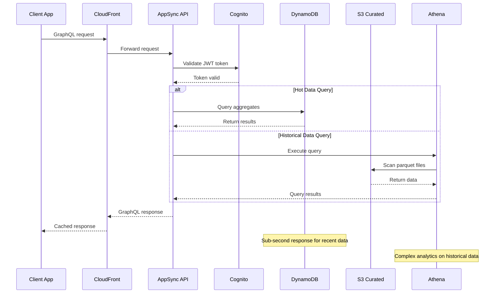

# Query Pipeline

*Documentation for data access flow from storage through GraphQL API to frontend.*

## Overview

The query pipeline serves data from storage through GraphQL API to frontend applications and MCP clients with optimized performance for different access patterns.

## Query Flow Components

### GraphQL API (AppSync)
- **Service**: AWS AppSync
- **Authentication**: Cognito JWT tokens
- **Resolvers**: Direct DynamoDB and Athena integration
- **Caching**: Built-in response caching

### Data Sources
- **Hot Data**: DynamoDB for recent aggregates (sub-second response)
- **Historical Data**: Athena queries on S3 parquet files
- **Raw Data**: Direct S3 access for exports

## Query Flow Diagram

*Content will be generated from GraphQL schema and resolver analysis*