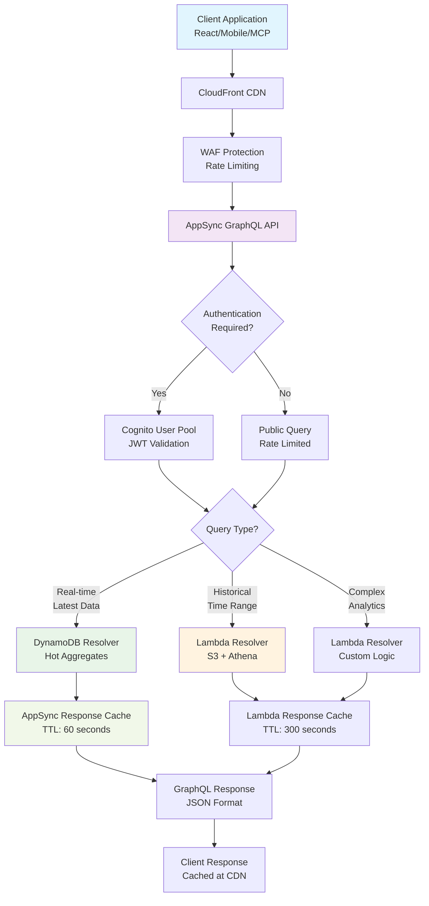
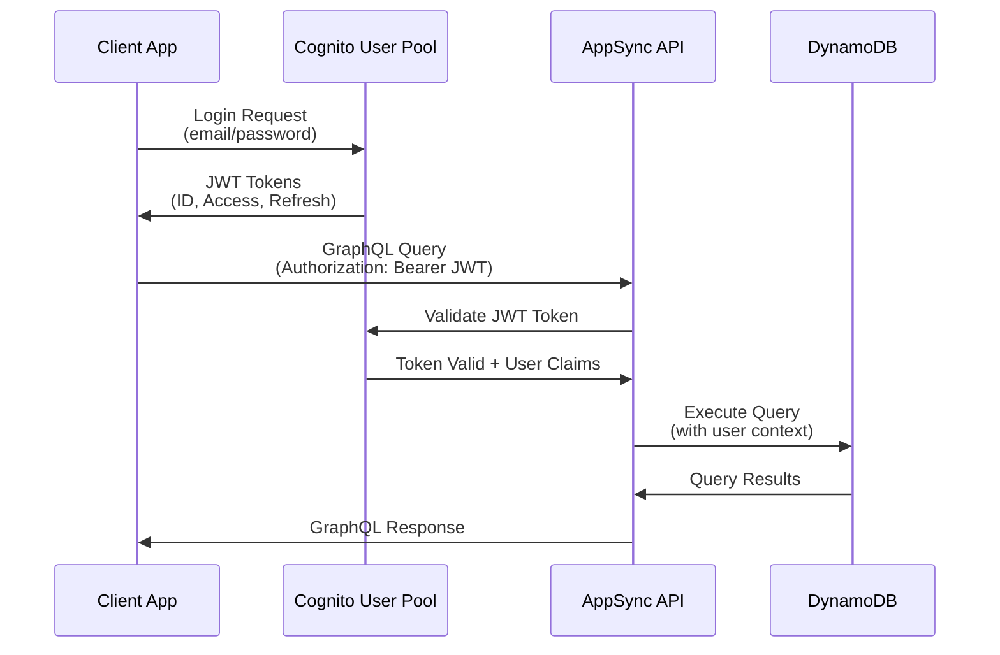

# Query Pipeline Documentation

## Overview

The OpenData Pulse query pipeline provides fast, scalable access to NSW Air Quality data through a GraphQL API. The pipeline serves both real-time data from DynamoDB hot aggregates and historical data from S3 parquet files, with intelligent caching and performance optimization strategies.

## Architecture Components

- **AppSync GraphQL API**: Managed GraphQL endpoint with built-in caching
- **Cognito Authentication**: User authentication and authorization
- **DynamoDB**: Hot aggregates for real-time queries (< 1 second response)
- **S3 + Athena**: Historical data queries via federated data sources
- **WAF**: API protection and rate limiting
- **CloudFront**: CDN for static assets and API caching
- **Lambda Resolvers**: Custom business logic for complex queries

## Query Execution Flow



## Data Access Patterns

### 1. Real-Time Queries (DynamoDB)

#### Latest Readings by Station
```graphql
query GetLatestReadings($stationId: String!) {
  getAirQualityReading(id: $stationId) {
    id
    station_id
    suburb
    region
    timestamp
    pm25
    pm10
    no2
    o3
    aqi
    data_quality
  }
}
```

**DynamoDB Access Pattern**:
```python
# Primary Key: STATION#{station_id}
# Sort Key: LATEST
{
  'PK': 'STATION#001',
  'SK': 'LATEST',
  'station_id': '001',
  'suburb': 'Rozelle',
  'timestamp': '2024-01-15T10:00:00Z',
  'pm25': 12.5,
  'aqi': 45
}
```

**Performance**: < 100ms response time, strongly consistent reads

#### Suburb-Level Aggregates
```graphql
query GetSuburbAirQuality($suburb: String!, $limit: Int) {
  listAirQualityReadings(suburb: $suburb, limit: $limit) {
    items {
      suburb
      timestamp
      aqi
      pm25
      pm10
    }
    nextToken
  }
}
```

**DynamoDB GSI Access Pattern**:
```python
# GSI: SuburbIndex
# Partition Key: SUBURB#{suburb}
# Sort Key: TIMESTAMP (descending)
{
  'SUBURB': 'Rozelle',
  'TIMESTAMP': '2024-01-15T10:00:00Z',
  'aqi_value': 45,
  'station_count': 2
}
```

**Performance**: < 200ms response time, eventually consistent reads

### 2. Historical Queries (S3 + Athena)

#### Time Range Analysis
```graphql
query GetHistoricalData(
  $region: String!
  $startTime: AWSDateTime!
  $endTime: AWSDateTime!
) {
  listAirQualityReadings(
    region: $region
    startTime: $startTime
    endTime: $endTime
  ) {
    items {
      timestamp
      suburb
      aqi
      pm25
      pm10
    }
  }
}
```

**Athena Query Execution**:
```sql
SELECT 
  timestamp,
  suburb,
  aqi_value,
  pm25_value,
  pm10_value
FROM opendata_pulse_db.air_quality_curated
WHERE region = 'Sydney East'
  AND year = 2024
  AND month = 1
  AND day BETWEEN 10 AND 15
  AND timestamp BETWEEN '2024-01-10T00:00:00Z' AND '2024-01-15T23:59:59Z'
ORDER BY timestamp DESC
LIMIT 1000;
```

**Performance**: 2-10 seconds response time (cached for 5 minutes)

### 3. Complex Analytics (Lambda Resolvers)

#### Air Quality Trends
```graphql
query GetAirQualityTrends(
  $suburb: String!
  $pollutant: String!
  $period: String!
) {
  getAirQualityTrends(
    suburb: $suburb
    pollutant: $pollutant
    period: $period
  ) {
    trend_direction
    average_value
    peak_value
    data_points
    confidence_score
  }
}
```

**Lambda Resolver Logic**:
```python
def resolve_air_quality_trends(event, context):
    """Calculate air quality trends using statistical analysis"""
    suburb = event['arguments']['suburb']
    pollutant = event['arguments']['pollutant']
    period = event['arguments']['period']
    
    # Query historical data from S3
    query = f"""
    SELECT timestamp, {pollutant}_value
    FROM opendata_pulse_db.air_quality_curated
    WHERE suburb = '{suburb}'
      AND timestamp >= current_timestamp - interval '{period}'
      AND {pollutant}_value IS NOT NULL
    ORDER BY timestamp
    """
    
    # Execute Athena query
    results = execute_athena_query(query)
    
    # Calculate trend using linear regression
    trend_analysis = calculate_trend(results)
    
    return {
        'trend_direction': trend_analysis['direction'],
        'average_value': trend_analysis['mean'],
        'peak_value': trend_analysis['max'],
        'data_points': len(results),
        'confidence_score': trend_analysis['r_squared']
    }
```

**Performance**: 5-15 seconds response time (cached for 1 hour)

## Caching Strategy

### Multi-Layer Caching Architecture

#### 1. AppSync Response Caching
```python
# AppSync resolver caching configuration
CACHE_CONFIG = {
    'real_time_queries': {
        'ttl': 60,  # 1 minute
        'cache_key_parameters': ['station_id', 'suburb']
    },
    'historical_queries': {
        'ttl': 300,  # 5 minutes
        'cache_key_parameters': ['region', 'startTime', 'endTime']
    },
    'analytics_queries': {
        'ttl': 3600,  # 1 hour
        'cache_key_parameters': ['suburb', 'pollutant', 'period']
    }
}
```

#### 2. Lambda Function Caching
```python
import functools
from datetime import datetime, timedelta

def cache_result(ttl_seconds=300):
    """Decorator for caching Lambda resolver results"""
    def decorator(func):
        cache = {}
        
        @functools.wraps(func)
        def wrapper(*args, **kwargs):
            # Create cache key from arguments
            cache_key = hash(str(args) + str(sorted(kwargs.items())))
            
            # Check if cached result exists and is fresh
            if cache_key in cache:
                result, timestamp = cache[cache_key]
                if datetime.now() - timestamp < timedelta(seconds=ttl_seconds):
                    return result
            
            # Execute function and cache result
            result = func(*args, **kwargs)
            cache[cache_key] = (result, datetime.now())
            
            return result
        return wrapper
    return decorator

@cache_result(ttl_seconds=300)
def get_historical_data(region, start_time, end_time):
    """Cached historical data retrieval"""
    return execute_athena_query(build_query(region, start_time, end_time))
```

#### 3. CloudFront CDN Caching
```yaml
# CloudFront cache behaviors
cache_behaviors:
  - path_pattern: "/graphql"
    cache_policy:
      default_ttl: 0  # No caching for mutations
      max_ttl: 300   # 5 minutes for queries
      headers: ["Authorization", "Content-Type"]
      query_strings: ["query", "variables"]
  
  - path_pattern: "/static/*"
    cache_policy:
      default_ttl: 86400  # 24 hours for static assets
      max_ttl: 31536000   # 1 year maximum
```

### Cache Invalidation Strategy

#### 1. Time-Based Invalidation
```python
def invalidate_cache_on_data_update():
    """Invalidate caches when new data arrives"""
    # Clear AppSync cache for affected regions
    appsync_client.flush_api_cache(apiId=API_ID)
    
    # Clear CloudFront cache for GraphQL endpoints
    cloudfront_client.create_invalidation(
        DistributionId=DISTRIBUTION_ID,
        InvalidationBatch={
            'Paths': {
                'Quantity': 1,
                'Items': ['/graphql*']
            },
            'CallerReference': str(int(time.time()))
        }
    )
```

#### 2. Event-Driven Invalidation
```python
def handle_etl_completion_event(event, context):
    """Handle ETL completion and invalidate relevant caches"""
    # Parse ETL completion event
    partition_info = event['detail']['partition']
    affected_regions = event['detail']['regions']
    
    # Invalidate specific cache keys
    for region in affected_regions:
        cache_keys = [
            f"latest_readings_{region}",
            f"historical_data_{region}",
            f"trends_{region}"
        ]
        
        for key in cache_keys:
            redis_client.delete(key)
```

## Performance Optimization

### Query Optimization Strategies

#### 1. Query Complexity Analysis
```python
def analyze_query_complexity(query_string):
    """Analyze GraphQL query complexity and apply limits"""
    parsed_query = parse(query_string)
    
    complexity_score = 0
    max_depth = 0
    
    def visit_field(node, depth=0):
        nonlocal complexity_score, max_depth
        complexity_score += 1
        max_depth = max(max_depth, depth)
        
        for selection in node.selection_set.selections:
            if hasattr(selection, 'selection_set') and selection.selection_set:
                visit_field(selection, depth + 1)
    
    for definition in parsed_query.definitions:
        if definition.kind == 'operation_definition':
            visit_field(definition)
    
    return {
        'complexity_score': complexity_score,
        'max_depth': max_depth,
        'is_allowed': complexity_score <= 100 and max_depth <= 10
    }
```

#### 2. Pagination Implementation
```graphql
type AirQualityReadingsConnection {
  items: [AirQualityReading!]!
  nextToken: String
  totalCount: Int
}

query ListReadingsWithPagination(
  $limit: Int = 20
  $nextToken: String
) {
  listAirQualityReadings(limit: $limit, nextToken: $nextToken) {
    items {
      id
      timestamp
      aqi
    }
    nextToken
    totalCount
  }
}
```

**DynamoDB Pagination**:
```python
def paginate_dynamodb_query(table_name, query_params, limit=20, next_token=None):
    """Implement cursor-based pagination for DynamoDB"""
    query_kwargs = {
        'TableName': table_name,
        'Limit': limit,
        **query_params
    }
    
    if next_token:
        # Decode pagination token
        exclusive_start_key = json.loads(base64.b64decode(next_token))
        query_kwargs['ExclusiveStartKey'] = exclusive_start_key
    
    response = dynamodb_client.query(**query_kwargs)
    
    # Encode next token if more results available
    next_token = None
    if 'LastEvaluatedKey' in response:
        next_token = base64.b64encode(
            json.dumps(response['LastEvaluatedKey']).encode()
        ).decode()
    
    return {
        'items': response['Items'],
        'nextToken': next_token,
        'totalCount': response.get('Count', 0)
    }
```

#### 3. Batch Data Loading
```python
def batch_load_stations(station_ids):
    """Batch load multiple stations to reduce DynamoDB calls"""
    if not station_ids:
        return []
    
    # Use DynamoDB batch_get_item for efficient loading
    request_items = {
        'opendata-pulse-air-quality': {
            'Keys': [
                {'PK': f'STATION#{station_id}', 'SK': 'LATEST'}
                for station_id in station_ids
            ]
        }
    }
    
    response = dynamodb_client.batch_get_item(RequestItems=request_items)
    
    # Process and return results
    items = response.get('Responses', {}).get('opendata-pulse-air-quality', [])
    return [transform_dynamodb_item(item) for item in items]
```

### Performance Monitoring

#### Key Performance Metrics
| Metric | Target | Alert Threshold |
|--------|--------|-----------------|
| Real-time Query Response Time | < 100ms | > 500ms |
| Historical Query Response Time | < 5s | > 15s |
| Cache Hit Rate | > 80% | < 60% |
| API Error Rate | < 1% | > 5% |
| Concurrent Users | 100+ | Monitor scaling |

#### CloudWatch Metrics
```python
# Custom metrics for query performance
def publish_query_metrics(query_type, response_time, cache_hit):
    """Publish custom metrics to CloudWatch"""
    cloudwatch_client.put_metric_data(
        Namespace='OpenDataPulse/API',
        MetricData=[
            {
                'MetricName': 'QueryResponseTime',
                'Dimensions': [
                    {'Name': 'QueryType', 'Value': query_type}
                ],
                'Value': response_time,
                'Unit': 'Milliseconds'
            },
            {
                'MetricName': 'CacheHitRate',
                'Dimensions': [
                    {'Name': 'QueryType', 'Value': query_type}
                ],
                'Value': 1 if cache_hit else 0,
                'Unit': 'Count'
            }
        ]
    )
```

## Authentication and Authorization

### Cognito Integration

#### User Authentication Flow


#### JWT Token Structure
```json
{
  "sub": "user-uuid",
  "email": "user@example.com",
  "cognito:groups": ["basic_users", "premium_users"],
  "custom:region_preference": "Sydney",
  "custom:subscription_level": "premium",
  "iat": 1705939200,
  "exp": 1705942800,
  "token_use": "id"
}
```

#### Authorization Rules
```python
def check_user_authorization(user_claims, query_type, query_params):
    """Check if user is authorized for specific query"""
    subscription_level = user_claims.get('custom:subscription_level', 'basic')
    
    authorization_rules = {
        'basic': {
            'max_historical_days': 7,
            'max_results_per_query': 100,
            'allowed_regions': ['all'],
            'rate_limit_per_hour': 100
        },
        'premium': {
            'max_historical_days': 365,
            'max_results_per_query': 1000,
            'allowed_regions': ['all'],
            'rate_limit_per_hour': 1000
        }
    }
    
    rules = authorization_rules.get(subscription_level, authorization_rules['basic'])
    
    # Check historical data access
    if query_type == 'historical':
        days_requested = (query_params['endTime'] - query_params['startTime']).days
        if days_requested > rules['max_historical_days']:
            raise AuthorizationError(f"Historical data limited to {rules['max_historical_days']} days")
    
    # Check result limits
    if query_params.get('limit', 0) > rules['max_results_per_query']:
        raise AuthorizationError(f"Result limit exceeded: {rules['max_results_per_query']}")
    
    return True
```

### Rate Limiting

#### WAF Rate Limiting Rules
```yaml
waf_rules:
  - name: "RateLimitPerIP"
    priority: 1
    action: "BLOCK"
    rate_limit:
      limit: 1000
      window: 300  # 5 minutes
      scope: "IP"
  
  - name: "RateLimitPerUser"
    priority: 2
    action: "BLOCK"
    rate_limit:
      limit: 100
      window: 3600  # 1 hour
      scope: "USER"
```

#### Application-Level Rate Limiting
```python
import redis
from datetime import datetime, timedelta

redis_client = redis.Redis(host='elasticache-endpoint')

def check_rate_limit(user_id, endpoint, limit_per_hour=100):
    """Check if user has exceeded rate limit"""
    current_hour = datetime.now().strftime('%Y-%m-%d-%H')
    key = f"rate_limit:{user_id}:{endpoint}:{current_hour}"
    
    current_count = redis_client.get(key)
    if current_count is None:
        # First request this hour
        redis_client.setex(key, 3600, 1)  # Expire in 1 hour
        return True
    
    if int(current_count) >= limit_per_hour:
        return False
    
    # Increment counter
    redis_client.incr(key)
    return True
```

## Error Handling

### GraphQL Error Types
```python
class OpenDataPulseError(Exception):
    """Base exception for OpenData Pulse API"""
    def __init__(self, message, error_code=None, extensions=None):
        self.message = message
        self.error_code = error_code
        self.extensions = extensions or {}

class DataNotFoundError(OpenDataPulseError):
    """Raised when requested data is not found"""
    def __init__(self, resource_type, resource_id):
        super().__init__(
            f"{resource_type} with ID {resource_id} not found",
            error_code="DATA_NOT_FOUND",
            extensions={"resource_type": resource_type, "resource_id": resource_id}
        )

class RateLimitExceededError(OpenDataPulseError):
    """Raised when rate limit is exceeded"""
    def __init__(self, limit, window):
        super().__init__(
            f"Rate limit exceeded: {limit} requests per {window} seconds",
            error_code="RATE_LIMIT_EXCEEDED",
            extensions={"limit": limit, "window": window}
        )
```

### Error Response Format
```json
{
  "errors": [
    {
      "message": "Station with ID 999 not found",
      "errorType": "DataNotFoundError",
      "errorInfo": {
        "errorCode": "DATA_NOT_FOUND",
        "resource_type": "Station",
        "resource_id": "999"
      },
      "path": ["getAirQualityReading"],
      "locations": [{"line": 2, "column": 3}]
    }
  ],
  "data": null
}
```

### Retry Logic
```python
import backoff

@backoff.on_exception(
    backoff.expo,
    (DynamoDBThrottlingError, AthenaQueryTimeoutError),
    max_tries=3,
    max_time=30
)
def execute_query_with_retry(query_function, *args, **kwargs):
    """Execute query with exponential backoff retry"""
    try:
        return query_function(*args, **kwargs)
    except Exception as e:
        logger.error(f"Query execution failed: {e}")
        raise
```

## Monitoring and Observability

### Structured Logging
```python
import structlog

logger = structlog.get_logger()

def log_query_execution(query_type, user_id, execution_time, cache_hit):
    """Log query execution with structured data"""
    logger.info(
        "GraphQL query executed",
        query_type=query_type,
        user_id=user_id,
        execution_time_ms=execution_time,
        cache_hit=cache_hit,
        timestamp=datetime.now(timezone.utc).isoformat()
    )
```

### X-Ray Tracing
```python
from aws_xray_sdk.core import xray_recorder

@xray_recorder.capture('graphql_resolver')
def resolve_air_quality_reading(event, context):
    """GraphQL resolver with X-Ray tracing"""
    with xray_recorder.in_subsegment('validate_input'):
        station_id = event['arguments']['id']
        validate_station_id(station_id)
    
    with xray_recorder.in_subsegment('query_dynamodb'):
        result = query_dynamodb(station_id)
    
    with xray_recorder.in_subsegment('transform_response'):
        return transform_to_graphql_response(result)
```

### Health Checks
```graphql
query HealthCheck {
  health
}
```

```python
def resolve_health_check(event, context):
    """Health check resolver"""
    checks = {
        'dynamodb': check_dynamodb_health(),
        'athena': check_athena_health(),
        'cognito': check_cognito_health()
    }
    
    all_healthy = all(checks.values())
    
    return {
        'status': 'healthy' if all_healthy else 'degraded',
        'checks': checks,
        'timestamp': datetime.now(timezone.utc).isoformat()
    }
```

## Integration with Frontend

### Apollo Client Configuration
```javascript
import { ApolloClient, InMemoryCache, createHttpLink } from '@apollo/client';
import { setContext } from '@apollo/client/link/context';
import { Auth } from 'aws-amplify';

const httpLink = createHttpLink({
  uri: process.env.REACT_APP_GRAPHQL_ENDPOINT,
});

const authLink = setContext(async (_, { headers }) => {
  try {
    const token = (await Auth.currentSession()).getIdToken().getJwtToken();
    return {
      headers: {
        ...headers,
        authorization: token ? `Bearer ${token}` : "",
      }
    };
  } catch (error) {
    return { headers };
  }
});

const client = new ApolloClient({
  link: authLink.concat(httpLink),
  cache: new InMemoryCache({
    typePolicies: {
      Query: {
        fields: {
          listAirQualityReadings: {
            keyArgs: ['region', 'suburb', 'startTime', 'endTime'],
            merge(existing = { items: [] }, incoming) {
              return {
                ...incoming,
                items: [...existing.items, ...incoming.items],
              };
            },
          },
        },
      },
    },
  }),
});
```

### React Query Examples
```javascript
import { useQuery } from '@apollo/client';
import { GET_LATEST_READINGS } from '../queries/airQuality';

function AirQualityDashboard({ suburb }) {
  const { loading, error, data, refetch } = useQuery(GET_LATEST_READINGS, {
    variables: { suburb },
    pollInterval: 60000, // Refetch every minute
    errorPolicy: 'partial',
    fetchPolicy: 'cache-and-network'
  });

  if (loading) return <LoadingSpinner />;
  if (error) return <ErrorMessage error={error} />;

  return (
    <div>
      <h2>Air Quality in {suburb}</h2>
      {data?.listAirQualityReadings?.items?.map(reading => (
        <AirQualityCard key={reading.id} reading={reading} />
      ))}
      <button onClick={() => refetch()}>Refresh Data</button>
    </div>
  );
}
```

## Troubleshooting Guide

### Common Issues and Solutions

#### Issue: "Slow query performance for historical data"
**Symptoms**: Queries taking > 15 seconds, Athena timeout errors
**Diagnosis**:
```bash
# Check Athena query execution history
aws athena list-query-executions \
  --work-group opendata-pulse-workgroup \
  --max-results 10

# Analyze specific query performance
aws athena get-query-execution \
  --query-execution-id <execution-id>
```
**Resolution**:
- Optimize partition pruning in queries
- Add appropriate WHERE clauses for year/month/day
- Consider pre-aggregating frequently queried data
- Increase Athena query timeout limits

#### Issue: "High DynamoDB read throttling"
**Symptoms**: DynamoDB throttling errors, increased response times
**Diagnosis**:
```bash
# Check DynamoDB metrics
aws cloudwatch get-metric-statistics \
  --namespace AWS/DynamoDB \
  --metric-name ConsumedReadCapacityUnits \
  --dimensions Name=TableName,Value=opendata-pulse-air-quality \
  --start-time $(date -d '1 hour ago' --iso-8601) \
  --end-time $(date --iso-8601) \
  --period 300 \
  --statistics Average,Maximum
```
**Resolution**:
- Implement exponential backoff in resolvers
- Enable DynamoDB auto-scaling
- Optimize query patterns to use GSI effectively
- Implement application-level caching

#### Issue: "Authentication failures"
**Symptoms**: 401 Unauthorized errors, JWT validation failures
**Diagnosis**:
```javascript
// Check JWT token validity
import jwt_decode from 'jwt-decode';

try {
  const token = await Auth.currentSession().getIdToken().getJwtToken();
  const decoded = jwt_decode(token);
  console.log('Token expires:', new Date(decoded.exp * 1000));
  console.log('Current time:', new Date());
} catch (error) {
  console.error('Token validation failed:', error);
}
```
**Resolution**:
- Implement automatic token refresh
- Check Cognito User Pool configuration
- Verify AppSync authorization settings
- Handle token expiration gracefully

For information on the monitoring and alerting system, see [Monitoring and Alerting Documentation](monitoring-alerting.md).