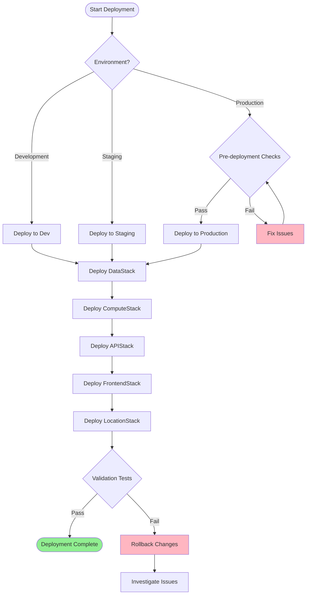

# Environment Setup and Deployment

*Step-by-step deployment procedures for each environment with CDK commands.*

## Prerequisites

### Required Tools
- AWS CLI v2+ configured with appropriate credentials
- AWS CDK v2+ installed globally
- Python 3.9+ with pip
- Node.js 18+ for frontend components

### AWS Account Setup
- AWS account with appropriate permissions
- CDK bootstrap completed in target region
- IAM roles for deployment automation

## Deployment Process



## Stack Deployment Order

1. **DataStack** - Foundation data services (S3, DynamoDB, Glue, Athena)
2. **ComputeStack** - Lambda functions and processing services
3. **APIStack** - GraphQL API and authentication
4. **FrontendStack** - Web hosting and CDN
5. **LocationStack** - Geographic services

## CDK Commands

### Initial Setup
```bash
# Clone repository and setup environment
git clone <repository-url>
cd opendata-pulse
python3 -m venv venv
source venv/bin/activate
pip install -r requirements.txt

# Bootstrap CDK (first time only)
cdk bootstrap
```

### Deployment Commands
```bash
# Deploy all stacks in correct order
cdk deploy --all

# Deploy specific stack
cdk deploy OpenDataPulseDataStack

# View differences before deployment
cdk diff

# Synthesize CloudFormation templates
cdk synth
```

### Environment-Specific Deployment
```bash
# Development environment
cdk deploy --all --context environment=dev

# Staging environment  
cdk deploy --all --context environment=staging

# Production environment
cdk deploy --all --context environment=prod
```

*Content will be generated from CDK stack dependency analysis*