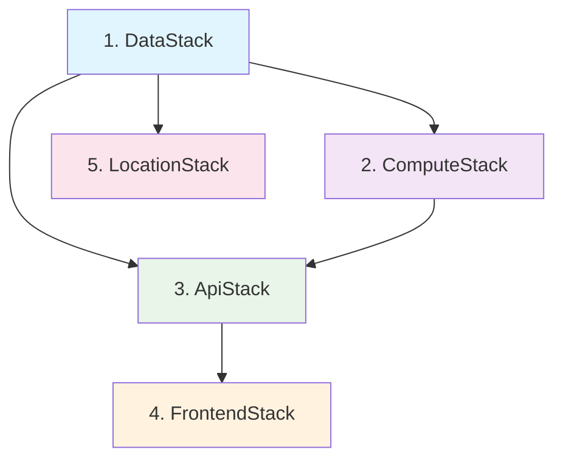

# Environment Setup and Deployment Procedures

## Overview

This document provides comprehensive deployment procedures for the OpenData Pulse serverless application across different environments. The system consists of five CDK stacks that must be deployed in a specific order due to their dependencies.

## Prerequisites

### Required Tools

- **AWS CLI v2+**: For AWS account access and configuration
- **AWS CDK v2.100.0+**: For infrastructure deployment
- **Python 3.9+**: For CDK application and Lambda functions
- **Node.js 18+**: For frontend and MCP server components
- **Git**: For source code management

### AWS Account Setup

1. **AWS Account Configuration**
   ```bash
   # Configure AWS credentials
   aws configure
   
   # Verify configuration
   aws sts get-caller-identity
   ```

2. **Required IAM Permissions**
   - CloudFormation full access
   - S3 full access
   - DynamoDB full access
   - Lambda full access
   - AppSync full access
   - Cognito full access
   - EventBridge full access
   - SNS/SQS full access
   - IAM role creation and management
   - Glue and Athena access
   - Location Service access

3. **CDK Bootstrap**
   ```bash
   # Bootstrap CDK for your account/region
   cdk bootstrap aws://ACCOUNT-ID/REGION
   
   # Verify bootstrap
   cdk list
   ```

## Environment Configuration

### Development Environment

**CDK Context Parameters:**
```json
{
  "account": "123456789012",
  "region": "ap-southeast-2",
  "environment": "development",
  "nsw_api_endpoint": "https://api.nsw.gov.au/air-quality/v1",
  "retention_days": 30,
  "enable_monitoring": true,
  "enable_debug_logging": true
}
```

**Environment Variables:**
```bash
export AWS_REGION=ap-southeast-2
export CDK_DEFAULT_ACCOUNT=123456789012
export CDK_DEFAULT_REGION=ap-southeast-2
export ENVIRONMENT=development
```

### Staging Environment

**CDK Context Parameters:**
```json
{
  "account": "123456789012",
  "region": "ap-southeast-2",
  "environment": "staging",
  "nsw_api_endpoint": "https://api.nsw.gov.au/air-quality/v1",
  "retention_days": 90,
  "enable_monitoring": true,
  "enable_debug_logging": false
}
```

### Production Environment

**CDK Context Parameters:**
```json
{
  "account": "987654321098",
  "region": "ap-southeast-2",
  "environment": "production",
  "nsw_api_endpoint": "https://api.nsw.gov.au/air-quality/v1",
  "retention_days": 365,
  "enable_monitoring": true,
  "enable_debug_logging": false,
  "enable_waf": true,
  "backup_enabled": true
}
```

## Stack Dependencies and Deployment Order

The OpenData Pulse system consists of five interconnected CDK stacks that must be deployed in the following order:



### 1. DataStack (Foundation)
**Purpose**: Core data infrastructure
**Resources**: S3 buckets, DynamoDB tables, Glue catalog, Athena workgroup
**Dependencies**: None
**Deployment Time**: ~5-8 minutes

### 2. ComputeStack (Processing)
**Purpose**: Data processing and business logic
**Resources**: Lambda functions, EventBridge rules, SQS/SNS
**Dependencies**: DataStack
**Deployment Time**: ~8-12 minutes

### 3. ApiStack (API Layer)
**Purpose**: GraphQL API and authentication
**Resources**: AppSync API, Cognito User Pool, WAF
**Dependencies**: DataStack, ComputeStack
**Deployment Time**: ~6-10 minutes

### 4. FrontendStack (User Interface)
**Purpose**: Web application hosting
**Resources**: Amplify hosting, CloudFront distribution
**Dependencies**: ApiStack
**Deployment Time**: ~10-15 minutes

### 5. LocationStack (Geographic Services)
**Purpose**: Map and location services
**Resources**: Location Service maps, place indexes
**Dependencies**: DataStack
**Deployment Time**: ~3-5 minutes

## Deployment Procedures

### Complete System Deployment

#### Method 1: Individual Stack Deployment (Recommended)

```bash
# 1. Deploy DataStack
./scripts/deploy-data-stack.sh

# 2. Deploy ComputeStack
./scripts/deploy-compute-stack.sh

# 3. Deploy ApiStack
./scripts/deploy-api-stack.sh

# 4. Deploy FrontendStack
cdk deploy OpenDataPulseFrontendStack

# 5. Deploy LocationStack
cdk deploy OpenDataPulseLocationStack
```

#### Method 2: Automated Full Deployment

```bash
# Deploy all stacks in correct order
cdk deploy --all --require-approval never

# Monitor deployment progress
watch -n 30 'aws cloudformation list-stacks --stack-status-filter CREATE_IN_PROGRESS UPDATE_IN_PROGRESS'
```

### Individual Stack Deployment

#### DataStack Deployment

```bash
# Validate stack
cdk synth OpenDataPulseDataStack

# Deploy with monitoring
cdk deploy OpenDataPulseDataStack --require-approval never --progress events

# Verify deployment
aws cloudformation describe-stacks --stack-name OpenDataPulseDataStack --query 'Stacks[0].StackStatus'
```

**Validation Steps:**
1. Verify S3 buckets are created with correct lifecycle policies
2. Check DynamoDB tables have proper indexes
3. Confirm Glue catalog database exists
4. Validate Athena workgroup configuration

#### ComputeStack Deployment

```bash
# Check dependencies
aws cloudformation describe-stacks --stack-name OpenDataPulseDataStack

# Deploy stack
cdk deploy OpenDataPulseComputeStack --require-approval never

# Test Lambda functions
aws lambda invoke --function-name opendata-pulse-health-check /tmp/health-response.json
```

**Validation Steps:**
1. Test all Lambda functions respond correctly
2. Verify EventBridge rules are active
3. Check SNS topic and SQS DLQ creation
4. Validate Lambda layer deployment

#### ApiStack Deployment

```bash
# Deploy API stack
cdk deploy OpenDataPulseApiStack --require-approval never

# Get GraphQL endpoint
aws cloudformation describe-stacks --stack-name OpenDataPulseApiStack --query 'Stacks[0].Outputs[?OutputKey==`GraphQLEndpoint`].OutputValue' --output text
```

**Validation Steps:**
1. Test GraphQL endpoint accessibility
2. Verify Cognito User Pool configuration
3. Check AppSync data sources and resolvers
4. Validate WAF rules (production only)

#### FrontendStack Deployment

```bash
# Deploy frontend
cdk deploy OpenDataPulseFrontendStack --require-approval never

# Get CloudFront URL
aws cloudformation describe-stacks --stack-name OpenDataPulseFrontendStack --query 'Stacks[0].Outputs[?OutputKey==`CloudFrontURL`].OutputValue' --output text
```

**Validation Steps:**
1. Verify Amplify app deployment
2. Check CloudFront distribution status
3. Test frontend application loads
4. Validate SSL certificate

#### LocationStack Deployment

```bash
# Deploy location services
cdk deploy OpenDataPulseLocationStack --require-approval never

# List created maps
aws location list-maps
```

**Validation Steps:**
1. Verify map resources creation
2. Check place index configuration
3. Test geocoding functionality

## Environment-Specific Configurations

### Development Environment Setup

```bash
# Set development context
cdk deploy --all --context environment=development --context enable_debug_logging=true

# Configure shorter retention periods
cdk deploy --context retention_days=7
```

### Staging Environment Setup

```bash
# Deploy to staging account
export CDK_DEFAULT_ACCOUNT=123456789012
cdk deploy --all --context environment=staging

# Enable monitoring without debug logs
cdk deploy --context enable_monitoring=true --context enable_debug_logging=false
```

### Production Environment Setup

```bash
# Deploy to production account with enhanced security
export CDK_DEFAULT_ACCOUNT=987654321098
cdk deploy --all --context environment=production --context enable_waf=true --context backup_enabled=true

# Enable all monitoring and alerting
cdk deploy --context enable_monitoring=true --context enable_alerting=true
```

## Post-Deployment Configuration

### 1. S3 Bucket Structure Setup

```bash
# Create NSW air quality data structure
RAW_BUCKET=$(aws cloudformation describe-stacks --stack-name OpenDataPulseDataStack --query 'Stacks[0].Outputs[?OutputKey==`RawBucketName`].OutputValue' --output text)

aws s3api put-object --bucket "$RAW_BUCKET" --key "nsw-air-quality/raw/"
aws s3api put-object --bucket "$RAW_BUCKET" --key "nsw-air-quality/processed/"
aws s3api put-object --bucket "$RAW_BUCKET" --key "nsw-air-quality/metadata/"
```

### 2. DynamoDB Initial Data

```bash
# Create sample geographic regions
aws dynamodb put-item --table-name opendata-pulse-hot-aggregates --item '{
  "PK": {"S": "REGION#NSW"},
  "SK": {"S": "METADATA"},
  "region_name": {"S": "New South Wales"},
  "total_stations": {"N": "50"},
  "last_updated": {"S": "'$(date -u +%Y-%m-%dT%H:%M:%SZ)'"}
}'
```

### 3. Cognito User Pool Configuration

```bash
# Get User Pool ID
USER_POOL_ID=$(aws cloudformation describe-stacks --stack-name OpenDataPulseApiStack --query 'Stacks[0].Outputs[?OutputKey==`UserPoolId`].OutputValue' --output text)

# Create admin user (development only)
aws cognito-idp admin-create-user --user-pool-id "$USER_POOL_ID" --username admin --user-attributes Name=email,Value=admin@example.com --temporary-password TempPass123! --message-action SUPPRESS
```

### 4. EventBridge Rule Activation

```bash
# Enable data ingestion schedule
aws events enable-rule --name "opendata-pulse-hourly-ingestion"

# Verify rule status
aws events describe-rule --name "opendata-pulse-hourly-ingestion"
```

## Deployment Validation Checklist

### DataStack Validation
- [ ] S3 buckets created with encryption enabled
- [ ] DynamoDB tables have correct partition/sort keys
- [ ] Glue catalog database exists
- [ ] Athena workgroup configured
- [ ] IAM roles have minimum required permissions

### ComputeStack Validation
- [ ] All Lambda functions deploy successfully
- [ ] Lambda layers are attached correctly
- [ ] EventBridge rules are active
- [ ] SNS topic accepts subscriptions
- [ ] SQS DLQ is configured
- [ ] CloudWatch log groups created

### ApiStack Validation
- [ ] GraphQL endpoint is accessible
- [ ] Cognito User Pool allows registration
- [ ] AppSync data sources connect to DynamoDB
- [ ] WAF rules are active (production)
- [ ] API authentication works

### FrontendStack Validation
- [ ] Amplify app builds successfully
- [ ] CloudFront distribution is deployed
- [ ] SSL certificate is valid
- [ ] Frontend connects to GraphQL API

### LocationStack Validation
- [ ] Map resources are created
- [ ] Place index is functional
- [ ] Geocoding API responds correctly

## Troubleshooting Common Issues

### CDK Bootstrap Issues
```bash
# Re-bootstrap if needed
cdk bootstrap --force

# Check bootstrap stack
aws cloudformation describe-stacks --stack-name CDKToolkit
```

### Stack Dependency Errors
```bash
# Check stack status
aws cloudformation list-stacks --stack-status-filter CREATE_FAILED UPDATE_FAILED

# View stack events
aws cloudformation describe-stack-events --stack-name STACK_NAME
```

### Lambda Deployment Failures
```bash
# Check Lambda function logs
aws logs describe-log-groups --log-group-name-prefix "/aws/lambda/opendata-pulse"

# Test function locally
sam local invoke DataIngestFunction --event test-events/ingest-event.json
```

### Permission Issues
```bash
# Validate IAM role policies
aws iam simulate-principal-policy --policy-source-arn ROLE_ARN --action-names s3:GetObject --resource-arns BUCKET_ARN/*
```

## Next Steps

After successful deployment:

1. **Configure NSW API Integration**: Set up API keys and endpoints
2. **Test Data Pipeline**: Run initial data ingestion
3. **Set Up Monitoring**: Configure CloudWatch dashboards
4. **Create User Accounts**: Set up initial user access
5. **Deploy MCP Server**: Configure Model Context Protocol tools
6. **Performance Testing**: Validate system under load