# Scaling and Capacity Planning

## Overview

This document provides comprehensive guidance for scaling the OpenData Pulse serverless application to handle varying workloads and plan capacity requirements. The system is designed with auto-scaling capabilities across all AWS services, but understanding scaling patterns and capacity limits is crucial for optimal performance and cost management.

## Auto-Scaling Configurations

### Lambda Functions

#### Data Ingestion Function
**Current Configuration:**
- Memory: 512 MB
- Timeout: 5 minutes
- Concurrent executions: 10 (reserved)
- Provisioned concurrency: 2 (production)

**Auto-Scaling Behavior:**


**Scaling Triggers:**
- Hourly EventBridge schedule (predictable load)
- Manual invocation for backfill operations
- SQS DLQ processing for failed ingestions

**Capacity Planning:**
- **Normal Load**: 1-2 concurrent executions per hour
- **Peak Load**: 5-10 concurrent executions during backfill
- **Memory Usage**: 200-300 MB average, 512 MB allocated
- **Duration**: 30-60 seconds per execution

#### ETL Processing Function
**Current Configuration:**
- Memory: 1024 MB
- Timeout: 15 minutes
- Concurrent executions: 20 (reserved)
- Provisioned concurrency: 1 (production)

**Auto-Scaling Behavior:**
- Triggered by S3 events (new raw data files)
- Scales automatically based on S3 event volume
- Dead letter queue for failed processing

**Capacity Planning:**
- **Normal Load**: 2-5 concurrent executions per hour
- **Peak Load**: 15-20 concurrent executions during bulk processing
- **Memory Usage**: 400-600 MB average, 1024 MB allocated
- **Duration**: 2-5 minutes per file processing

#### Health Check Function
**Current Configuration:**
- Memory: 256 MB
- Timeout: 30 seconds
- Concurrent executions: 5 (reserved)
- Provisioned concurrency: 1 (production)

**Auto-Scaling Behavior:**
- Triggered by EventBridge every 5 minutes
- Minimal scaling requirements
- Fast execution for system health monitoring

### DynamoDB Tables

#### Hot Aggregates Table
**Current Configuration:**
- On-demand billing mode
- Auto-scaling enabled for provisioned mode (if switched)
- Global Secondary Indexes with auto-scaling

**Auto-Scaling Settings (Provisioned Mode):**
```yaml
Read Capacity:
  Min: 5 RCU
  Max: 4000 RCU
  Target Utilization: 70%
  Scale Up: +100% when > 70% for 2 minutes
  Scale Down: -50% when < 70% for 15 minutes

Write Capacity:
  Min: 5 WCU
  Max: 4000 WCU
  Target Utilization: 70%
  Scale Up: +100% when > 70% for 2 minutes
  Scale Down: -50% when < 70% for 15 minutes
```

**Capacity Planning:**
- **Item Size**: 2-5 KB average per aggregate record
- **Read Pattern**: 100-500 reads per minute during peak usage
- **Write Pattern**: 50-200 writes per hour during data processing
- **Storage**: 1-10 GB estimated for 1 year of data

#### Geographic Index (GSI)
**Auto-Scaling Configuration:**
- Follows same scaling policy as main table
- Optimized for geographic queries by suburb/region
- Read-heavy workload pattern

### S3 Storage

#### Raw Data Bucket
**Scaling Characteristics:**
- Unlimited storage capacity
- Request rate scaling: 3,500 PUT/COPY/POST/DELETE and 5,500 GET/HEAD per prefix per second
- Automatic scaling based on request patterns

**Capacity Planning:**


**Lifecycle Management:**
- Transition to IA after 30 days
- Transition to Glacier after 90 days
- Delete after 365 days (configurable)

#### Curated Data Bucket
**Scaling Characteristics:**
- Parquet files for optimized analytics
- Larger file sizes but fewer files
- Read-optimized for Athena queries

**Capacity Planning:**
- **File Size**: 10-50 MB per processed file
- **Compression Ratio**: 70-80% reduction from raw data
- **Query Performance**: Optimized for analytical workloads

### AppSync GraphQL API

**Auto-Scaling Configuration:**
- Automatic scaling up to account limits
- No explicit capacity planning required
- Rate limiting per API key/user

**Capacity Limits:**
- **Requests per second**: 1,000 per API (soft limit)
- **Concurrent connections**: 100,000 (WebSocket)
- **Request timeout**: 30 seconds
- **Response size**: 1 MB maximum

**Performance Optimization:**


## Capacity Planning Guidelines

### Traffic Patterns

#### Expected Load Patterns

```mermaid
gantt
    title Daily Traffic Pattern
    dateFormat HH:mm
    axisFormat %H:%M
    
    section API Usage
    Low Usage     :done, low, 00:00, 06:00
    Morning Peak  :active, morning, 06:00, 09:00
    Business Hours:business, 09:00, 17:00
    Evening Peak  :evening, 17:00, 20:00
    Night Low     :night, 20:00, 24:00
    
    section Data Processing
    Hourly Ingestion :crit, ingestion, 00:00, 24:00
    ETL Processing   :etl, 01:00, 23:00
```


#### Scaling Scenarios

**Scenario 1: Normal Operations**
- **API Requests**: 100-500 per minute
- **Data Ingestion**: 1 file per hour
- **ETL Processing**: 1-2 files per hour
- **Database Reads**: 50-200 per minute
- **Database Writes**: 10-50 per hour

**Scenario 2: High Usage (Public Interest Event)**
- **API Requests**: 2,000-5,000 per minute
- **Data Ingestion**: Same (1 file per hour)
- **ETL Processing**: Same (1-2 files per hour)
- **Database Reads**: 500-2,000 per minute
- **Database Writes**: Same (10-50 per hour)

**Scenario 3: Data Backfill Operation**
- **API Requests**: Normal levels
- **Data Ingestion**: 100+ files in batch
- **ETL Processing**: 50-100 files concurrently
- **Database Reads**: Normal levels
- **Database Writes**: 1,000-5,000 per hour

### Resource Utilization Patterns

#### Lambda Function Utilization
```yaml
Data Ingestion Function:
  Normal: 10-20% of allocated memory
  Peak: 40-60% of allocated memory
  Duration: 30-60 seconds average
  
ETL Processing Function:
  Normal: 30-50% of allocated memory
  Peak: 60-80% of allocated memory
  Duration: 2-5 minutes average
  
Health Check Function:
  Normal: 5-10% of allocated memory
  Peak: 15-25% of allocated memory
  Duration: 5-10 seconds average
```

#### DynamoDB Utilization
```yaml
Hot Aggregates Table:
  Read Utilization: 20-40% during business hours
  Write Utilization: 10-30% during processing
  Storage Growth: 1-2 GB per month
  
Geographic Index:
  Read Utilization: 30-60% during peak usage
  Write Utilization: Same as main table
  Query Patterns: Suburb-based filtering
```

### Cost Implications

#### Monthly Cost Estimates (USD)

**Development Environment:**
```yaml
Lambda:
  Requests: 100,000 per month
  Duration: 500 GB-seconds per month
  Cost: $5-10

DynamoDB:
  On-demand: 1M read units, 100K write units
  Storage: 1 GB
  Cost: $15-25

S3:
  Storage: 10 GB
  Requests: 10,000 GET, 1,000 PUT
  Cost: $2-5

AppSync:
  Requests: 500,000 per month
  Cost: $2-4

Total: $25-45 per month
```

**Production Environment:**
```yaml
Lambda:
  Requests: 1,000,000 per month
  Duration: 5,000 GB-seconds per month
  Cost: $50-100

DynamoDB:
  On-demand: 10M read units, 1M write units
  Storage: 10 GB
  Cost: $150-250

S3:
  Storage: 100 GB
  Requests: 100,000 GET, 10,000 PUT
  Cost: $20-30

AppSync:
  Requests: 5,000,000 per month
  Cost: $20-25

CloudFront:
  Data Transfer: 100 GB
  Requests: 1,000,000
  Cost: $10-15

Total: $250-420 per month
```

### Performance Metrics

#### Target Performance Benchmarks
```yaml
API Response Times:
  Simple Queries: < 200ms (95th percentile)
  Complex Queries: < 1000ms (95th percentile)
  Aggregation Queries: < 2000ms (95th percentile)

Data Processing:
  Ingestion Latency: < 5 minutes from API to S3
  ETL Processing: < 10 minutes from raw to curated
  End-to-End: < 15 minutes from API to queryable

System Availability:
  API Uptime: 99.9%
  Data Freshness: < 1 hour lag
  Error Rate: < 0.1%
```

#### Monitoring Thresholds
```yaml
Lambda Functions:
  Duration > 80% of timeout: WARNING
  Error Rate > 1%: CRITICAL
  Throttles > 0: WARNING

DynamoDB:
  Read/Write Throttles > 0: CRITICAL
  Consumed Capacity > 80%: WARNING
  Error Rate > 0.1%: WARNING

S3:
  4xx Errors > 1%: WARNING
  5xx Errors > 0.1%: CRITICAL
  Request Rate > 80% of limit: WARNING

AppSync:
  Latency > 2000ms (95th): WARNING
  Error Rate > 1%: CRITICAL
  Throttling > 0: WARNING
```

## Scaling Recommendations

### Immediate Optimizations

1. **Lambda Memory Optimization**
   ```bash
   # Test different memory configurations
   aws lambda update-function-configuration \
     --function-name opendata-pulse-etl \
     --memory-size 1536
   
   # Monitor performance and cost impact
   aws logs filter-log-events \
     --log-group-name /aws/lambda/opendata-pulse-etl \
     --filter-pattern "REPORT"
   ```

2. **DynamoDB Read Optimization**
   ```bash
   # Enable DynamoDB Accelerator (DAX) for read-heavy workloads
   aws dax create-cluster \
     --cluster-name opendata-pulse-cache \
     --node-type dax.r4.large \
     --replication-factor 3
   ```

3. **S3 Request Optimization**
   ```bash
   # Use prefixes to distribute load
   # Structure: /year/month/day/hour/file
   # Instead of: /sequential-files
   ```

### Long-term Scaling Strategy

#### Phase 1: Current State (0-1000 users)
- On-demand DynamoDB billing
- Basic Lambda configurations
- Single region deployment
- Manual monitoring

#### Phase 2: Growth (1000-10000 users)
- Provisioned DynamoDB with auto-scaling
- Optimized Lambda memory allocation
- CloudFront for global distribution
- Automated monitoring and alerting

#### Phase 3: Scale (10000+ users)
- Multi-region deployment
- DynamoDB Global Tables
- Lambda@Edge for regional processing
- Advanced caching strategies

### Emergency Scaling Procedures

#### High Traffic Incident Response
```bash
# 1. Increase Lambda concurrency limits
aws lambda put-provisioned-concurrency-config \
  --function-name opendata-pulse-api \
  --provisioned-concurrency-config ProvisionedConcurrencyConfig=100

# 2. Scale DynamoDB capacity (if provisioned)
aws dynamodb update-table \
  --table-name opendata-pulse-hot-aggregates \
  --provisioned-throughput ReadCapacityUnits=1000,WriteCapacityUnits=1000

# 3. Enable CloudFront caching
aws cloudfront create-invalidation \
  --distribution-id DISTRIBUTION_ID \
  --paths "/*"
```

#### Data Processing Backlog
```bash
# 1. Increase ETL function concurrency
aws lambda put-function-concurrency \
  --function-name opendata-pulse-etl \
  --reserved-concurrent-executions 50

# 2. Process files in parallel
aws lambda invoke \
  --function-name opendata-pulse-etl \
  --invocation-type Event \
  --payload '{"Records":[{"s3":{"bucket":{"name":"BUCKET"},"object":{"key":"FILE"}}}]}'
```

## Monitoring and Alerting

### Key Metrics to Monitor

#### Lambda Metrics
- Duration (average, 95th percentile)
- Error count and error rate
- Throttles and concurrent executions
- Memory utilization

#### DynamoDB Metrics
- Consumed read/write capacity
- Throttled requests
- System errors
- Item count and table size

#### S3 Metrics
- Request count (GET, PUT, DELETE)
- Error rates (4xx, 5xx)
- Data transfer volumes
- Storage utilization

#### AppSync Metrics
- Request count and latency
- Error rates by resolver
- Cache hit/miss ratios
- Connection counts (WebSocket)

### Automated Scaling Triggers

```yaml
Lambda Auto-Scaling:
  Trigger: Concurrent executions > 80% of limit
  Action: Increase reserved concurrency by 50%
  Cooldown: 5 minutes

DynamoDB Auto-Scaling:
  Trigger: Consumed capacity > 70% for 2 minutes
  Action: Increase capacity by 100%
  Cooldown: Scale up 0 minutes, Scale down 15 minutes

S3 Request Rate:
  Trigger: Request rate > 80% of prefix limit
  Action: Alert operations team
  Recommendation: Implement request distribution
```

This comprehensive scaling and capacity planning documentation provides the foundation for managing the OpenData Pulse system as it grows from initial deployment to production scale.