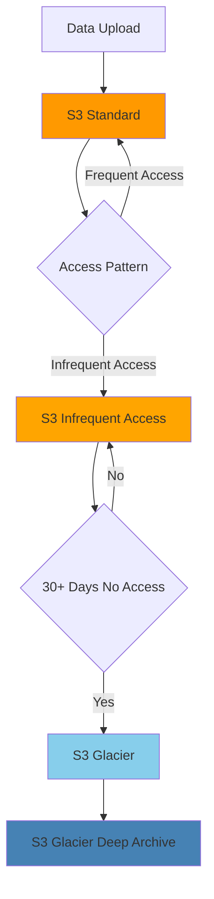

# Cost Optimization

*Resource costs and optimization strategies for the OpenData Pulse system.*

## Overview

OpenData Pulse is designed for cost-effective operation using serverless and managed services with pay-per-use pricing models and automated optimization strategies.

## Cost Structure

### Primary Cost Components

#### Compute Costs
- **Lambda Functions**: Pay-per-execution model
  - Ingestion: ~$5-10/month for hourly execution
  - ETL Processing: ~$10-20/month based on data volume
  - Health Checks: ~$1-2/month for monitoring
- **Total Compute**: ~$16-32/month

#### Storage Costs
- **S3 Raw Data**: ~$5-15/month (Standard tier)
- **S3 Curated Data**: ~$3-10/month (Intelligent Tiering)
- **DynamoDB**: ~$10-25/month (On-demand pricing)
- **Total Storage**: ~$18-50/month

#### API and Networking
- **AppSync GraphQL**: ~$2-8/month based on requests
- **CloudFront CDN**: ~$1-5/month for caching
- **Data Transfer**: ~$1-3/month for API responses
- **Total API/Network**: ~$4-16/month

### Total Monthly Cost Estimate
- **Development**: $20-40/month
- **Staging**: $30-60/month  
- **Production**: $50-150/month (depending on usage)

## Cost Optimization Strategies

### Storage Optimization

#### S3 Intelligent Tiering


#### Lifecycle Policies
- **Raw Data**: Move to IA after 30 days, Glacier after 90 days
- **Curated Data**: Keep in Standard for 60 days, then IA
- **Temporary Files**: Delete after 7 days
- **Log Files**: Compress and archive after 30 days

### Compute Optimization

#### Lambda Function Optimization
- **Memory Allocation**: Right-sized based on profiling
- **Timeout Settings**: Optimized to prevent unnecessary charges
- **Provisioned Concurrency**: Only for critical functions
- **Dead Letter Queues**: Prevent infinite retry costs

#### DynamoDB Optimization
- **On-Demand Pricing**: Automatic scaling without pre-provisioning
- **Global Secondary Indexes**: Minimal indexes for cost efficiency
- **TTL (Time To Live)**: Automatic cleanup of old data
- **Compression**: Efficient data encoding to reduce storage

### Monitoring and Alerting

#### Cost Monitoring Setup
```bash
# CloudWatch billing alarms
aws cloudwatch put-metric-alarm \
  --alarm-name "OpenDataPulse-MonthlyCost" \
  --alarm-description "Monthly cost threshold" \
  --metric-name EstimatedCharges \
  --namespace AWS/Billing \
  --statistic Maximum \
  --period 86400 \
  --threshold 100 \
  --comparison-operator GreaterThanThreshold
```

#### Budget Configuration
- **Monthly Budget**: Set alerts at 50%, 80%, and 100% of budget
- **Service-Level Budgets**: Track costs by AWS service
- **Environment Budgets**: Separate budgets for dev/staging/prod
- **Anomaly Detection**: Automated detection of unusual spending

### Performance vs Cost Trade-offs

#### Caching Strategy
- **CloudFront**: Cache static content and API responses
- **AppSync**: Built-in query result caching
- **DynamoDB**: Hot data for fast access vs cold storage costs
- **Lambda**: Memory vs execution time optimization

#### Data Retention Policies
- **Hot Data**: 30 days in DynamoDB for fast queries
- **Warm Data**: 1 year in S3 Standard/IA for regular access
- **Cold Data**: Long-term archive in Glacier for compliance
- **Purge Policy**: Automatic deletion of data beyond retention period

## Cost Optimization Recommendations

### Immediate Actions
1. **Enable S3 Intelligent Tiering** for all data buckets
2. **Set up CloudWatch billing alarms** for cost monitoring
3. **Implement lifecycle policies** for automated data archival
4. **Right-size Lambda functions** based on actual usage patterns

### Medium-term Optimizations
1. **Reserved Capacity**: Consider DynamoDB reserved capacity for predictable workloads
2. **Spot Instances**: Use for batch processing workloads if applicable
3. **Data Compression**: Implement compression for S3 storage
4. **Query Optimization**: Optimize GraphQL queries to reduce compute costs

### Long-term Strategies
1. **Multi-region Optimization**: Evaluate regional pricing differences
2. **Savings Plans**: Consider AWS Compute Savings Plans for consistent usage
3. **Architecture Review**: Regular review of cost vs performance trade-offs
4. **Usage Analytics**: Implement detailed cost attribution and chargeback

## Cost Monitoring Dashboard

### Key Metrics to Track
- Daily and monthly spending trends
- Cost per API request
- Storage costs by data type and age
- Lambda execution costs by function
- Data transfer costs by region

### Automated Reports
- Weekly cost summary emails
- Monthly cost analysis with recommendations
- Quarterly architecture review for optimization opportunities
- Annual budget planning with growth projections

*Content will be generated from AWS Cost Explorer and billing analysis*