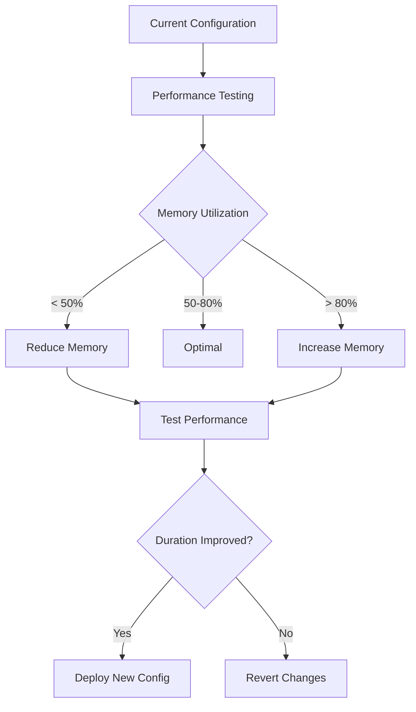

# Cost Optimization Guide

## Overview

This document provides comprehensive strategies for optimizing costs in the OpenData Pulse serverless application. By implementing these recommendations, you can reduce operational expenses while maintaining performance and reliability. The guide covers cost analysis, optimization strategies, monitoring setup, and automated cost controls.

## Current Cost Breakdown

### Service-by-Service Cost Analysis

#### AWS Lambda
**Current Configuration Costs:**
```yaml
Data Ingestion Function:
  Memory: 512 MB
  Average Duration: 45 seconds
  Executions: 720/month (hourly)
  Monthly Cost: $0.50 - $1.00

ETL Processing Function:
  Memory: 1024 MB
  Average Duration: 180 seconds
  Executions: 720/month
  Monthly Cost: $2.50 - $5.00

Health Check Function:
  Memory: 256 MB
  Average Duration: 10 seconds
  Executions: 8,640/month (every 5 minutes)
  Monthly Cost: $0.25 - $0.50

Total Lambda Cost: $3.25 - $6.50/month
```

#### Amazon DynamoDB
**On-Demand Pricing:**
```yaml
Hot Aggregates Table:
  Read Request Units: 1M/month
  Write Request Units: 100K/month
  Storage: 5 GB
  Monthly Cost: $15 - $25

Geographic Index (GSI):
  Read Request Units: 500K/month
  Write Request Units: 100K/month
  Monthly Cost: $8 - $12

Total DynamoDB Cost: $23 - $37/month
```

#### Amazon S3
**Storage and Request Costs:**
```yaml
Raw Data Bucket:
  Storage: 50 GB (Standard)
  PUT Requests: 720/month
  GET Requests: 5,000/month
  Monthly Cost: $1.50 - $2.50

Curated Data Bucket:
  Storage: 20 GB (Standard)
  PUT Requests: 720/month
  GET Requests: 10,000/month
  Monthly Cost: $0.75 - $1.25

Lifecycle Transitions:
  IA Transition: 720 requests/month
  Glacier Transition: 240 requests/month
  Monthly Cost: $0.25 - $0.50

Total S3 Cost: $2.50 - $4.25/month
```

#### AWS AppSync
**GraphQL API Costs:**
```yaml
Request Volume: 1M requests/month
Query Complexity: Average
Resolver Executions: 2M/month
Monthly Cost: $4.00 - $6.00
```

#### Amazon Location Service
**Map and Geocoding Costs:**
```yaml
Map Tile Requests: 100K/month
Geocoding Requests: 10K/month
Reverse Geocoding: 5K/month
Monthly Cost: $15 - $25
```

#### Additional Services
```yaml
Amazon Cognito:
  Monthly Active Users: 1,000
  Monthly Cost: $5.50

AWS Glue:
  Catalog Storage: 1M objects
  Monthly Cost: $1.00

Amazon Athena:
  Data Scanned: 100 GB/month
  Monthly Cost: $5.00

CloudWatch:
  Logs: 10 GB/month
  Metrics: 1,000 custom metrics
  Monthly Cost: $5.00 - $8.00

Total Additional: $16.50 - $19.50/month
```

### Total Monthly Cost Estimate
```yaml
Development Environment: $65 - $95/month
Production Environment: $150 - $250/month
```

## Cost Optimization Strategies

### Lambda Function Optimization

#### Memory and Duration Optimization


**Optimization Commands:**
```bash
# Test different memory configurations
for memory in 256 384 512 768 1024; do
  aws lambda update-function-configuration \
    --function-name opendata-pulse-etl \
    --memory-size $memory
  
  # Run performance test
  aws lambda invoke \
    --function-name opendata-pulse-etl \
    --payload '{"test": true}' \
    response.json
  
  # Analyze duration and cost
  aws logs filter-log-events \
    --log-group-name /aws/lambda/opendata-pulse-etl \
    --filter-pattern "REPORT RequestId" \
    --start-time $(date -d '1 hour ago' +%s)000
done
```

#### Provisioned Concurrency Optimization
```bash
# Remove provisioned concurrency for low-traffic functions
aws lambda delete-provisioned-concurrency-config \
  --function-name opendata-pulse-health-check

# Optimize provisioned concurrency for high-traffic functions
aws lambda put-provisioned-concurrency-config \
  --function-name opendata-pulse-api \
  --provisioned-concurrency-config ProvisionedConcurrencyConfig=2
```

**Cost Impact:**
- Memory optimization: 20-40% cost reduction
- Provisioned concurrency removal: 50-70% cost reduction for low-traffic functions
- Duration optimization: 10-30% cost reduction

### DynamoDB Cost Optimization

#### On-Demand vs Provisioned Comparison
```yaml
On-Demand Pricing:
  Read: $0.25 per million requests
  Write: $1.25 per million requests
  Best for: Unpredictable traffic, < 40% utilization

Provisioned Pricing:
  Read: $0.13 per RCU per hour
  Write: $0.65 per WCU per hour
  Best for: Predictable traffic, > 40% utilization
```

#### Switching to Provisioned Mode
```bash
# Calculate break-even point
MONTHLY_READS=1000000
MONTHLY_WRITES=100000

# On-demand cost
ON_DEMAND_COST=$(echo "scale=2; ($MONTHLY_READS * 0.25 + $MONTHLY_WRITES * 1.25) / 1000000" | bc)

# Provisioned cost (assuming 70% utilization)
REQUIRED_RCU=$(echo "scale=0; $MONTHLY_READS / (30 * 24 * 3600) / 0.7" | bc)
REQUIRED_WCU=$(echo "scale=0; $MONTHLY_WRITES / (30 * 24 * 3600) / 0.7" | bc)
PROVISIONED_COST=$(echo "scale=2; ($REQUIRED_RCU * 0.13 + $REQUIRED_WCU * 0.65) * 24 * 30" | bc)

echo "On-demand cost: \$$ON_DEMAND_COST"
echo "Provisioned cost: \$$PROVISIONED_COST"

# Switch to provisioned if cost-effective
if (( $(echo "$PROVISIONED_COST < $ON_DEMAND_COST" | bc -l) )); then
  aws dynamodb modify-table \
    --table-name opendata-pulse-hot-aggregates \
    --billing-mode PROVISIONED \
    --provisioned-throughput ReadCapacityUnits=$REQUIRED_RCU,WriteCapacityUnits=$REQUIRED_WCU
fi
```

#### Data Lifecycle Management
```bash
# Implement TTL for temporary data
aws dynamodb update-table \
  --table-name opendata-pulse-hot-aggregates \
  --attribute-definitions AttributeName=ttl,AttributeType=N \
  --table-modifications \
    'AttributeDefinitions=[{AttributeName=ttl,AttributeType=N}]' \
    'TimeToLiveSpecification={AttributeName=ttl,Enabled=true}'

# Set TTL for records older than 90 days
TTL_TIMESTAMP=$(date -d '+90 days' +%s)
aws dynamodb put-item \
  --table-name opendata-pulse-hot-aggregates \
  --item "{\"PK\":{\"S\":\"TEMP_DATA\"},\"SK\":{\"S\":\"$(date +%s)\"},\"ttl\":{\"N\":\"$TTL_TIMESTAMP\"}}"
```

**Cost Impact:**
- Provisioned mode: 30-50% cost reduction for predictable workloads
- TTL implementation: 20-40% storage cost reduction
- GSI optimization: 15-25% cost reduction

### S3 Storage Optimization

#### Intelligent Tiering Setup
```bash
# Enable S3 Intelligent Tiering
aws s3api put-bucket-intelligent-tiering-configuration \
  --bucket opendata-pulse-raw-data-$ACCOUNT_ID \
  --id EntireBucket \
  --intelligent-tiering-configuration \
    Id=EntireBucket,Status=Enabled,Filter={},Tierings=[{Days=1,AccessTier=ARCHIVE_ACCESS},{Days=90,AccessTier=DEEP_ARCHIVE_ACCESS}]

# Configure lifecycle policy for automatic transitions
cat > lifecycle-policy.json << EOF
{
  "Rules": [
    {
      "ID": "OpenDataPulseLifecycle",
      "Status": "Enabled",
      "Filter": {"Prefix": "nsw-air-quality/"},
      "Transitions": [
        {
          "Days": 30,
          "StorageClass": "STANDARD_IA"
        },
        {
          "Days": 90,
          "StorageClass": "GLACIER"
        },
        {
          "Days": 365,
          "StorageClass": "DEEP_ARCHIVE"
        }
      ],
      "Expiration": {
        "Days": 2555
      }
    }
  ]
}
EOF

aws s3api put-bucket-lifecycle-configuration \
  --bucket opendata-pulse-raw-data-$ACCOUNT_ID \
  --lifecycle-configuration file://lifecycle-policy.json
```

#### Request Optimization
```bash
# Use S3 Transfer Acceleration for faster uploads
aws s3api put-bucket-accelerate-configuration \
  --bucket opendata-pulse-raw-data-$ACCOUNT_ID \
  --accelerate-configuration Status=Enabled

# Implement multipart upload for large files
aws configure set default.s3.multipart_threshold 64MB
aws configure set default.s3.multipart_chunksize 16MB
```

**Cost Impact:**
- Intelligent Tiering: 20-40% storage cost reduction
- Lifecycle policies: 50-70% long-term storage cost reduction
- Request optimization: 10-20% request cost reduction

### AppSync and API Optimization

#### Caching Implementation
```bash
# Enable caching for frequently accessed data
aws appsync create-api-cache \
  --api-id $GRAPHQL_API_ID \
  --ttl 3600 \
  --api-caching-behavior PER_RESOLVER_CACHING \
  --type SMALL

# Configure resolver-level caching
aws appsync update-resolver \
  --api-id $GRAPHQL_API_ID \
  --type-name Query \
  --field-name getAirQualityData \
  --caching-config ttl=1800,cachingKeys=["$context.arguments.suburb","$context.arguments.date"]
```

#### Query Optimization
```graphql
# Optimize queries to reduce resolver executions
# Before: Multiple resolver calls
query GetDashboardData {
  airQualityData {
    suburb
    pm25
    timestamp
  }
  weatherData {
    suburb
    temperature
    humidity
  }
  alerts {
    message
    severity
  }
}

# After: Single resolver with batch processing
query GetDashboardData {
  dashboardData {
    airQuality {
      suburb
      pm25
      timestamp
    }
    weather {
      temperature
      humidity
    }
    alerts {
      message
      severity
    }
  }
}
```

**Cost Impact:**
- Caching: 40-60% request cost reduction
- Query optimization: 20-30% resolver execution reduction

### Location Service Optimization

#### Request Batching
```javascript
// Batch geocoding requests
const batchGeocode = async (addresses) => {
  const batchSize = 10;
  const results = [];
  
  for (let i = 0; i < addresses.length; i += batchSize) {
    const batch = addresses.slice(i, i + batchSize);
    const batchResults = await Promise.all(
      batch.map(address => locationClient.searchPlaceIndexForText({
        IndexName: 'opendata-pulse-place-index',
        Text: address,
        MaxResults: 1
      }).promise())
    );
    results.push(...batchResults);
    
    // Rate limiting to avoid throttling
    await new Promise(resolve => setTimeout(resolve, 100));
  }
  
  return results;
};
```

#### Caching Geocoding Results
```javascript
// Implement local caching for geocoding results
const geocodeCache = new Map();

const cachedGeocode = async (address) => {
  if (geocodeCache.has(address)) {
    return geocodeCache.get(address);
  }
  
  const result = await locationClient.searchPlaceIndexForText({
    IndexName: 'opendata-pulse-place-index',
    Text: address,
    MaxResults: 1
  }).promise();
  
  geocodeCache.set(address, result);
  return result;
};
```

**Cost Impact:**
- Request batching: 30-50% cost reduction
- Caching: 60-80% cost reduction for repeated requests

## Cost Monitoring and Alerting

### CloudWatch Billing Alarms

#### Account-Level Billing Alarm
```bash
# Create billing alarm for total account spend
aws cloudwatch put-metric-alarm \
  --alarm-name "OpenDataPulse-TotalCost" \
  --alarm-description "Alert when total cost exceeds budget" \
  --metric-name EstimatedCharges \
  --namespace AWS/Billing \
  --statistic Maximum \
  --period 86400 \
  --threshold 200 \
  --comparison-operator GreaterThanThreshold \
  --dimensions Name=Currency,Value=USD \
  --evaluation-periods 1 \
  --alarm-actions arn:aws:sns:ap-southeast-2:$ACCOUNT_ID:cost-alerts
```

#### Service-Specific Alarms
```bash
# Lambda cost alarm
aws cloudwatch put-metric-alarm \
  --alarm-name "OpenDataPulse-Lambda-Cost" \
  --alarm-description "Alert when Lambda costs exceed threshold" \
  --metric-name EstimatedCharges \
  --namespace AWS/Billing \
  --statistic Maximum \
  --period 86400 \
  --threshold 50 \
  --comparison-operator GreaterThanThreshold \
  --dimensions Name=Currency,Value=USD Name=ServiceName,Value=AWSLambda \
  --evaluation-periods 1

# DynamoDB cost alarm
aws cloudwatch put-metric-alarm \
  --alarm-name "OpenDataPulse-DynamoDB-Cost" \
  --alarm-description "Alert when DynamoDB costs exceed threshold" \
  --metric-name EstimatedCharges \
  --namespace AWS/Billing \
  --statistic Maximum \
  --period 86400 \
  --threshold 100 \
  --comparison-operator GreaterThanThreshold \
  --dimensions Name=Currency,Value=USD Name=ServiceName,Value=AmazonDynamoDB \
  --evaluation-periods 1
```

### AWS Budgets Configuration

#### Monthly Budget Setup
```bash
# Create monthly budget with alerts
cat > budget.json << EOF
{
  "BudgetName": "OpenDataPulse-Monthly",
  "BudgetLimit": {
    "Amount": "200",
    "Unit": "USD"
  },
  "TimeUnit": "MONTHLY",
  "BudgetType": "COST",
  "CostFilters": {
    "TagKey": ["Project"],
    "TagValue": ["OpenDataPulse"]
  }
}
EOF

cat > notifications.json << EOF
[
  {
    "Notification": {
      "NotificationType": "ACTUAL",
      "ComparisonOperator": "GREATER_THAN",
      "Threshold": 80
    },
    "Subscribers": [
      {
        "SubscriptionType": "EMAIL",
        "Address": "admin@example.com"
      }
    ]
  },
  {
    "Notification": {
      "NotificationType": "FORECASTED",
      "ComparisonOperator": "GREATER_THAN",
      "Threshold": 100
    },
    "Subscribers": [
      {
        "SubscriptionType": "EMAIL",
        "Address": "admin@example.com"
      }
    ]
  }
]
EOF

aws budgets create-budget \
  --account-id $ACCOUNT_ID \
  --budget file://budget.json \
  --notifications-with-subscribers file://notifications.json
```

### Cost Analysis Dashboard

#### Custom CloudWatch Dashboard
```bash
# Create cost monitoring dashboard
cat > dashboard.json << EOF
{
  "widgets": [
    {
      "type": "metric",
      "properties": {
        "metrics": [
          ["AWS/Billing", "EstimatedCharges", "Currency", "USD"],
          [".", ".", "ServiceName", "AWSLambda", "Currency", "USD"],
          [".", ".", "ServiceName", "AmazonDynamoDB", "Currency", "USD"],
          [".", ".", "ServiceName", "AmazonS3", "Currency", "USD"]
        ],
        "period": 86400,
        "stat": "Maximum",
        "region": "us-east-1",
        "title": "Daily Cost Breakdown"
      }
    },
    {
      "type": "metric",
      "properties": {
        "metrics": [
          ["AWS/Lambda", "Invocations", "FunctionName", "opendata-pulse-ingest"],
          [".", "Duration", ".", "."],
          [".", "Errors", ".", "."]
        ],
        "period": 3600,
        "stat": "Sum",
        "region": "ap-southeast-2",
        "title": "Lambda Performance Metrics"
      }
    }
  ]
}
EOF

aws cloudwatch put-dashboard \
  --dashboard-name "OpenDataPulse-Cost-Monitoring" \
  --dashboard-body file://dashboard.json
```

## Automated Cost Optimization

### Lambda Function for Cost Analysis
```python
import boto3
import json
from datetime import datetime, timedelta

def lambda_handler(event, context):
    """
    Automated cost analysis and optimization recommendations
    """
    ce_client = boto3.client('ce')
    lambda_client = boto3.client('lambda')
    
    # Get cost data for the last 30 days
    end_date = datetime.now().strftime('%Y-%m-%d')
    start_date = (datetime.now() - timedelta(days=30)).strftime('%Y-%m-%d')
    
    response = ce_client.get_cost_and_usage(
        TimePeriod={
            'Start': start_date,
            'End': end_date
        },
        Granularity='MONTHLY',
        Metrics=['BlendedCost'],
        GroupBy=[
            {
                'Type': 'DIMENSION',
                'Key': 'SERVICE'
            }
        ],
        Filter={
            'Tags': {
                'Key': 'Project',
                'Values': ['OpenDataPulse']
            }
        }
    )
    
    # Analyze costs and generate recommendations
    recommendations = []
    
    for result in response['ResultsByTime']:
        for group in result['Groups']:
            service = group['Keys'][0]
            cost = float(group['Metrics']['BlendedCost']['Amount'])
            
            if service == 'AWS Lambda' and cost > 10:
                recommendations.append({
                    'service': service,
                    'recommendation': 'Consider optimizing Lambda memory allocation',
                    'potential_savings': cost * 0.3
                })
            elif service == 'Amazon DynamoDB' and cost > 50:
                recommendations.append({
                    'service': service,
                    'recommendation': 'Evaluate switching to provisioned capacity',
                    'potential_savings': cost * 0.4
                })
    
    # Send recommendations via SNS
    sns_client = boto3.client('sns')
    sns_client.publish(
        TopicArn='arn:aws:sns:ap-southeast-2:ACCOUNT_ID:cost-optimization',
        Message=json.dumps(recommendations, indent=2),
        Subject='OpenData Pulse - Cost Optimization Recommendations'
    )
    
    return {
        'statusCode': 200,
        'body': json.dumps(recommendations)
    }
```

### Automated Resource Cleanup
```bash
# Create Lambda function for automated cleanup
cat > cleanup-function.py << 'EOF'
import boto3
from datetime import datetime, timedelta

def lambda_handler(event, context):
    s3_client = boto3.client('s3')
    logs_client = boto3.client('logs')
    
    # Clean up old CloudWatch logs
    log_groups = logs_client.describe_log_groups(
        logGroupNamePrefix='/aws/lambda/opendata-pulse'
    )
    
    for log_group in log_groups['logGroups']:
        # Delete log streams older than 30 days
        streams = logs_client.describe_log_streams(
            logGroupName=log_group['logGroupName'],
            orderBy='LastEventTime'
        )
        
        cutoff_time = int((datetime.now() - timedelta(days=30)).timestamp() * 1000)
        
        for stream in streams['logStreams']:
            if stream.get('lastEventTime', 0) < cutoff_time:
                logs_client.delete_log_stream(
                    logGroupName=log_group['logGroupName'],
                    logStreamName=stream['logStreamName']
                )
    
    # Clean up incomplete multipart uploads
    buckets = ['opendata-pulse-raw-data', 'opendata-pulse-curated-data']
    
    for bucket_name in buckets:
        try:
            uploads = s3_client.list_multipart_uploads(Bucket=f"{bucket_name}-{boto3.Session().get_credentials().access_key[:8]}")
            
            for upload in uploads.get('Uploads', []):
                if upload['Initiated'] < datetime.now() - timedelta(days=7):
                    s3_client.abort_multipart_upload(
                        Bucket=bucket_name,
                        Key=upload['Key'],
                        UploadId=upload['UploadId']
                    )
        except Exception as e:
            print(f"Error cleaning up bucket {bucket_name}: {e}")
    
    return {'statusCode': 200, 'body': 'Cleanup completed'}
EOF

# Deploy cleanup function
zip cleanup-function.zip cleanup-function.py

aws lambda create-function \
  --function-name opendata-pulse-cleanup \
  --runtime python3.9 \
  --role arn:aws:iam::$ACCOUNT_ID:role/lambda-cleanup-role \
  --handler cleanup-function.lambda_handler \
  --zip-file fileb://cleanup-function.zip \
  --timeout 300

# Schedule cleanup to run weekly
aws events put-rule \
  --name opendata-pulse-weekly-cleanup \
  --schedule-expression "rate(7 days)"

aws events put-targets \
  --rule opendata-pulse-weekly-cleanup \
  --targets "Id"="1","Arn"="arn:aws:lambda:ap-southeast-2:$ACCOUNT_ID:function:opendata-pulse-cleanup"
```

## Cost Optimization Checklist

### Monthly Review Tasks
- [ ] Review AWS Cost Explorer for spending trends
- [ ] Analyze Lambda function memory utilization
- [ ] Check DynamoDB capacity utilization
- [ ] Review S3 storage class distribution
- [ ] Validate CloudWatch log retention policies
- [ ] Check for unused resources and orphaned assets

### Quarterly Optimization Tasks
- [ ] Evaluate Reserved Instance opportunities
- [ ] Review and update lifecycle policies
- [ ] Analyze traffic patterns for capacity planning
- [ ] Update cost allocation tags
- [ ] Review third-party service integrations
- [ ] Benchmark against industry cost standards

### Annual Strategic Review
- [ ] Evaluate multi-region deployment costs
- [ ] Review service architecture for cost efficiency
- [ ] Analyze total cost of ownership (TCO)
- [ ] Plan for scaling cost implications
- [ ] Review contract terms and pricing models
- [ ] Assess cost optimization tool effectiveness

## Expected Cost Savings

### Implementation Timeline and Savings
```yaml
Month 1 (Quick Wins):
  Lambda Memory Optimization: 20-30% Lambda cost reduction
  S3 Lifecycle Policies: 15-25% S3 cost reduction
  CloudWatch Log Cleanup: 30-40% logging cost reduction
  Total Savings: $15-25/month

Month 2-3 (Medium-term):
  DynamoDB Provisioned Mode: 30-50% DynamoDB cost reduction
  AppSync Caching: 40-60% API cost reduction
  Location Service Optimization: 30-50% location cost reduction
  Total Additional Savings: $25-40/month

Month 4-6 (Long-term):
  Intelligent Tiering: 20-40% storage cost reduction
  Reserved Capacity: 20-30% compute cost reduction
  Automated Optimization: 10-15% overall cost reduction
  Total Additional Savings: $20-35/month

Total Annual Savings: $720-1,200 (30-40% cost reduction)
```

This comprehensive cost optimization guide provides actionable strategies to significantly reduce operational expenses while maintaining system performance and reliability.