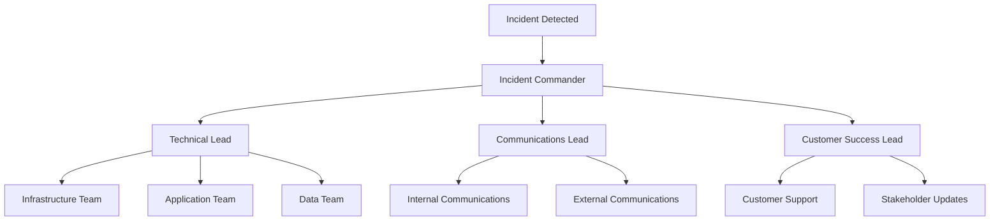

# Operational Runbooks and Incident Procedures

## Overview

This document provides comprehensive operational runbooks and incident response procedures for the OpenData Pulse serverless application. It covers common operational scenarios, troubleshooting guides, rollback procedures, and incident response protocols to ensure system reliability and rapid issue resolution.

## Incident Classification

### Severity Levels

#### Severity 1 (Critical)
- **Definition**: Complete system outage or data loss
- **Response Time**: 15 minutes
- **Examples**: 
  - GraphQL API completely unavailable
  - Data ingestion pipeline completely failed
  - Security breach detected
  - Complete DynamoDB table corruption

#### Severity 2 (High)
- **Definition**: Major functionality impaired, significant user impact
- **Response Time**: 1 hour
- **Examples**:
  - High error rates (>5%) in API responses
  - Data processing delays >4 hours
  - Authentication system partially down
  - Performance degradation >50%

#### Severity 3 (Medium)
- **Definition**: Minor functionality impaired, limited user impact
- **Response Time**: 4 hours
- **Examples**:
  - Intermittent API errors (<5%)
  - Data processing delays 1-4 hours
  - Non-critical features unavailable
  - Performance degradation 20-50%

#### Severity 4 (Low)
- **Definition**: Cosmetic issues, minimal user impact
- **Response Time**: 24 hours
- **Examples**:
  - Documentation updates needed
  - Minor UI inconsistencies
  - Non-critical monitoring alerts
  - Performance degradation <20%

## Common Operational Scenarios

### Data Ingestion Issues

#### Scenario: NSW API Data Ingestion Failure

**Symptoms:**
- No new data files in S3 raw bucket
- Lambda function errors in CloudWatch logs
- Missing hourly data updates

**Diagnosis Steps:**
```bash
# 1. Check Lambda function logs
aws logs filter-log-events \
  --log-group-name /aws/lambda/opendata-pulse-ingest \
  --start-time $(date -d '2 hours ago' +%s)000 \
  --filter-pattern "ERROR"

# 2. Check EventBridge rule status
aws events describe-rule --name opendata-pulse-hourly-ingestion

# 3. Test NSW API connectivity
curl -I "https://api.nsw.gov.au/air-quality/v1/stations"

# 4. Check S3 bucket permissions
aws s3api get-bucket-policy --bucket opendata-pulse-raw-data-$ACCOUNT_ID
```

**Resolution Steps:**
```bash
# 1. Manual function invocation to test
aws lambda invoke \
  --function-name opendata-pulse-ingest \
  --payload '{"test": true}' \
  response.json

# 2. Check and fix IAM permissions if needed
aws iam get-role-policy \
  --role-name opendata-pulse-ingest-role \
  --policy-name S3AccessPolicy

# 3. Re-enable EventBridge rule if disabled
aws events enable-rule --name opendata-pulse-hourly-ingestion

# 4. Trigger manual backfill for missed data
for hour in {1..6}; do
  TIMESTAMP=$(date -d "$hour hours ago" +%Y-%m-%dT%H:00:00Z)
  aws lambda invoke \
    --function-name opendata-pulse-ingest \
    --payload "{\"backfill\": true, \"timestamp\": \"$TIMESTAMP\"}" \
    backfill-$hour.json
done
```

**Validation:**
```bash
# Verify new data files are created
aws s3 ls s3://opendata-pulse-raw-data-$ACCOUNT_ID/nsw-air-quality/raw/$(date +%Y/%m/%d)/

# Check function metrics
aws cloudwatch get-metric-statistics \
  --namespace AWS/Lambda \
  --metric-name Invocations \
  --dimensions Name=FunctionName,Value=opendata-pulse-ingest \
  --start-time $(date -d '1 hour ago' --iso-8601) \
  --end-time $(date --iso-8601) \
  --period 300 \
  --statistics Sum
```

#### Scenario: ETL Processing Backlog

**Symptoms:**
- Raw data files not being processed
- DynamoDB not receiving updates
- Curated bucket missing recent files

**Diagnosis Steps:**
```bash
# 1. Check ETL function logs
aws logs filter-log-events \
  --log-group-name /aws/lambda/opendata-pulse-etl \
  --start-time $(date -d '4 hours ago' +%s)000 \
  --filter-pattern "ERROR"

# 2. Check SQS DLQ for failed messages
aws sqs get-queue-attributes \
  --queue-url https://sqs.ap-southeast-2.amazonaws.com/$ACCOUNT_ID/opendata-pulse-processing-dlq \
  --attribute-names ApproximateNumberOfMessages

# 3. Check Lambda concurrency limits
aws lambda get-function-concurrency \
  --function-name opendata-pulse-etl
```

**Resolution Steps:**
```bash
# 1. Increase Lambda concurrency temporarily
aws lambda put-function-concurrency \
  --function-name opendata-pulse-etl \
  --reserved-concurrent-executions 20

# 2. Process DLQ messages manually
aws sqs receive-message \
  --queue-url https://sqs.ap-southeast-2.amazonaws.com/$ACCOUNT_ID/opendata-pulse-processing-dlq \
  --max-number-of-messages 10 > dlq-messages.json

# 3. Reprocess failed files
for file in $(aws s3 ls s3://opendata-pulse-raw-data-$ACCOUNT_ID/nsw-air-quality/raw/ --recursive | grep "$(date +%Y/%m/%d)" | awk '{print $4}'); do
  aws lambda invoke \
    --function-name opendata-pulse-etl \
    --payload "{\"Records\":[{\"s3\":{\"bucket\":{\"name\":\"opendata-pulse-raw-data-$ACCOUNT_ID\"},\"object\":{\"key\":\"$file\"}}}]}" \
    reprocess-$(basename $file).json
done
```

### API Performance Issues

#### Scenario: High GraphQL API Latency

**Symptoms:**
- API response times >2 seconds
- User complaints about slow loading
- High CloudWatch latency metrics

**Diagnosis Steps:**
```bash
# 1. Check AppSync metrics
aws cloudwatch get-metric-statistics \
  --namespace AWS/AppSync \
  --metric-name Latency \
  --dimensions Name=GraphQLAPIId,Value=$GRAPHQL_API_ID \
  --start-time $(date -d '1 hour ago' --iso-8601) \
  --end-time $(date --iso-8601) \
  --period 300 \
  --statistics Average,Maximum

# 2. Check DynamoDB throttling
aws cloudwatch get-metric-statistics \
  --namespace AWS/DynamoDB \
  --metric-name ThrottledRequests \
  --dimensions Name=TableName,Value=opendata-pulse-hot-aggregates \
  --start-time $(date -d '1 hour ago' --iso-8601) \
  --end-time $(date --iso-8601) \
  --period 300 \
  --statistics Sum

# 3. Analyze resolver performance
aws appsync list-resolvers \
  --api-id $GRAPHQL_API_ID \
  --type-name Query
```

**Resolution Steps:**
```bash
# 1. Enable AppSync caching if not already enabled
aws appsync create-api-cache \
  --api-id $GRAPHQL_API_ID \
  --ttl 3600 \
  --api-caching-behavior PER_RESOLVER_CACHING \
  --type SMALL

# 2. Increase DynamoDB capacity temporarily
aws dynamodb update-table \
  --table-name opendata-pulse-hot-aggregates \
  --provisioned-throughput ReadCapacityUnits=100,WriteCapacityUnits=50

# 3. Optimize frequently used resolvers
aws appsync update-resolver \
  --api-id $GRAPHQL_API_ID \
  --type-name Query \
  --field-name getAirQualityData \
  --caching-config ttl=1800,cachingKeys=["$context.arguments.suburb"]
```

#### Scenario: Authentication Failures

**Symptoms:**
- Users cannot log in
- JWT token validation errors
- Cognito service errors

**Diagnosis Steps:**
```bash
# 1. Check Cognito User Pool status
aws cognito-idp describe-user-pool --user-pool-id $USER_POOL_ID

# 2. Check User Pool Client configuration
aws cognito-idp describe-user-pool-client \
  --user-pool-id $USER_POOL_ID \
  --client-id $USER_POOL_CLIENT_ID

# 3. Test authentication flow
aws cognito-idp admin-initiate-auth \
  --user-pool-id $USER_POOL_ID \
  --client-id $USER_POOL_CLIENT_ID \
  --auth-flow ADMIN_NO_SRP_AUTH \
  --auth-parameters USERNAME=testuser,PASSWORD=TestPass123!
```

**Resolution Steps:**
```bash
# 1. Reset user password if needed
aws cognito-idp admin-set-user-password \
  --user-pool-id $USER_POOL_ID \
  --username testuser \
  --password NewTempPass123! \
  --temporary

# 2. Update User Pool Client settings if needed
aws cognito-idp update-user-pool-client \
  --user-pool-id $USER_POOL_ID \
  --client-id $USER_POOL_CLIENT_ID \
  --explicit-auth-flows ADMIN_NO_SRP_AUTH,ALLOW_USER_PASSWORD_AUTH,ALLOW_REFRESH_TOKEN_AUTH

# 3. Clear AppSync cache if authentication is cached
aws appsync flush-api-cache --api-id $GRAPHQL_API_ID
```

### Infrastructure Issues

#### Scenario: DynamoDB Throttling

**Symptoms:**
- High error rates in API responses
- DynamoDB throttling metrics
- Slow data writes

**Diagnosis Steps:**
```bash
# 1. Check throttling metrics
aws cloudwatch get-metric-statistics \
  --namespace AWS/DynamoDB \
  --metric-name ThrottledRequests \
  --dimensions Name=TableName,Value=opendata-pulse-hot-aggregates \
  --start-time $(date -d '2 hours ago' --iso-8601) \
  --end-time $(date --iso-8601) \
  --period 300 \
  --statistics Sum

# 2. Check consumed capacity
aws cloudwatch get-metric-statistics \
  --namespace AWS/DynamoDB \
  --metric-name ConsumedReadCapacityUnits \
  --dimensions Name=TableName,Value=opendata-pulse-hot-aggregates \
  --start-time $(date -d '1 hour ago' --iso-8601) \
  --end-time $(date --iso-8601) \
  --period 300 \
  --statistics Sum
```

**Resolution Steps:**
```bash
# 1. Increase table capacity immediately
aws dynamodb update-table \
  --table-name opendata-pulse-hot-aggregates \
  --provisioned-throughput ReadCapacityUnits=200,WriteCapacityUnits=100

# 2. Update GSI capacity
aws dynamodb update-table \
  --table-name opendata-pulse-hot-aggregates \
  --global-secondary-index-updates \
    'Update={IndexName=GeographicIndex,ProvisionedThroughput={ReadCapacityUnits=100,WriteCapacityUnits=50}}'

# 3. Enable auto-scaling for future
aws application-autoscaling register-scalable-target \
  --service-namespace dynamodb \
  --resource-id table/opendata-pulse-hot-aggregates \
  --scalable-dimension dynamodb:table:ReadCapacityUnits \
  --min-capacity 5 \
  --max-capacity 1000
```

## Rollback Procedures

### CDK Stack Rollback

#### Complete Stack Rollback
```bash
# 1. Identify the last known good deployment
aws cloudformation describe-stacks \
  --stack-name OpenDataPulseApiStack \
  --query 'Stacks[0].{Status:StackStatus,LastUpdated:LastUpdatedTime}'

# 2. Get stack events to identify the issue
aws cloudformation describe-stack-events \
  --stack-name OpenDataPulseApiStack \
  --query 'StackEvents[?ResourceStatus==`UPDATE_FAILED`]'

# 3. Rollback using CDK
cdk deploy OpenDataPulseApiStack --rollback

# 4. If CDK rollback fails, use CloudFormation
aws cloudformation cancel-update-stack --stack-name OpenDataPulseApiStack
aws cloudformation continue-update-rollback --stack-name OpenDataPulseApiStack
```

#### Lambda Function Rollback
```bash
# 1. List function versions
aws lambda list-versions-by-function \
  --function-name opendata-pulse-etl \
  --query 'Versions[*].{Version:Version,LastModified:LastModified}'

# 2. Update alias to previous version
PREVIOUS_VERSION=$(aws lambda list-versions-by-function \
  --function-name opendata-pulse-etl \
  --query 'Versions[-2].Version' \
  --output text)

aws lambda update-alias \
  --function-name opendata-pulse-etl \
  --name LIVE \
  --function-version $PREVIOUS_VERSION

# 3. Verify rollback
aws lambda get-alias \
  --function-name opendata-pulse-etl \
  --name LIVE
```

#### Database Schema Rollback
```bash
# 1. Backup current data before rollback
aws dynamodb create-backup \
  --table-name opendata-pulse-hot-aggregates \
  --backup-name pre-rollback-$(date +%Y%m%d-%H%M%S)

# 2. If schema changes were made, restore from backup
BACKUP_ARN=$(aws dynamodb list-backups \
  --table-name opendata-pulse-hot-aggregates \
  --query 'BackupSummaries[0].BackupArn' \
  --output text)

aws dynamodb restore-table-from-backup \
  --target-table-name opendata-pulse-hot-aggregates-restored \
  --backup-arn $BACKUP_ARN

# 3. Switch application to use restored table (requires code deployment)
```

### Configuration Rollback

#### Environment Variable Rollback
```bash
# 1. Get current configuration
aws lambda get-function-configuration \
  --function-name opendata-pulse-etl \
  --query 'Environment.Variables' > current-env.json

# 2. Restore previous environment variables
aws lambda update-function-configuration \
  --function-name opendata-pulse-etl \
  --environment Variables='{
    "NSW_API_ENDPOINT": "https://api.nsw.gov.au/air-quality/v1",
    "S3_BUCKET": "opendata-pulse-raw-data-'$ACCOUNT_ID'",
    "DYNAMODB_TABLE": "opendata-pulse-hot-aggregates",
    "LOG_LEVEL": "INFO"
  }'
```

## Incident Response Procedures

### Incident Response Team Structure



### Incident Response Workflow

#### Phase 1: Detection and Initial Response (0-15 minutes)

**Actions:**
1. **Incident Detection**
   - Automated monitoring alerts
   - User reports
   - System health checks

2. **Initial Assessment**
   ```bash
   # Quick system health check
   ./scripts/health-check.sh
   
   # Check critical metrics
   aws cloudwatch get-metric-statistics \
     --namespace AWS/ApplicationELB \
     --metric-name TargetResponseTime \
     --dimensions Name=LoadBalancer,Value=opendata-pulse-alb \
     --start-time $(date -d '15 minutes ago' --iso-8601) \
     --end-time $(date --iso-8601) \
     --period 300 \
     --statistics Average
   ```

3. **Severity Classification**
   - Determine incident severity level
   - Activate appropriate response team
   - Set initial response timeline

4. **Communication Setup**
   ```bash
   # Create incident Slack channel
   curl -X POST -H 'Authorization: Bearer $SLACK_TOKEN' \
     -H 'Content-type: application/json' \
     --data '{"name":"incident-'$(date +%Y%m%d-%H%M)'","is_private":false}' \
     https://slack.com/api/conversations.create
   
   # Send initial notification
   aws sns publish \
     --topic-arn arn:aws:sns:ap-southeast-2:$ACCOUNT_ID:incident-alerts \
     --message "INCIDENT: Severity $SEVERITY detected in OpenData Pulse system"
   ```

#### Phase 2: Investigation and Diagnosis (15 minutes - 1 hour)

**Actions:**
1. **Detailed Investigation**
   ```bash
   # Collect system logs
   aws logs create-export-task \
     --log-group-name /aws/lambda/opendata-pulse-etl \
     --from $(date -d '2 hours ago' +%s)000 \
     --to $(date +%s)000 \
     --destination incident-logs-$ACCOUNT_ID \
     --destination-prefix incident-$(date +%Y%m%d-%H%M)/
   
   # Check error patterns
   aws logs filter-log-events \
     --log-group-name /aws/lambda/opendata-pulse-etl \
     --start-time $(date -d '2 hours ago' +%s)000 \
     --filter-pattern "ERROR" | jq '.events[].message'
   ```

2. **Impact Assessment**
   - Determine affected users/services
   - Estimate business impact
   - Identify root cause

3. **Containment Actions**
   ```bash
   # Implement circuit breaker if needed
   aws lambda update-function-configuration \
     --function-name opendata-pulse-etl \
     --environment Variables='{"CIRCUIT_BREAKER":"true"}'
   
   # Scale up resources if capacity issue
   aws lambda put-provisioned-concurrency-config \
     --function-name opendata-pulse-api \
     --provisioned-concurrency-config ProvisionedConcurrencyConfig=50
   ```

#### Phase 3: Resolution and Recovery (1-4 hours)

**Actions:**
1. **Implement Fix**
   ```bash
   # Deploy hotfix if code issue
   cdk deploy OpenDataPulseComputeStack --hotswap
   
   # Or rollback if recent deployment caused issue
   cdk deploy OpenDataPulseComputeStack --rollback
   ```

2. **Validate Resolution**
   ```bash
   # Run comprehensive health checks
   ./scripts/post-incident-validation.sh
   
   # Monitor key metrics for 30 minutes
   watch -n 60 'aws cloudwatch get-metric-statistics \
     --namespace AWS/Lambda \
     --metric-name Errors \
     --dimensions Name=FunctionName,Value=opendata-pulse-etl \
     --start-time $(date -d "5 minutes ago" --iso-8601) \
     --end-time $(date --iso-8601) \
     --period 300 \
     --statistics Sum'
   ```

3. **System Recovery**
   - Restore normal operations
   - Remove temporary fixes
   - Update monitoring thresholds

#### Phase 4: Post-Incident Activities (24-48 hours)

**Actions:**
1. **Post-Incident Review**
   - Conduct blameless post-mortem
   - Document timeline and actions
   - Identify improvement opportunities

2. **Follow-up Actions**
   ```bash
   # Create improvement tickets
   # Update runbooks based on learnings
   # Implement additional monitoring
   ```

### Communication Templates

#### Initial Incident Notification
```
INCIDENT ALERT - OpenData Pulse System

Severity: [SEVERITY_LEVEL]
Start Time: [TIMESTAMP]
Status: Investigating

Description: [BRIEF_DESCRIPTION]

Impact: [USER_IMPACT_DESCRIPTION]

Next Update: [TIMESTAMP + 30 minutes]

Incident Commander: [NAME]
```

#### Status Update Template
```
INCIDENT UPDATE - OpenData Pulse System

Incident ID: [INCIDENT_ID]
Status: [INVESTIGATING/IDENTIFIED/MONITORING/RESOLVED]
Time: [TIMESTAMP]

Update: [DETAILED_UPDATE]

Actions Taken:
- [ACTION_1]
- [ACTION_2]

Next Update: [TIMESTAMP]
```

#### Resolution Notification
```
INCIDENT RESOLVED - OpenData Pulse System

Incident ID: [INCIDENT_ID]
Resolution Time: [TIMESTAMP]
Duration: [TOTAL_DURATION]

Root Cause: [ROOT_CAUSE_SUMMARY]

Resolution: [RESOLUTION_SUMMARY]

Follow-up Actions:
- [ACTION_1]
- [ACTION_2]

Post-Mortem: [SCHEDULED_DATE]
```

## Monitoring and Alerting Setup

### Critical Alerts Configuration

```bash
# API Error Rate Alert
aws cloudwatch put-metric-alarm \
  --alarm-name "OpenDataPulse-API-ErrorRate" \
  --alarm-description "Alert when API error rate exceeds 5%" \
  --metric-name 4XXError \
  --namespace AWS/AppSync \
  --statistic Sum \
  --period 300 \
  --threshold 5 \
  --comparison-operator GreaterThanThreshold \
  --dimensions Name=GraphQLAPIId,Value=$GRAPHQL_API_ID \
  --evaluation-periods 2 \
  --alarm-actions arn:aws:sns:ap-southeast-2:$ACCOUNT_ID:critical-alerts

# Lambda Function Errors
aws cloudwatch put-metric-alarm \
  --alarm-name "OpenDataPulse-Lambda-Errors" \
  --alarm-description "Alert when Lambda errors exceed threshold" \
  --metric-name Errors \
  --namespace AWS/Lambda \
  --statistic Sum \
  --period 300 \
  --threshold 5 \
  --comparison-operator GreaterThanThreshold \
  --dimensions Name=FunctionName,Value=opendata-pulse-etl \
  --evaluation-periods 1 \
  --alarm-actions arn:aws:sns:ap-southeast-2:$ACCOUNT_ID:critical-alerts

# DynamoDB Throttling Alert
aws cloudwatch put-metric-alarm \
  --alarm-name "OpenDataPulse-DynamoDB-Throttling" \
  --alarm-description "Alert when DynamoDB requests are throttled" \
  --metric-name ThrottledRequests \
  --namespace AWS/DynamoDB \
  --statistic Sum \
  --period 300 \
  --threshold 1 \
  --comparison-operator GreaterThanOrEqualToThreshold \
  --dimensions Name=TableName,Value=opendata-pulse-hot-aggregates \
  --evaluation-periods 1 \
  --alarm-actions arn:aws:sns:ap-southeast-2:$ACCOUNT_ID:critical-alerts
```

### Health Check Scripts

#### System Health Check Script
```bash
#!/bin/bash
# health-check.sh - Comprehensive system health check

echo "=== OpenData Pulse System Health Check ==="
echo "Timestamp: $(date)"
echo ""

# Check Lambda functions
echo "1. Lambda Function Health:"
for func in opendata-pulse-ingest opendata-pulse-etl opendata-pulse-health-check; do
  STATUS=$(aws lambda get-function --function-name $func --query 'Configuration.State' --output text 2>/dev/null)
  if [ "$STATUS" = "Active" ]; then
    echo "  ✓ $func: Active"
  else
    echo "  ✗ $func: $STATUS"
  fi
done

# Check DynamoDB tables
echo ""
echo "2. DynamoDB Table Health:"
for table in opendata-pulse-hot-aggregates; do
  STATUS=$(aws dynamodb describe-table --table-name $table --query 'Table.TableStatus' --output text 2>/dev/null)
  if [ "$STATUS" = "ACTIVE" ]; then
    echo "  ✓ $table: Active"
  else
    echo "  ✗ $table: $STATUS"
  fi
done

# Check S3 buckets
echo ""
echo "3. S3 Bucket Health:"
for bucket in opendata-pulse-raw-data-$ACCOUNT_ID opendata-pulse-curated-data-$ACCOUNT_ID; do
  if aws s3 ls s3://$bucket > /dev/null 2>&1; then
    echo "  ✓ $bucket: Accessible"
  else
    echo "  ✗ $bucket: Not accessible"
  fi
done

# Check AppSync API
echo ""
echo "4. GraphQL API Health:"
API_STATUS=$(aws appsync get-graphql-api --api-id $GRAPHQL_API_ID --query 'graphqlApi.status' --output text 2>/dev/null)
if [ "$API_STATUS" = "ACTIVE" ]; then
  echo "  ✓ GraphQL API: Active"
else
  echo "  ✗ GraphQL API: $API_STATUS"
fi

echo ""
echo "=== Health Check Complete ==="
```

This comprehensive runbook provides the operational foundation for maintaining the OpenData Pulse system with clear procedures for common scenarios, incident response, and system recovery.