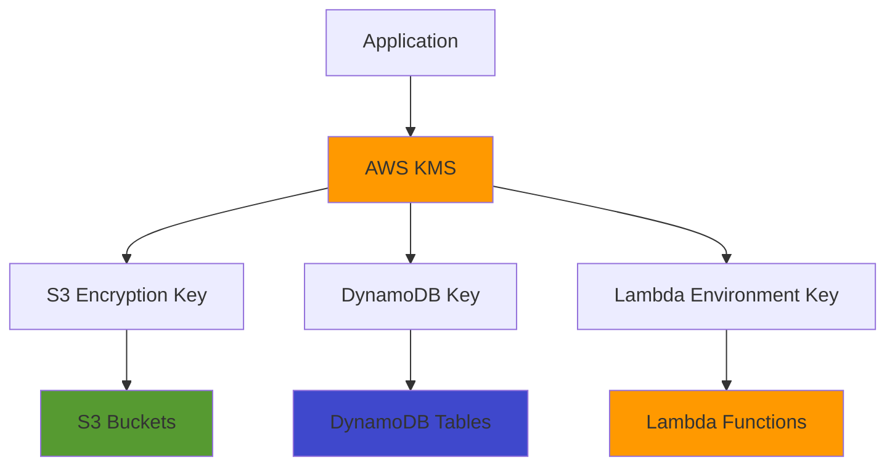

# Data Protection and Encryption

*Comprehensive encryption documentation for data at rest and in transit.*

## Overview

OpenData Pulse implements comprehensive encryption across all data storage and transmission layers following AWS security best practices and compliance requirements.

## Encryption at Rest

### S3 Bucket Encryption
- **Algorithm**: AES-256 server-side encryption
- **Key Management**: AWS managed keys (SSE-S3)
- **Scope**: All raw and curated data buckets
- **Compliance**: FIPS 140-2 Level 3 validated

### DynamoDB Encryption
- **Algorithm**: AES-256 encryption
- **Key Management**: AWS managed DynamoDB encryption keys
- **Scope**: All tables and indexes
- **Performance**: No impact on read/write operations

### Lambda Environment Variables
- **Algorithm**: AES-256 encryption
- **Key Management**: AWS KMS customer managed keys
- **Scope**: All sensitive configuration data
- **Access Control**: IAM-based key access policies

## Encryption in Transit

### API Communications
- **Protocol**: TLS 1.2+ for all HTTPS connections
- **Certificate Management**: AWS Certificate Manager
- **Cipher Suites**: Strong encryption only (AES-256, ECDHE)
- **HSTS**: HTTP Strict Transport Security enabled

### Internal Service Communication
- **VPC Endpoints**: Encrypted communication within AWS
- **Service-to-Service**: TLS encryption for all internal APIs
- **Database Connections**: Encrypted connections to DynamoDB and Athena

## Key Management

### AWS KMS Integration
- **Customer Managed Keys**: For sensitive application data
- **Key Rotation**: Automatic annual key rotation enabled
- **Access Policies**: Least privilege access controls
- **Audit Trail**: All key usage logged in CloudTrail

### Key Usage Patterns

## Compliance and Standards

### Regulatory Compliance
- **SOC 2 Type II**: Encryption controls implemented
- **ISO 27001**: Information security management
- **NIST Cybersecurity Framework**: Protect function implementation
- **Australian Privacy Principles**: Data protection compliance

### Encryption Standards
- **FIPS 140-2**: Federal Information Processing Standards
- **Common Criteria**: Security evaluation standards
- **AES-256**: Advanced Encryption Standard
- **RSA-2048**: Public key cryptography

*Content will be generated from infrastructure encryption configuration analysis*